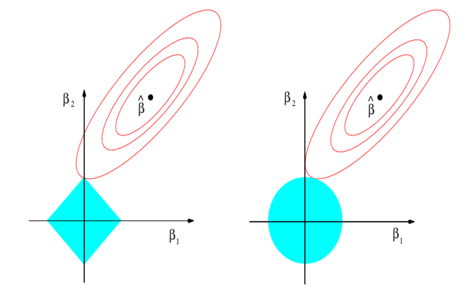
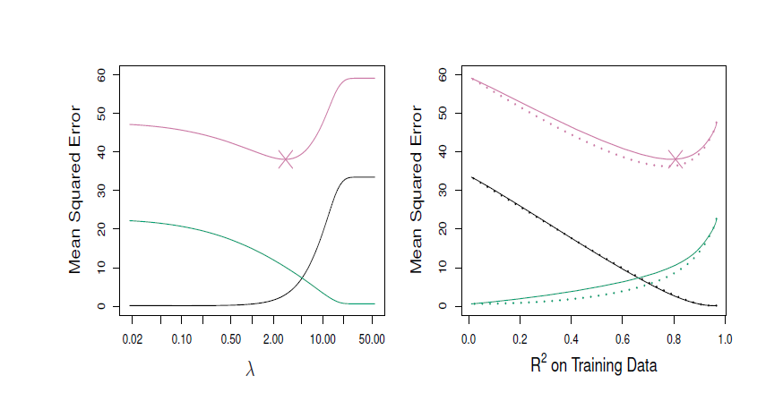
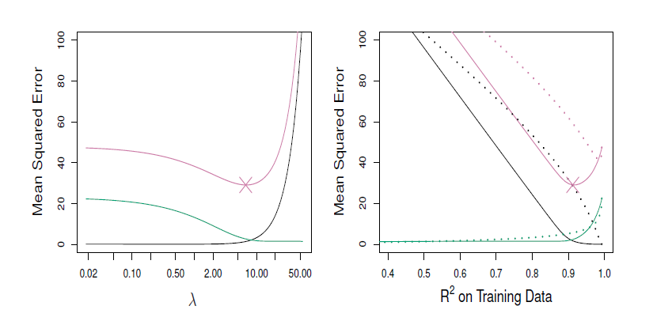
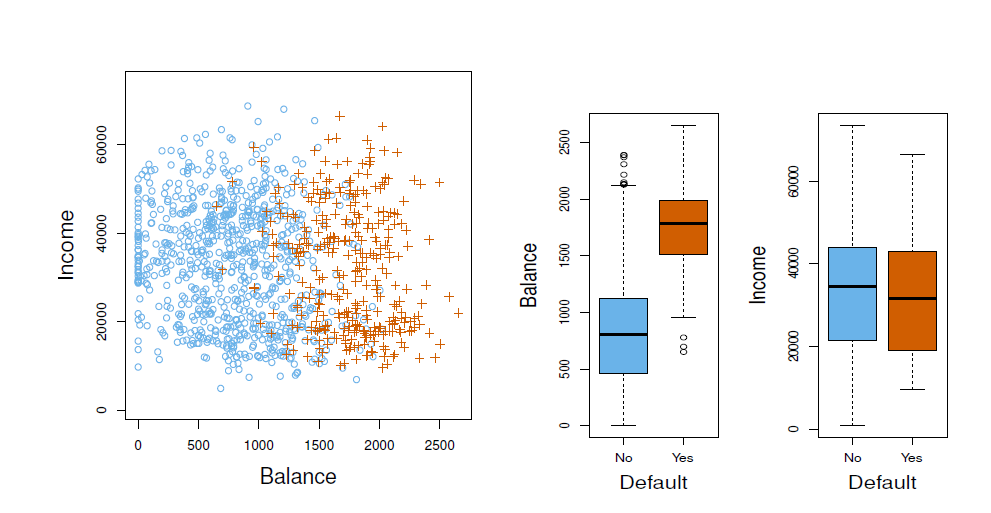
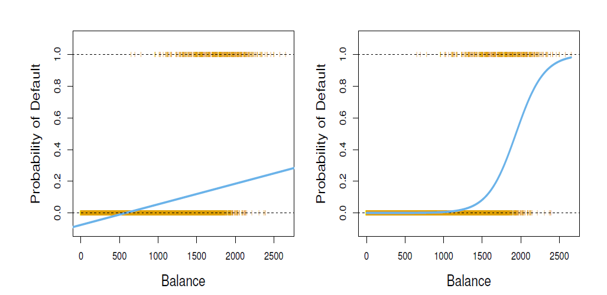

# Data Mining

Data Mining - many related fields ( Data science, ML, stats) can be viewed under the single umbrella term "data mining" = extracting useful knowledge / patterns from data 

Data mining is useful because it has the power to turn raw/ transactional data into actionable knowledge. It can be used in many types of ways for eg: recommendation systems. Like in ecommerce sites such as amazon, prime etc: Association rule example form (used in recommendation systems): If customer buys X and Y, then they are also likely to buy Z. 

# Why Data Mining is important - Scientific Viewpoint 

Modern science and tech generates massive amounts of data very quickly - this makes it difficult to analyse manually 

**Examples of large data sources:**
1. Genome data: DNA sequencing produces extremely large datasets 
2. Protein data: Used in bioinformatics to study protein structures and functions. 
3. Astronomical data: Telescopes generate huge image datasets of space. 
4. Digital data: Emails, youtube and other online content also produce large datasets. 

**Problem** - traditional methods like statistical or manual analysis techniques cannot handle raw, extremely large datasets. 

**Why cant they handle large datasets?**

1. Enormity of data - the sheer volume of the data is too much 
2. High dimensionality - Data can have many variables / features 
3. Heterogeneous and distributed data - data comes from many sources ( images, text, biological data etc)

The scientific motivation for data mining is the need to **automatically analyse large, complex, high dimensional datasets** generated by modern technologies and scientific research. 

Data mining is a field withing computer science focused on **discovering useful patterns and knowledge from large datasets**. It combines several techniques from areas such as *Machine learning *Statistics *Artificial Intelligence *Database systems 

The term data mining can be a bit misleading the goal is **not to extract the data itself** but to extract **meaningful patterns, relationship and knowledge from the data.**

**To summarise:** Data mining focuses on discovering patterns and useful knowledge **from large datasets using computational statistical techniques**

The term **Data mining** became popular because of marketing. Even though most of data mining techniques are already present in traditional Machine learning and statistical analysis. There was a well known book that was mainly about machine learning techniques that used the word **Data mining** in the title mainly to attract attention. 

Data mining mainly refers to **large scale data analysis** using techniques from **machine learning, Artificial intelligence and Statistics**

**Data Mining** = broader term used in industry for analystics + machine learning applied to large datasets

# Pattern Recognition 
It is the automatic recognition of patterns and regular structures in large amounts of data. Used in statistical analysis and ML specially in tasks where the systems should detect structure - such as classification, clustering and image recognition. 

It was originally developed from statistics and engineering but modern techniques heavily use machine learning. Pattern recognition can depend on whether: 
1. labels are available - supervised learning
2. labels are not available - unsupervised learning 
3. approach is statistical - probability based models
4. approach is non - statistical - rule based heiristic methods 

**Key takeaway** - pattern recognition is about automatically detecting patterns in data often using ML and statistical techniques and can involve supervised and unsupervised techniques. 

# Machine Learning 
Machine learning is a subfield of **Computer science and artificial intelligence** focused on developing algorithms that **learn patterns from data and improve performance automatically without explicit programming** 

ML was developed from **pattern recognition and computational learning theory** and is closely connected to **computational ststistics** since many ML algorithms rely on ststistical methods implemented on computers. 

ML and pattern recognition both focus on finding patterns and making predictions from data. 

# Main categories of ML 
1. Supervised learning: learning from labeled data. 
2. Unsupervised learning: discovering structure in unlabeled data. 
3. Reinforcement learning: learning through interaction and feedback from the environment

**Key Takeaway**: ML focuses on algorithms that learn patterns from data, combining ideas from AI, statistics, and pattern recognition and is commonly divifed into supervised, unsupervised and reinforcment learning. 

# Relationship between **Data Mining** and **Machine Learning**

Both are closely related and use the same algorithms hence can be confused between one anther - 
**ML mainly focuses on prediction** - learning from training data to predict future outcomes.
**Data Mining** - mainly focuses on **discovering previously unknown patterns or relationships in large datasets** 

**The overlap** - Data mining frequently uses ML algorithms to discover patterns in data. 

ML can also use data mining techniques - mostly 1. Unsupervised learning and 2. Data preprocessing (finding patterns or structure in data befor training the models)

**Key Takeaway** - ML is **prediction focused** and Data mining is **discovery focused** - both fields share many methods and strongly overlap. 

# Statistical Machine Learning

These notes are on **statistical ML** which lies between **data mining, machine learning and classical statistics** but is not the same as any of them. 

**Why not purely data mining or machine learning**
1. Data mining - is a very broad field covering many types of large scale data analysis. 
2. Machine learning - often focuses more on prediction accuracy and large scale applications. 
3. Classical multivariate statistics - includes traditional statictical techniques but does not cover modern computational methods

Statistical ML - combines ststictics with computational methods from Computer science, optimization and systems science. 

**Main focus of statistical ML** 
1. Building statistical models 
2. Understanding model interpretability
3. Measuring precision and uncertainty in predictions 

Statistical ML integrates statistical modeling with computational algorithms, focusing not only on prediction but also on understanding models, uncertainty and interpretability. 

# Data Science 

Data science is a broad interdisciplinary field focused on extracting useful knowledge and insights from data (structured and unstructured). 

**Goal of data science** 
The aim is to analyse real - world data to understand phenomena and support decision making using scientific methods and computational tools. 

Data science brings together several areas: 
1. Statistics and mathematics (for modeling and inference)
2. Computer science (for algorithms and computation)
3. Data analysis and machine learning
4. Domain knowledge or business expertise 

Data science integrates statistics, computing and domain knowledge to analyse large datasets and extract actionable insights from real-world data. 

The **Two cultures** concept in the use of statisical modeling to reach conclusions from data. 

As mentioned in **Leo Breiman Statistical Modeling : The two cultures** There are 2 cultures : Data modeling and ALgorithmic modeling 
1. Data modeling : assumes that the data is generated by  a given stochastic data model 
2. Algorithmic modeling : assumes the use of algorithmic modeling while treating the data as unknown. 

If the goal is to use data to solve problems we need to move away from exclusive dependence on data models and adopt a more diverse set of tools. 

# Supervised Machine Learning
In Supervised learning the dataset contains **input variables (X)** and **known output / response (Y)**. The goal is to **learn a relationship between X and Y** so that we can predict Y for new data. 

**Two main types of supervised learning problems:** 
1. Regression: The response variable Y is continuous (numerical). Examples: predicting house prices or blood pressure 

2. Classification: The response variable Y is categorical (labels or classes)
Examples: predicting survived /died or recognizing digitd 0 - 9 

**Common regression methods**
Linear regression, non linear regression, and model selection techniques

**Common classification methods** 
Logistic regression, discriminant analysis, and support vector machine

**Other important supervised methods**
Tree-based models and ensemble methods such as bagging, boosting and random forests. 

**Key takeaway** - Supervised learning learns a mapping from inputs (X) to known outputs (Y) and mainly involves regression (continuous Y) and classification (categorical Y) problems. 

# Unsupervised Learning 

In Unsupervised learning there is no response/output variable (Y). We **only observe input features (X)** and try to discover hidden structures or patterns in the data. 

**Goal of unsupervised learning** 
Since there are no labels the objective is less clearly defined. 
Typical goals include: 
1. Clustering - finding groups of similar observations 
2. Finding relationships between variables 
3. Finding **low dimensional respresentations** that capture most of the variables in the data. 

Evaluation difficulty - because there is no correct output it is often hard to measure how well models perform. 

**Unsupervised methods** often used as a preprocessing step before supervised learning, for example to reduce dimensionality or discover structure in data. 

**Common methods**
1. Clustering methods 
2. Principal Component Analysis (PCA)
3. Independent Component Analysis 
4. Factor Analysis 
5. Canonical Correlation Analysis 

**Key takeaway** - Unsupervised learning analyzes unlabeled data to discover structure, groups, or underlying patterns in the dataset. 

# Reinforcement Learning 
Reinforcement learning is a type of machine learning **where the agent learns to make decisions by interacting with the environment** 

**How the learning process works** 
The agent: 
1. Observes the current state of the environment
2. Takes an action 
3. Received a reward or penalty from the environment 
4. Uses this feedback to improve future actions 

**Goal of reinforment learning** 
The objective is to learn a strategy (policy) that maximizes the total long -term reward. 

**Connection to other fields** 
In operations research and control theory, reinforcement learning is related to **approximate dynamic programming**

**Mathemtical framework** 
Reinforcement learning problems are commonly modeled using a markov Decision Process (MDP), which describes states, actions, transitions and rewards. 

**Key takeaway** - Reinformcent learning learns optimal decision - making hrough interaction with an environment using rewards as feedback. 

# Modern Large Language Models (LLMS)

Modern LLMS are a result of the evolution of NLP (natural language processing), moving from traditional statistical methods to transformer based deep learning models. 

**How LLMs work** - They rely on **large neural network architectures (tranformers)** trained on massive datasets using specific training objectives and pipelines. 

**Why LLMS are powerful** 
Theire performance comes from 
1. Rich internal representation of language 
2. Scaling to very large datasets and models 
3. Emergent behaviours - where new capabilities appear as models become larger 

**How do people interact with LLMs** 
LLMs are used through techniques such as:
1. Prompting 
2. Instruction Tuning 
3. Reinforcement Learning from Human Feedbacl (RLHF)
4. Retrieval Augmented Generation (RAG) and external tools. 

Cuurent research direction - active areas include multimodal models (text + images etc), AI agents, safety and evaluation of model behaviour 

Key takeaway for exam: Modern LLms are **large tranformer based models trained on massive data**, and their capabilities come from **scaling, advanced training methods and new interactions like prompting and RLHF.**

# Historical Milestones in NLP and LLM development
**1950s - 1990s:** - Early NLP relied mainly on symbolic approaches, using handwritten grammar rules and some basic statictical techniques. 
**1990s - 2000s:** - The field shifted towards data driven methods, using probabilistic models such as n-grams, Hidden Markov Models (HMMs), and Conditional Random Fields (CRFs).
**2013 - 2017:** - Neural language models became important using deep learning methods such as word embeddings (word2vec) and sequence models like RNNs and LSTMs with attention mechanisms. 
**2017 - 2020:** - The introduction of trnsformer architectures revolutionized NLP, enabling large-scale pretraining models like BERT and GPT. 
**2020 - present:** - progress focuses on scaling models to huge sizes, improving alignment with human preferences, integrating external tools and developing multimodal and agent based systems. 

**Key takeaway** - NLP evolved from rule based systems --> statitical models --> neural networks --> transformers --> large-scale LLms with multimodal and agent capabilities. 

_______________________________________________________________

# LINEAR MODELS

Linear models is one of the most fundamental tools in statistical machine learning. They are used to **describe the relationship between input variables (features) and an output variable** using a **linear equation**.

This serves as a core foundation for many machine learning and statistical methods - especially in regression and classification problems. 

# Statistical Machine Learning

In statistical learning we model the relationship between predictors (covariates) X and a response variable Y. 

### General Model

The response is written as : 
Given response $$ Y and Covariates (X1i, X2i, X3i ....Xpi)^T $$

We model the relationship as: 

$$
Y_i = f(X_i) + \epsilon_i
$$

where:

- $f(X_i)$ represents the true underlying relationship between inputs and output.
- $\epsilon_i$ is random error (noise) with mean zero, capturing randomness or unexplained variation.

**Interpretation** - The goal of statistical learning is to estimate or approximae the unknown function $f$ using observed data. 

## Income vs Education


**Key Takeaway** - Statistical machine learning models data as : 
response = systematic relationship (function $f$) + random error, and the main goal is to **estimate $f$ from data**

# Learning the relationship between variables 

In statistical learning the goal is to estimate or learn the function $$f$$ that describes how the **response variable Y** depends on the **predictors X**.

**Two main objectives of learning $$f$$**
1. Prediction 
Use the estimated relationship to predict the response Y for new observations of X 
2. Inference 
Understand how the predictors influence the response, such as: 
- which variable affects Y 
- whether the effect is positive or negative 
- How strong the relationship is

**Example of prediction:** - Predicting how much money a person will donate using many observed characteristics of individuals. 

**Example of inference:** - Studying house prices to determine which factors (e.g. size, location, etc) have the strongest impact on price. 

**Key Takeaway** - Learning the function $$f$$ serves two purposes: predicting outcomes for new data and understanding the relationship between variables. 

# Methods for estimating the function of $$f$$$
To learn the relationship between inputs X and response Y we must estimate the unknown function $$f$$ using statistical models. 

2 main approaches 
1. **Parametric methods** - Assume a specific functional form for the relationship 
**Example** - Linear regression, where Y is modeled as a linear combination of predictors.
The parameters(coefficents $\beta$) are estimated using a loss function, commonly **Ordinary Least Squares (OLS)**

2. **Non parametric methods**  - Do not assume a fixed functional form for $$f$$. 
Instead, the data is allowed to determine the shape of the relationship. 
Examples include: **Spline method** & **Kernel Smoothing** 

**Trade off** 
- Parametric methods are simpler and require less data but may be less flexible. 
- Non Parametric methods are more flexible but usually require larger datasets for accurate estimation. 

**Key takeaway** - The relationship $$f$$ can be estimated using parametric methods(fixed structure) or nonparametric models (flexible structure) - with flexibility requiring more data.

# Tradeoff between accuracy and interpretability 
In statistical learning there is often a tradeoff between how accurate a model is and how easy it is to interpret. 

**Principle of Simpliciy**
According to Occam's razor (parsimony principle), simpler models are generally preferred because they are easier to understand and explain. 

Simple models like linear regression are highy interpretable because we can clearly see how each variable affects the response. 

**Accuracy and Overfitting**
More complex models may capture more patterns in data but can overfit, meaning they learn noise rather than true relationship. 
Sometimes simpler models actually give better predictions because they generalise better. 

## Accuracy Vs Interpretability


The above figure shows:
**Simple models** (eg: subset selection, lasso, least squares) --> high interpretability but lower flexibility. 
**Complex models** (e.g. SVM, boosting,bagging) -->higher flexibility and often better predictive power but harder to interpret. 

**Key Takeaway:** Machine Learning models must balance interpretability (simplicity) and predictive accuracy (flexibility), since increasing model complexity usually reduces interpretability. 

# Quality of Fit

Measuring the modelaccuracy or Quality of Fit - A common way to measure how well a model predicts the response variable is the **Mean Square Error (MSE)**

**What is the meaning of MSE** 
- MSE measures the avergae squared difference between the actual values Yi and the predicted values $\hat{Y}_i$.
- Smaller MSE means **better predictive accuracy** 

**Training Vs Test Data** 
- **Training data:** used to build the model and estimate predictions 
- **Test date:** new unseen data used to evaluate how well the model generalizes. 

Very flexible models can achieve **very low training MSE**, but may perform **worse on test data**, leading to higher test MSE. 

Model quality is often evaluated using **MSE** but the most important measure is **test MSE** since it reflects performance on new unseen data. 

# Levels of Flexibility 


Different models have different levels of flexibility - ie. how complex the relationship can learn between X and Y. 

In the above plot:
**Black line** - true underlying relationship
**Orange line** - simple linear model (low flexibilty)
**Blue Curve** - moderately flexible model 
**Green Curve** - highly flexible model that closely follows the data. 

**Effect of increasing flexibility** 
As the model flexibilty increases the model can fit the training data more closely - capturing more complex patterns. 

**Training vs test error** 
- **Training MSE(grey)** - decreases as flexibility increases because complex models fir the training data better. 
- **Test MSE (red)** - first decreases then increases when the model becomes too flexible 

The reason for increase in the test error is highly flexible models may overfit ie. they may capture noise in the training data instead of the true pattern. 

**Irreducible error** 
The dashed line represnts the minimum possible prediction error caused by randomness in the data that no model can eliminate.

**Key Takeaway** - Increasing model flexibility reduces training error but can increase test error due to overfitting - so the best model is usually somewhere in the middle level of flexibility 

# Bias and Variance Tradeoff 

When we choose any learning method we need to try to balance bias and variance  - two key sources of prediction error. 

- Bias : Bias measures the error caused by approximating a complex real-world relationship with a simpler model. 
High bias models are too simple and may miss important patterns in the data. 
- Variance: Variance measures how much the models predictions would change if we trained it on a different dataset. 

More flexible models usually have **higher variance** which means they are more sensitive to small changes in the training data. 

**Remember** 
Simple models --> high bias, low variance 
Complex models --> low bias, high variance

**Goal in ML**: Find the balance that will minimize overall prediction error. 

# Simple Linear Regression 

Linear regression is a basic supervised learning method used to model the relationship between a response variable Y and one or more predictor variables X. 

In real world problems the true relationship is usually more complex and not perfectly linear. 

**So why is linear regression still useful** 
It's simple yet widely used because: 
- easy to interpret 
- computationally efficient
- A foundation for many advanced statistical and machine learning methods. 


In the above graph the red curve represents the true nonlinear relationship and the blue line shows the linear approximation used by linear regression. 

Linear regression assumes a linear relationship between predictors and response and despite being simple it is a fundamental and powerful tool in statistical learning. 

## Simple Linear Regression (SLR)

### Model Idea
Simple Linear Regression models the relationship between a response variable $Y$ and a single predictor $X$ using a straight-line equation.

### Model Form

$$
Y = \beta_0 + \beta_1 X + \epsilon
$$

where:

- $\beta_0$ — intercept (value of $Y$ when $X = 0$)
- $\beta_1$ — slope (change in $Y$ for a one-unit increase in $X$)
- $\epsilon$ — random error capturing unexplained variation

### Estimated Regression Line

Since $\beta_0$ and $\beta_1$ are unknown, they are estimated from data:

$$
\hat{y} = \hat{\beta}_0 + \hat{\beta}_1 x
$$

### Prediction

For a new input $x$, the predicted response is:

$$
\hat{y}
$$

The hat symbol ($\hat{}$) indicates an **estimated or predicted value**.

### Key Takeaway

Simple Linear Regression estimates a **linear relationship between one predictor and a response variable**, using slope and intercept parameters learned from data.

## Estimating Parameters in Simple Linear Regression

### Residuals

For each observation $(y_i, x_i)$, the predicted value from the regression model is

$$
\hat{y}_i = \hat{\beta}_0 + \hat{\beta}_1 x_i
$$

The **residual** represents the difference between the observed value and the predicted value:

$$
e_i = y_i - \hat{y}_i
$$

Residuals measure the **prediction error** for each data point.

---

### Estimation Method (Ordinary Least Squares)

To estimate the parameters $\beta_0$ and $\beta_1$, we minimize the **Residual Sum of Squares (RSS)**:

$$
RSS = \sum_i e_i^2 = \sum_i (y_i - \hat{\beta}_0 - \hat{\beta}_1 x_i)^2
$$

This approach is known as **Ordinary Least Squares (OLS)**.

---

### Estimated Coefficients

Let

$$
\bar{x} = \frac{1}{n}\sum_i x_i, \qquad
\bar{y} = \frac{1}{n}\sum_i y_i
$$

The estimated parameters are

$$
\hat{\beta}_1 =
\frac{\sum_i (y_i - \bar{y})(x_i - \bar{x})}
{\sum_i (x_i - \bar{x})^2}
$$

$$
\hat{\beta}_0 = \bar{y} - \hat{\beta}_1 \bar{x}
$$

---

### Interpretation

- **Slope ($\hat{\beta}_1$)**: measures how the response variable $Y$ changes with a one-unit increase in $X$.
- **Intercept ($\hat{\beta}_0$)**: ensures the regression line passes through the point $(\bar{x}, \bar{y})$.

---

### Key Takeaway

In **Simple Linear Regression**, the parameters are estimated by minimizing the **sum of squared residuals (RSS)** using the **Ordinary Least Squares (OLS)** method.


### Example: Advertising Data

This example shows a simple linear regression model relating **TV advertising expenditure** to **sales**.

- The **blue line** is the least squares regression line.
- The **grey vertical lines** represent residuals (prediction errors).
- The regression line is chosen to **minimize the sum of squared residuals (RSS)**.

This approach captures the overall linear relationship between advertising spending and sales.

## Assessing the Coefficient Estimates

After fitting a simple linear regression model

$$
Y = \beta_0 + \beta_1 X + \epsilon
$$

we obtain estimates $\hat{\beta}_0$ and $\hat{\beta}_1$.  
However, these estimates are computed from a **sample of data**, so they are **not the true parameter values**.

If we collected a different sample, the estimated coefficients would be slightly different.  
Therefore, we need a way to **measure how reliable these estimates are**.

---

## 1. Standard Error (SE)

The **standard error** measures how much an estimated coefficient would vary if we repeatedly collected new datasets and refit the model.

- Small SE → estimate is **stable and reliable**
- Large SE → estimate is **noisy and uncertain**

Conceptually, imagine collecting many samples of data and estimating the regression line each time.  
The standard error measures the **variability of those estimates**.

---

## 2. Standard Error of the Slope

The standard error of the slope estimate is

$$
SE(\hat{\beta}_1) =
\sqrt{
\frac{\sigma^2}
{\sum_i (x_i - \bar{x})^2}
}
$$

where

- $\sigma^2 = Var(\epsilon)$ is the variance of the error term.

### Interpretation

The slope estimate becomes more precise when:

1. **Noise is small** (small $\sigma^2$)
2. **The predictor values vary a lot**

If all $X$ values are very similar, it becomes difficult to estimate a reliable slope.

---

## 3. Standard Error of the Intercept

The standard error of the intercept estimate is

$$
SE(\hat{\beta}_0) =
\sqrt{
\sigma^2
\left(
\frac{1}{n}
+
\frac{\bar{x}^2}{\sum_i (x_i - \bar{x})^2}
\right)
}
$$

This measures the **uncertainty in the intercept estimate**.

The intercept is usually harder to estimate precisely because it depends strongly on how the data are centered.

---

## 4. Confidence Intervals

A **confidence interval (CI)** provides a range of plausible values for the true parameter.

For a 95% confidence interval, the approximate form is

$$
\hat{\beta}_1 \pm 2 \cdot SE(\hat{\beta}_1)
$$

The constant "2" comes from the normal distribution and corresponds roughly to a **95% confidence level**.

---

## 5. What a 95% Confidence Interval Means

A common misunderstanding is:

> "There is a 95% probability that the true parameter lies in this interval."

This is **not correct**.

The correct interpretation is:

> If we repeated the sampling process many times and constructed a confidence interval each time, **about 95% of those intervals would contain the true parameter**.

---

## 6. Example: Advertising Dataset

For the advertising data, the 95% confidence interval for the slope coefficient is

$$
[0.042, 0.053]
$$

This means that for every additional unit of **TV advertising**, sales increase by approximately

- **at least 0.042**
- **at most 0.053**

This indicates that the relationship between TV advertising and sales is **clearly positive**.

---

## Key Takeaway

When fitting a regression model we:

1. Estimate regression coefficients
2. Measure the **uncertainty** of those estimates using **standard errors**
3. Express that uncertainty using **confidence intervals**

This allows us to assess **how trustworthy our regression results are**.

## Hypothesis Testing in Linear Regression

After fitting a regression model

$$
Y = \beta_0 + \beta_1 X + \epsilon
$$

we want to determine whether the relationship between **X and Y** is real or simply due to random variation in the data.

Hypothesis testing helps us answer this question.

---

## The Hypotheses

We test two competing statements about the slope coefficient.

### Null Hypothesis

$$
H_0: \beta_1 = 0
$$

This means there is **no relationship between X and Y**.

If this is true, the regression model reduces to

$$
Y = \beta_0 + \epsilon
$$

which implies that **X does not influence Y**.

---

### Alternative Hypothesis

$$
H_A: \beta_1 \neq 0
$$

This means there **is a relationship between X and Y**, and the predictor variable helps explain changes in the response variable.

---

## Role of the Standard Error

To test the hypotheses, we use the **standard error of the slope estimate**.

The idea is to check whether the estimated slope $\hat{\beta}_1$ is **large relative to its standard error**.

- If the slope is **much larger than its standard error**, it suggests the relationship between X and Y is real.
- If the slope is **similar in size to its standard error**, the relationship could simply be due to random noise.

---

## Intuition

- If $\beta_1 = 0$ → X and Y are unrelated.
- If $\beta_1 \neq 0$ → X helps explain variation in Y.

Hypothesis testing allows us to determine whether the predictor variable **has a statistically significant effect** on the response variable.

---

## Key Idea

In simple linear regression, we typically test

$$
H_0 : \beta_1 = 0
$$

to determine whether the predictor variable **X has a statistically significant relationship with Y**.

## Hypothesis Testing, t-Statistic, and Model Fit

After estimating a simple linear regression model

$$
Y = \beta_0 + \beta_1 X + \epsilon
$$

we want to determine whether the relationship between **X and Y** is statistically significant and how well the model explains the data.

---

## 1. The t-Statistic

To test the null hypothesis

$$
H_0 : \beta_1 = 0
$$

we compute the **t-statistic**

$$
t = \frac{\hat{\beta}_1 - 0}{SE(\hat{\beta}_1)}
$$

This measures **how many standard errors the estimated slope is away from zero**.

### Interpretation

- **Small |t|** → the slope could be due to random noise.
- **Large |t|** → the slope is far from zero, suggesting a real relationship between X and Y.

### Example intuition

If

$$
\hat{\beta}_1 = 0.05, \quad SE = 0.01
$$

then

$$
t = 5
$$

meaning the estimate is **5 standard errors away from zero**, which is strong evidence of a relationship.

---

## 2. Distribution of the t-Statistic

Under the null hypothesis

$$
H_0 : \beta_1 = 0
$$

the t-statistic follows a **t-distribution with \(n-2\) degrees of freedom**.

Why \(n-2\)?

Because we estimate two parameters:

- $\beta_0$ (intercept)
- $\beta_1$ (slope)

This reduces the degrees of freedom by two.

---

## 3. The p-Value

The **p-value** is the probability of observing a t-statistic as extreme as the one computed if the null hypothesis were true.

### Interpretation

- **Small p-value (< 0.05)** → reject \(H_0\)  
- **Large p-value** → insufficient evidence against \(H_0\)

If the p-value is small, it suggests that **X has a statistically significant effect on Y**.

---

## 4. R-Squared (Goodness of Fit)

The **R-squared statistic** measures how much of the variability in the response variable is explained by the model.

$$
R^2 = \frac{TSS - RSS}{TSS} = 1 - \frac{RSS}{TSS}
$$

---

## Components of R²

### Total Sum of Squares (TSS)

$$
TSS = \sum_i (y_i - \bar{y})^2
$$

Measures the **total variability in Y around its mean**.

---

### Residual Sum of Squares (RSS)

$$
RSS = \sum_i (y_i - \hat{y}_i)^2
$$

Measures the **unexplained error after fitting the regression model**.

---

## 5. Meaning of \(R^2\)

R-squared represents the **fraction of variance explained by the model**.

Examples:

| R² | Interpretation |
|----|---------------|
| 0.2 | Model explains 20% of variation |
| 0.6 | Model explains 60% of variation |
| 0.9 | Very strong fit |

Example:

If

$$
R^2 = 0.72
$$

then **72% of the variation in Y is explained by X**.

---

## Key Intuition

Regression analysis answers two main questions:

1️⃣ **Is there a relationship?**  
→ Use **hypothesis testing** (t-test, p-value)

2️⃣ **How strong is the model?**  
→ Use **R² (goodness of fit)**

Together, these measures help determine whether the regression results are **statistically meaningful and useful for prediction**.

# Linear Model 

## Multiple Linear Regression

In many real-world problems, a response variable depends on **multiple predictors**, not just one.

Instead of the simple linear regression model

Y = β₀ + β₁X + ε

we use **multiple linear regression**, where several predictors explain the response:

Y = β₀ + β₁X₁ + β₂X₂ + ... + βₚXₚ + ε

Where:

- **Y** = response variable  
- **X₁, X₂, ..., Xₚ** = predictor variables  
- **β₀** = intercept  
- **β₁, β₂, ..., βₚ** = coefficients measuring the effect of each predictor  
- **ε** = random error term  

### Example

Predicting **house price** using multiple predictors:

- Size of the house  
- Location  
- Number of bedrooms  
- Age of the house  

Each variable contributes to explaining the final price.

---

## Indicator Variables (Categorical Variables)

Regression models require **numerical inputs**, but many predictors are **categorical**.

Indicator variables (also called **dummy variables**) allow categorical information to be included in regression.

### Example: Gender

Male = 0  
Female = 1  

### Example: City

Edmonton = 1, otherwise 0  
Calgary = 1, otherwise 0  

These variables allow regression models to handle **non-numeric categories**.

---

## Model Selection

When many predictors are available, we must decide:

- Which variables should remain in the model
- Which variables should be removed

Including too many predictors can lead to **overfitting**, where the model fits the training data well but performs poorly on new data.

### Goal

Build a model that:

- Explains the data well  
- Uses only relevant predictors  
- Avoids unnecessary complexity  

In other words, we aim to find the **best predictive model without overfitting**.

## Multiple Linear Regression

In many real-world problems, the response variable depends on **multiple predictors**, not just one.  
Multiple Linear Regression extends simple linear regression to include several explanatory variables.

### Model

The multiple linear regression model is:

$$
Y = \beta_0 + \beta_1 X_1 + \beta_2 X_2 + ... + \beta_p X_p + \epsilon
$$

Where:

- **Y** = response variable (what we want to predict)
- **X₁, X₂, ..., Xₚ** = predictor variables
- **β₀** = intercept
- **β₁, β₂, ..., βₚ** = regression coefficients
- **ε** = random error term (often assumed to follow \(N(0, \sigma^2)\))

---

## Interpretation of the Coefficients

Each coefficient **βⱼ** represents the **average change in Y when Xⱼ increases by one unit**, while **all other predictors remain fixed**.

This is called the **partial effect** of a variable.

In other words, the coefficient measures the **separate contribution of each predictor** to the response.

---

## Example: Advertising Data

Suppose we model product sales using three advertising channels:

- TV advertising
- Radio advertising
- Newspaper advertising

The regression model becomes:

$$
Sales = \beta_0 + \beta_1 TV + \beta_2 Radio + \beta_3 Newspaper + \epsilon
$$

Interpretation:

- **β₁** → effect of TV advertising on sales  
- **β₂** → effect of Radio advertising on sales  
- **β₃** → effect of Newspaper advertising on sales  

Each effect is measured **while the other advertising channels are held constant**.

---

## Key Idea

Multiple regression allows us to measure the **individual impact of several predictors simultaneously**, helping us understand how each variable contributes to predicting the response.

## Multiple Linear Regression

Multiple Linear Regression extends simple linear regression by allowing **multiple predictor variables** to explain a response variable.

### Model

The multiple regression model is

Y = β₀ + β₁X₁ + β₂X₂ + ... + βₚXₚ + ε

where:

- **Y** = response variable (what we want to predict)
- **X₁, X₂, ..., Xₚ** = predictor variables
- **β₀** = intercept
- **β₁, β₂, ..., βₚ** = coefficients
- **ε** = random error term, usually assumed to follow  
  ε ~ N(0, σ²)

---

## Meaning of the Coefficients

Each coefficient **βⱼ** represents the **average change in Y when Xⱼ increases by one unit**, while **all other predictors are held fixed**.

This is called the **partial effect** of the predictor.

In other words, the coefficient measures how much a variable contributes to predicting **Y independently of the other variables**.

---

## Example: Advertising Data

Suppose we want to predict product **sales** using three advertising channels:

- TV advertising
- Radio advertising
- Newspaper advertising

The regression model becomes

Sales = β₀ + β₁(TV) + β₂(Radio) + β₃(Newspaper) + ε

### Interpretation

- **β₁** → effect of TV advertising on sales
- **β₂** → effect of radio advertising on sales
- **β₃** → effect of newspaper advertising on sales

Each effect is measured **while the other advertising channels are held constant**.

---

## Key Takeaway

Multiple linear regression allows us to measure the **separate contribution of multiple predictors** when explaining or predicting a response variable.

## Multiple Linear Regression

Multiple Linear Regression is used when the response variable depends on **more than one predictor variable**.

### Model

The multiple regression model is

Y = β₀ + β₁X₁ + β₂X₂ + ... + βₚXₚ + ε

where:

- **Y** = response variable (what we want to predict)
- **X₁, X₂, ..., Xₚ** = predictor variables
- **β₀** = intercept
- **β₁, β₂, ..., βₚ** = regression coefficients
- **ε** = random error term, typically assumed to follow  
  ε ~ N(0, σ²)

---

## Interpretation of the Coefficients

Each coefficient **βⱼ** represents the **average change in Y when Xⱼ increases by one unit**, while **all other predictors remain fixed**.

This is called the **partial effect** of the predictor.

In other words, the coefficient measures the **individual contribution of each variable** to predicting Y.

---

## Example: Advertising Data

Suppose we want to predict **sales** using three types of advertising:

- TV advertising
- Radio advertising
- Newspaper advertising

The regression model becomes

Sales = β₀ + β₁ × TV + β₂ × Radio + β₃ × Newspaper + ε

### Interpretation

- **β₁** → effect of TV advertising on sales  
- **β₂** → effect of radio advertising on sales  
- **β₃** → effect of newspaper advertising on sales  

Each effect is estimated **while keeping the other advertising channels constant**.

---

## Key Idea

Multiple linear regression allows us to measure the **separate impact of multiple predictors** on the response variable, helping us understand how different variables contribute to predicting Y.


## Coefficient Interpretation in Multiple Linear Regression

In multiple linear regression, each coefficient represents the effect of a predictor on the response variable **while holding all other predictors constant**.

### Ideal Case: Predictors are Uncorrelated

The easiest situation for interpretation occurs when the predictors are **uncorrelated** (sometimes called a *balanced design*).

In this case:

- Each coefficient can be estimated and tested **independently**
- The interpretation is straightforward

If \(X_j\) increases by **one unit**, then the response variable \(Y\) changes by **\(\beta_j\)**, **while all other variables remain fixed**.

This allows us to interpret the **separate contribution of each variable** to predicting \(Y\).

---

## When Predictors are Correlated

Problems arise when predictors are **correlated with each other**.

For example, in advertising data, spending on **TV and radio advertising** might increase together.

This creates several issues:

- Coefficient estimates become **unstable**
- The **variance of coefficient estimates increases**
- It becomes difficult to determine **which variable is actually responsible for the change in \(Y\)**

This phenomenon is known as **multicollinearity**.

Because predictors move together, when one variable changes, others tend to change as well, making interpretation harder.

---

## Causality Warning

Regression analysis on **observational data** identifies **associations**, not necessarily **causal relationships**.

Example:

- Ice cream sales increase
- Drowning incidents increase

Regression may detect a relationship, but the true cause is **temperature** (a hidden variable).

Therefore:

> Regression models show **relationships between variables**, but they do not automatically prove **cause and effect**.

---

## Key Takeaways

- If predictors are **independent**, coefficients are easy to interpret.
- If predictors are **correlated**, interpretation becomes difficult due to **multicollinearity**.
- Regression identifies **associations**, not necessarily **causal effects**.

## The Woes of Regression Coefficients

In multiple linear regression, a coefficient \( \beta_j \) represents the **expected change in the response variable \(Y\)** when the predictor \(X_j\) increases by one unit **while all other predictors are held fixed**.

This interpretation works well in theory, but it can become problematic in practice because predictors often **change together**.

---

## Why This Can Be Problematic

The regression interpretation assumes that we can change one variable while keeping the others constant.  
However, in real-world data, predictors are often **correlated**, meaning they tend to move together.

When this happens, the interpretation of regression coefficients becomes less intuitive.

---

## Example 1: Coins in Your Pocket

Suppose we want to model:

- \(Y\) = total amount of money in your pocket  
- \(X_1\) = number of coins  
- \(X_2\) = number of pennies, nickels, and dimes  

If the number of pennies increases, the **number of coins also increases**.

So it is unrealistic to interpret the coefficient of \(X_2\) as:

> increasing pennies while keeping the number of coins fixed.

Because these variables naturally change together, interpreting their coefficients separately can be misleading.

---

## Example 2: Football Player Tackles

Suppose we model:

- \(Y\) = number of tackles in a season  
- \(W\) = player weight  
- \(H\) = player height  

Regression model:

\[
Y = \beta_0 + 0.50W - 0.10H
\]

At first glance, the negative coefficient for height may seem strange.

However, the coefficient for height means:

> If height increases by one unit **while weight stays constant**, the number of tackles decreases.

But in reality, taller players are often heavier, so the model is considering an **unusual scenario**: a taller player with the same weight (a thinner player). This can lead to unexpected coefficient signs.

---

## Key Insight

Regression coefficients assume that other predictors remain fixed.  
But when predictors are correlated, this assumption may represent **unrealistic situations**, making coefficient interpretations harder.

This issue is closely related to **multicollinearity**.

---

## Main Takeaway

- Regression coefficients describe the effect of one variable **holding others fixed**
- In real data, predictors often **change together**
- This can make coefficient interpretations **counterintuitive**

# 2 Quotes by Famous Statisticians 

Essentially, all models are wrong but some are useful - George Box
The only way to find out what will happen when a complex system is disturbed is to disturb the system - not merely observe it passively. - Fred Mosteller and John Tukey, paraphrasing George Box

## Coefficient Estimation in Multiple Linear Regression

In multiple linear regression, the goal is to estimate the unknown coefficients of the model.

The regression model is

Y = β₀ + β₁X₁ + β₂X₂ + ... + βₚXₚ + ε

Since the true coefficients β₀, β₁, ..., βₚ are unknown, we estimate them from data.  
The estimated regression equation becomes

ŷ = β̂₀ + β̂₁X₁ + ... + β̂ₚXₚ

where:

- ŷ = predicted value of Y
- β̂₀, β̂₁, ..., β̂ₚ = estimated regression coefficients

---

## Residuals

For each observation we compare:

Actual value: yᵢ  
Predicted value: ŷᵢ  

The difference between them is called the **residual**:

eᵢ = yᵢ − ŷᵢ

Residuals represent the **prediction errors** of the model.

---

## Residual Sum of Squares (RSS)

To measure the overall prediction error, we compute the **Residual Sum of Squares**:

RSS = Σ (yᵢ − ŷᵢ)²

This quantity measures the total squared difference between the observed values and the predicted values.

---

## Least Squares Estimation

The regression coefficients are chosen to **minimize the Residual Sum of Squares (RSS)**.

The values

β̂₀, β̂₁, ..., β̂ₚ

that minimize RSS are called the **least squares estimates**.

This method is known as **Ordinary Least Squares (OLS)** and is used by statistical software to estimate regression models.

---

## Key Idea

Multiple linear regression estimates coefficients by choosing the values that **minimize the total squared prediction error**.


## Estimation Example (Geometric Interpretation)

This figure illustrates how **multiple linear regression fits a surface to data**.

### Axes in the Plot

The graph shows three variables:

- **X₁** – first predictor variable
- **X₂** – second predictor variable
- **Y** – response variable

Each red point represents an observed data point with coordinates:

(X₁, X₂, Y)

---

## The Regression Plane

In simple linear regression, we fit a **line** to the data.  
In multiple linear regression, we fit a **plane**.

The model is:

Y = β₀ + β₁X₁ + β₂X₂

The colored surface in the plot represents this **regression plane**.

For any combination of \(X₁\) and \(X₂\), the plane gives the predicted value:

ŷ = β̂₀ + β̂₁X₁ + β̂₂X₂

---

## Residuals (Prediction Errors)

The vertical lines between the red points and the plane represent **residuals**.

Residual for observation \(i\):

eᵢ = yᵢ − ŷᵢ

These measure the difference between the **actual value** and the **predicted value**.

---

## Least Squares Estimation

The regression coefficients are chosen to minimize the **Residual Sum of Squares (RSS)**:

RSS = Σ (yᵢ − ŷᵢ)²

This places the regression plane so that the **total squared vertical distance between the data points and the plane is minimized**.

---

## Key Insight

- Simple linear regression fits a **line**
- Multiple linear regression fits a **plane (or hyperplane)**

The goal is always to **minimize squared prediction errors**.

## Inference in Multiple Linear Regression

After fitting a regression model, we want to understand whether the predictors are useful and how reliable our predictions are. This is done through **statistical inference**.

---

## 1. Is the Model Useful? (F-Test)

First we test whether **at least one predictor affects the response variable**.

Null hypothesis:

H₀: β₁ = β₂ = ... = βₚ = 0

Alternative hypothesis:

Hₐ: At least one βⱼ ≠ 0

This is tested using the **F-statistic**:

F = ((TSS − RSS)/p) / (RSS/(n − p − 1))

Where:

- **TSS** = Total Sum of Squares
- **RSS** = Residual Sum of Squares
- **p** = number of predictors
- **n** = sample size

A large F-value suggests that the predictors explain a significant portion of the variation in Y.

---

## 2. Is an Individual Predictor Useful? (t-Test)

To test whether a specific predictor \(X_i\) is useful, we test:

H₀: βᵢ = 0

The test statistic is

t = β̂ᵢ / SE(β̂ᵢ)

If the t-statistic is large (or the p-value is small), we conclude that the predictor has a significant effect on Y.

---

## 3. Prediction Interval (PI)

A **prediction interval** estimates the range where a **future individual observation** is likely to fall.

This interval accounts for:

- uncertainty in the regression estimate
- natural variation in individual observations

---

## 4. Confidence Interval (CI)

A **confidence interval** estimates the range of the **average response value** for given predictor values.

---

## Key Difference

Prediction Interval (PI) → predicts **individual observation**

Confidence Interval (CI) → estimates **average response**

Prediction intervals are **wider than confidence intervals** because they include more sources of uncertainty.

## Advertising Example: Interpreting Regression Output

This example shows the results of fitting a multiple linear regression model to predict **sales** using three advertising channels:

Sales = β₀ + β₁(TV) + β₂(Radio) + β₃(Newspaper) + ε

---

## Estimated Coefficients

| Predictor | Estimate | Interpretation |
|-----------|----------|---------------|
| Intercept | 2.94 | Baseline sales when advertising spending is zero |
| TV | 0.0458 | Increasing TV advertising by 1 unit increases sales by about **0.0458 units**, holding other variables fixed |
| Radio | 0.1885 | Increasing radio advertising by 1 unit increases sales by about **0.1885 units**, holding other variables fixed |
| Newspaper | -0.0010 | Very close to zero → newspaper advertising has little effect on sales |

---

## Statistical Significance (p-values)

| Predictor | p-value | Conclusion |
|-----------|--------|------------|
| TV | < 2e-16 | Highly significant |
| Radio | < 2e-16 | Highly significant |
| Newspaper | 0.86 | Not significant |

Rule of thumb:

p-value < 0.05 → predictor is statistically significant.

**Conclusion:** TV and Radio advertising significantly affect sales, but Newspaper advertising does not add meaningful predictive power.

---

## Model Quality

Multiple R-squared = **0.897**

This means the model explains about **89.7% of the variation in sales**, indicating a very strong fit.

---

## Overall Model Significance

F-statistic = **570.3**

p-value < **2.2e-16**

This test checks whether **at least one predictor is useful**.

Since the p-value is extremely small, we conclude that **the regression model is statistically significant overall**.

---

## Confidence Interval (CI)

Average predicted sales:

Fit = **20.52**

95% Confidence Interval:

[19.99, 21.05]

Interpretation:

The **average expected sales** for these predictor values likely fall between **19.99 and 21.05**.

---

## Prediction Interval (PI)

Predicted value for a **new observation**:

Fit = **20.52**

95% Prediction Interval:

[17.15, 23.88]

Prediction intervals are **wider** because they account for variability in individual observations.

---

## Key Takeaways

- **TV and Radio advertising significantly increase sales.**
- **Newspaper advertising does not significantly contribute to predicting sales.**
- The model explains **about 90% of the variability in sales**, indicating a strong fit.
- Prediction intervals are **wider than confidence intervals** because they include additional uncertainty from individual observations.

## Indicator Variables (Categorical Predictors)

Sometimes predictors in regression are **not numerical**.  
Instead, they represent **categories** such as gender, city, or product type.

These are called:

- **Categorical variables**
- **Factor variables**
- **Indicator variables (dummy variables)**

---

## Example: Gender

Suppose we want to study whether **credit card balance differs between males and females**.

Since gender is categorical, we convert it into a **numeric indicator variable**.

Define:

xᵢ =  
- 1 → if person *i* is **female**  
- 0 → if person *i* is **male**

---

## Regression Model

We fit the regression:

Yᵢ = β₀ + β₁xᵢ + εᵢ

where:

- **Yᵢ** = credit card balance
- **xᵢ** = indicator variable (gender)

---

## Interpretation

### If the person is male

xᵢ = 0

The model becomes:

Yᵢ = β₀ + εᵢ

So **β₀ represents the average balance for males**.

---

### If the person is female

xᵢ = 1

The model becomes:

Yᵢ = β₀ + β₁ + εᵢ

So **β₀ + β₁ represents the average balance for females**.

---

## Meaning of β₁

β₁ measures the **difference between the two groups**.

β₁ = Average balance (female) − Average balance (male)

So:

- **β₁ > 0 → females have higher balances**
- **β₁ < 0 → males have higher balances**

---

## Key Idea

Indicator variables allow regression to **include categorical data** by converting categories into **0/1 numeric variables**.

This lets regression models analyze **group differences**.

---

## What if there are more than two categories?

If a variable has **k categories**, we use **k − 1 indicator variables**.

Example: City

- Edmonton → (1,0)
- Calgary → (0,1)
- Vancouver → (0,0) (reference category)

This avoids **perfect multicollinearity**.

---

## Key Takeaway

Indicator variables allow regression models to include **qualitative variables** and measure **differences between groups** in the response variable.

## Indicator Variables with Multiple Categories

When a categorical variable has **k categories (levels)**, we cannot include all k indicators in a regression model.

Instead, we use **k − 1 indicator variables**.

This avoids a problem called **perfect multicollinearity**.

---

## Example: 3 Categories

Suppose a categorical variable **x** has three levels:

- A
- B
- C

We create **two indicator variables**:

x_A =  
- 1 if x = A  
- 0 otherwise  

x_B =  
- 1 if x = B  
- 0 otherwise  

---

## Baseline Category

If the observation belongs to **C**, then:

x_A = 0  
x_B = 0  

So **C becomes the baseline (reference category)**.

The regression model compares other categories **relative to this baseline**.

---

## Regression Model

The model becomes:

Y = β₀ + β_A x_A + β_B x_B + ε

---

## Interpretation of Coefficients

| Case | Model Value | Meaning |
|-----|-----|-----|
| x = C | Y = β₀ + ε | Baseline category |
| x = A | Y = β₀ + β_A + ε | Difference between A and C |
| x = B | Y = β₀ + β_B + ε | Difference between B and C |

---

## Meaning of the Coefficients

- **β_A** = difference between category **A and baseline C**
- **β_B** = difference between category **B and baseline C**

These are called **contrasts**.

---

## Key Takeaway

For a categorical variable with **k levels**, we use **k − 1 indicator variables**, and the remaining category becomes the **baseline** that all other categories are compared against.

## Why Model Selection

In many real-world problems, we may have **many predictors (features)** available.

Sometimes the number of predictors **p** can even be larger than the number of observations **n**.

Because of this, we usually do **model selection** — choosing only the **important predictors** to include in the model.

This follows **Occam's Razor**, which states that **simpler models are preferred when they explain the data well**.

---

## Why Remove Unimportant Predictors?

### 1. Simpler Models

Removing unnecessary variables makes the model:

- easier to understand
- easier to interpret
- less complex

---

### 2. Lower Cost of Prediction

If a model requires fewer variables:

- fewer measurements need to be collected
- prediction becomes cheaper and faster

Example:
If predicting house prices requires only **size and location**, we don't need to measure **20 other variables**.

---

### 3. Better Prediction Performance

Including too many predictors can cause **overfitting**.

Overfitting means the model learns noise from the training data and performs poorly on new data.

Removing irrelevant predictors can **improve prediction accuracy** on new observations.

---

## Prediction Error Decomposition

Prediction error is often written as:

\[
MSE = Bias^2 + Variance
\]

Where:

- **Bias** = error due to overly simple models
- **Variance** = error due to overly complex models

---

## The Bias–Variance Tradeoff

Model selection is a **balance between bias and variance**.

- **Too many variables → high variance → overfitting**
- **Too few variables → high bias → underfitting**

The goal is to choose a model with the **right level of complexity**.

---

## Key Takeaway

Model selection helps us:

- keep only **important predictors**
- build **simpler models**
- reduce **cost and complexity**
- improve **prediction performance**
- manage the **bias–variance tradeoff**

## How to Select a Model in Linear Regression

When we have many predictors, we need methods to decide **which variables to include in the model**.  
There are three common approaches used in linear regression.

---

## 1. Subset Selection

Subset selection chooses **a subset of the available predictors** that are most related to the response variable.

Instead of using all predictors, we fit the regression model using only the selected variables.

Two common methods are:

### Best Subset Selection
- Fits models using **all possible combinations of predictors**.
- Then selects the best model based on a performance metric (like AIC, BIC, or adjusted \(R^2\)).

### Stepwise Selection
Adds or removes predictors step-by-step.

Common variants:
- **Forward Selection** → start with no predictors, add variables one at a time.
- **Backward Selection** → start with all predictors, remove the least useful variables.
- **Stepwise Selection** → combination of forward and backward methods.

Goal: find a **good subset of predictors without testing every possible model**.

---

## 2. Shrinkage (Regularization)

Shrinkage methods keep **all predictors in the model**, but they **shrink the estimated coefficients toward zero**.

This reduces model complexity and helps prevent overfitting.

Mathematically, the coefficients become **smaller than the ordinary least squares estimates**.

Benefits:
- Reduces **variance of the model**
- Improves **prediction performance**
- Can sometimes **automatically remove unimportant variables**

Common shrinkage methods in machine learning:

- **Ridge Regression**
- **Lasso Regression**
- **Elastic Net**

These methods are also called **regularization techniques**.

---

## 3. Dimension Reduction

Instead of selecting predictors, we **transform the original predictors into a smaller set of new variables**.

If we start with **p predictors**, we create **M new variables**, where:

\[
M < p
\]

These new variables are **linear combinations of the original predictors**.

We then fit a regression model using these new variables instead.

Example techniques:

- **Principal Component Regression (PCR)**
- **Partial Least Squares (PLS)**

Benefits:
- Reduces complexity
- Handles highly correlated predictors
- Improves stability of the model

---

## Key Idea

All three approaches aim to **handle situations with many predictors** and improve model performance.

| Method | Main Idea |
|------|------|
| Subset Selection | Choose a subset of predictors |
| Shrinkage | Keep all predictors but shrink coefficients |
| Dimension Reduction | Create new predictors from combinations of the original ones |

Each method helps **reduce overfitting and improve prediction accuracy**.

## Coefficient Estimation in Linear Regression

In multiple linear regression, we want to estimate the **unknown coefficients** of the model using observed data.

The regression model is:

Y = β₀ + β₁X₁ + β₂X₂ + ... + βₚXₚ + ε

Where:

- **Y** → response variable (what we want to predict)
- **X₁, X₂, ..., Xₚ** → predictors (features)
- **β₀, β₁, ..., βₚ** → unknown coefficients
- **ε** → random error (noise)

Our goal is to **estimate the coefficients** β₀, β₁, ..., βₚ using the data.

---

# Observations and Data Structure

Suppose we have **n observations**.

For each observation *i*, we observe:

- response: **yᵢ**
- predictors: **xᵢ₁, xᵢ₂, ..., xᵢₚ**

The model for each observation becomes:

y₁ = β₀ + β₁x₁₁ + β₂x₁₂ + ... + βₚx₁ₚ + ε₁  

y₂ = β₀ + β₁x₂₁ + β₂x₂₂ + ... + βₚx₂ₚ + ε₂  

⋮  

yₙ = β₀ + β₁xₙ₁ + β₂xₙ₂ + ... + βₚxₙₚ + εₙ  

Each observation follows the **same regression model**, but with different predictor values.

---

# Estimated Regression Equation

After estimating the coefficients, the **fitted regression model** becomes:

ŷ = β̂₀ + β̂₁x₁ + ... + β̂ₚxₚ

Where:

- **β̂ (beta-hat)** = estimated coefficient
- **ŷ** = predicted value of Y

These estimated coefficients are obtained from the data.

---

# Residuals

A **residual** is the difference between the observed value and the predicted value.

residual = yᵢ − ŷᵢ

Where:

- **yᵢ** → actual value
- **ŷᵢ** → predicted value

Residuals represent the **prediction errors of the model**.

---

# Residual Sum of Squares (RSS)

To estimate the coefficients, we minimize the **Residual Sum of Squares (RSS)**:

RSS = Σ (yᵢ − ŷᵢ)²

This measures the **total squared prediction error** of the model.

The idea is simple:

Choose the coefficients **β₀, β₁, ..., βₚ** that make the predictions **as close as possible to the observed data**.

---

# Least Squares Estimation

The coefficients that **minimize RSS** are called the **least squares estimates**.

These are:

β̂₀, β̂₁, ..., β̂ₚ

This method is called **Ordinary Least Squares (OLS)**.

Modern statistical software (R, Python, etc.) automatically computes these values.

---

# Intuition

The regression model tries to find the coefficients that produce a line (or hyperplane) that **best fits the data**.

In simple regression → the best fitting **line**.

In multiple regression → the best fitting **plane or hyperplane**.

The chosen coefficients minimize the **overall squared prediction errors**.

---

# Key Takeaway

Coefficient estimation in linear regression works by:

1. Observing data (yᵢ, xᵢ₁, ..., xᵢₚ)
2. Predicting values using a regression equation
3. Measuring prediction errors (residuals)
4. Choosing coefficients that **minimize the residual sum of squares (RSS)**

This process is called **least squares estimation**.

## Matrix Form of Linear Regression

Linear regression can be written in a **compact matrix form**, which makes the mathematics and computations much cleaner.

Instead of writing many separate equations, we represent the model using matrices.

---

# Standard Regression Form

For each observation \(i\):

\[
y_i = \beta_0 + \beta_1 x_{i1} + \beta_2 x_{i2} + \dots + \beta_p x_{ip} + \epsilon_i
\]

Where:

- \(y_i\) = response variable
- \(x_{ij}\) = predictor \(j\) for observation \(i\)
- \(\beta_j\) = regression coefficients
- \(\epsilon_i\) = error term

If we have **n observations**, we get **n such equations**.

---

# Writing the Model in Matrix Form

We can rewrite all equations together as:

\[
Y = X\beta + \epsilon
\]

This is the **matrix representation of linear regression**.

---

# Components of the Matrix Equation

### Response Vector

\[
Y =
\begin{bmatrix}
y_1 \\
y_2 \\
\vdots \\
y_n
\end{bmatrix}
\]

Dimensions:

\[
(n \times 1)
\]

This contains all observed response values.

---

### Design Matrix

\[
X =
\begin{bmatrix}
1 & x_{11} & x_{12} & \dots & x_{1p} \\
1 & x_{21} & x_{22} & \dots & x_{2p} \\
\vdots & \vdots & \vdots & \dots & \vdots \\
1 & x_{n1} & x_{n2} & \dots & x_{np}
\end{bmatrix}
\]

Dimensions:

\[
(n \times (p+1))
\]

Important points:

- Each **row = one observation**
- Each **column = one predictor**
- The **first column of 1s represents the intercept \( \beta_0 \)**

---

### Coefficient Vector

\[
\beta =
\begin{bmatrix}
\beta_0 \\
\beta_1 \\
\vdots \\
\beta_p
\end{bmatrix}
\]

Dimensions:

\[
((p+1) \times 1)
\]

These are the **unknown coefficients we want to estimate**.

---

### Error Vector

\[
\epsilon =
\begin{bmatrix}
\epsilon_1 \\
\epsilon_2 \\
\vdots \\
\epsilon_n
\end{bmatrix}
\]

Dimensions:

\[
(n \times 1)
\]

These represent **random noise in the data**.

---

# Final Matrix Equation

\[
Y = X\beta + \epsilon
\]

Dimensions:

| Matrix | Size |
|------|------|
| \(Y\) | \(n \times 1\) |
| \(X\) | \(n \times (p+1)\) |
| \(\beta\) | \((p+1) \times 1\) |
| \(\epsilon\) | \(n \times 1\) |

---

# Why This Form Is Important

Writing regression in matrix form:

- makes formulas **much more compact**
- simplifies **mathematical derivations**
- allows **efficient computation**
- is used in **machine learning algorithms**

For example, the least squares estimate becomes:

\[
\hat{\beta} = (X^T X)^{-1} X^T Y
\]

which is the **closed-form solution for linear regression**.

---

# Key Idea

The matrix equation

\[
Y = X\beta + \epsilon
\]

is simply a **compact way of writing all regression equations at once**.

It represents the **same linear regression model**, but in a form that is easier to analyze and compute.

## Least Squares Estimation (OLS)

In linear regression, we estimate the coefficients by choosing values that make the model's predictions **as close as possible to the observed data**.

This method is called **Least Squares Estimation**.

---

# Residual Sum of Squares (RSS)

For a regression model:

\[
y_j = b_0 + b_1 x_{j1} + \dots + b_p x_{jp}
\]

the prediction error for observation \(j\) is:

\[
y_j - (b_0 + b_1 x_{j1} + \dots + b_p x_{jp})
\]

These errors are called **residuals**.

To measure the total error of the model, we compute the **Residual Sum of Squares (RSS)**:

\[
RSS = \sum_{j=1}^{n} (y_j - b_0 - b_1x_{j1} - ... - b_px_{jp})^2
\]

In matrix form this becomes:

\[
RSS = (y - Xb)'(y - Xb)
\]

---

# Goal of Least Squares

We choose the coefficient vector \(b\) that **minimizes RSS**.

When the design matrix \(X\) has **full rank**, the least squares estimate is:

\[
\hat{\beta} = (X'X)^{-1} X'y
\]

This is the **closed-form solution for linear regression**.

---

# Example

Suppose we fit a simple regression model:

\[
Y = \beta_0 + \beta_1 X + \epsilon
\]

Data:

| X | Y |
|---|---|
|0|1|
|1|4|
|2|3|
|3|8|
|4|9|

---

# Step 1: Construct the Design Matrix

\[
X =
\begin{bmatrix}
1 & 0 \\
1 & 1 \\
1 & 2 \\
1 & 3 \\
1 & 4
\end{bmatrix}
\]

Response vector:

\[
y =
\begin{bmatrix}
1 \\
4 \\
3 \\
8 \\
9
\end{bmatrix}
\]

---

# Step 2: Compute \(X'X\)

\[
X'X =
\begin{bmatrix}
5 & 10 \\
10 & 30
\end{bmatrix}
\]

---

# Step 3: Compute the Inverse

For a matrix

\[
A =
\begin{bmatrix}
a_{11} & a_{12} \\
a_{21} & a_{22}
\end{bmatrix}
\]

the inverse is:

\[
A^{-1} =
\frac{1}{|A|}
\begin{bmatrix}
a_{22} & -a_{12} \\
-a_{21} & a_{11}
\end{bmatrix}
\]

Using this:

\[
(X'X)^{-1} =
\begin{bmatrix}
3/5 & -1/5 \\
-1/5 & 1/10
\end{bmatrix}
\]

---

# Step 4: Compute \(X'Y\)

\[
X'Y =
\begin{bmatrix}
25 \\
70
\end{bmatrix}
\]

---

# Step 5: Compute the Coefficient Estimates

\[
\hat{\beta} = (X'X)^{-1}X'Y
\]

\[
\hat{\beta} =
\begin{bmatrix}
1 \\
2
\end{bmatrix}
\]

So the estimated regression line is:

\[
\hat{Y} = 1 + 2X
\]

---

# Interpretation

- **Intercept (\(\beta_0 = 1\))**  
  When \(X = 0\), the predicted value of \(Y\) is **1**.

- **Slope (\(\beta_1 = 2\))**  
  For every increase of **1 unit in \(X\)**, \(Y\) increases by **2 units**.

---

# Key Idea

Least Squares Estimation finds the coefficients that:

- minimize the **sum of squared residuals**
- provide the **best fitting regression line**
- can be computed using the matrix formula:

\[
\hat{\beta} = (X'X)^{-1}X'Y
\]

This method is the foundation of **linear regression in statistics and machine learning**.

## Inference in Linear Regression

After fitting a regression model, we want to answer important statistical questions about the predictors.

Inference helps us determine:

- Whether the predictors are **useful**
- Whether individual predictors have **significant effects**
- Whether there is a **linear relationship between the predictors and the response**

---

# 1. Testing if the Model is Useful (F-test)

We first test whether **at least one predictor is useful** in explaining the response variable.

### Hypotheses

Null hypothesis:

H₀ : β₁ = β₂ = ... = βₚ = 0  

Alternative hypothesis:

H₁ : At least one βⱼ ≠ 0

Meaning:

- Under **H₀**, none of the predictors affect Y.
- Under **H₁**, at least one predictor is related to Y.

---

# F-Test Statistic

The test statistic is

F = ((TSS − RSS) / p) / (RSS / (n − p − 1))

where:

- **RSS (Residual Sum of Squares)**  
  RSS = Σ (yᵢ − ŷᵢ)²  

- **TSS (Total Sum of Squares)**  
  TSS = Σ (yᵢ − ȳ)²  

Interpretation:

- TSS measures **total variability in the data**
- RSS measures **unexplained variability after fitting the model**

If the model explains the data well, **RSS will be much smaller than TSS**, making the F-statistic large.

---

# Distribution of the Test Statistic

Under the null hypothesis:

F ~ F(p, n − p − 1)

where:

- **p** = number of predictors
- **n − p − 1** = residual degrees of freedom

Decision rule:

- If **F is large**, reject H₀
- This means the regression model is **statistically significant**

---

# 2. Testing Individual Predictors (t-test)

We can also test whether **a specific coefficient βⱼ is useful**.

### Hypotheses

H₀ : βⱼ = 0  

H₁ : βⱼ ≠ 0

Meaning:

- Under **H₀**, predictor Xⱼ has no effect on Y.
- Under **H₁**, predictor Xⱼ significantly affects Y.

---

# t-Test Statistic

The test statistic is

t = (β̂ⱼ − 0) / SE(β̂ⱼ)

where:

- **β̂ⱼ** = estimated coefficient
- **SE(β̂ⱼ)** = standard error of the coefficient

---

# Distribution of the t-Statistic

t ~ t(n − p − 1)

where:

- **n − p − 1** is the degrees of freedom.

If the **absolute value of t is large**, we reject the null hypothesis.

---

# Standard Error of the Coefficient

The standard error of the coefficient is:

SE(β̂ⱼ) = √[(RSS / (n − p − 1)) × ((XᵀX)⁻¹)ⱼⱼ]

Where:

- **RSS / (n − p − 1)** estimates the noise variance
- **(XᵀX)⁻¹ⱼⱼ** is the j-th diagonal element of the matrix (XᵀX)⁻¹

This measures the **uncertainty in estimating βⱼ**.

---

# Key Idea

Inference in regression allows us to determine:

1. Whether the **entire regression model is useful** (F-test)
2. Whether **individual predictors are significant** (t-test)
3. How **confident we are in the estimated coefficients**

These tests help determine which variables should remain in the model.

## R² and Adjusted R²

In linear regression, we want to measure **how well the model explains the variability in the response variable**.

Two commonly used measures are:

- **R² (Coefficient of Determination)**
- **Adjusted R²**

---

# 1. R² (Coefficient of Determination)

R² measures the **proportion of the total variation in the response variable that is explained by the regression model**.

\[
R^2 = \frac{\sum_{i=1}^{n}(\hat{y}_i - \bar{y})^2}{\sum_{i=1}^{n}(y_i - \bar{y})^2}
\]

Equivalent form:

\[
R^2 = 1 - \frac{RSS}{TSS}
\]

Where:

- **RSS (Residual Sum of Squares)**  
\[
RSS = \sum (y_i - \hat{y}_i)^2
\]

- **TSS (Total Sum of Squares)**  
\[
TSS = \sum (y_i - \bar{y})^2
\]

---

# Interpretation of R²

\[
R^2 \in [0,1]
\]

- **R² = 1** → perfect fit (predictions exactly match data)
- **R² = 0** → predictors explain none of the variation in Y

Example:

If

\[
R^2 = 0.80
\]

then **80% of the variability in Y is explained by the predictors**.

---

# Important Property of R²

R² **never decreases when a new predictor is added** to the model.

Even if the predictor has **no real predictive power**, R² may still increase.

This means R² can sometimes **favor overly complex models**.

---

# 2. Adjusted R²

Adjusted R² corrects this issue by **penalizing models that include unnecessary predictors**.

\[
R^2_{adj} =
1 -
\frac{RSS/(n-r-1)}{TSS/(n-1)}
\]

Where:

- **n** = number of observations
- **r** = number of predictors

---

# Why Adjusted R² is Useful

Unlike R²:

- Adjusted R² **can decrease** when irrelevant predictors are added.
- It rewards models that improve prediction **while penalizing unnecessary complexity**.

This makes it **more reliable for comparing models with different numbers of predictors**.

---

# Residual Mean Square

The quantity

\[
\frac{RSS}{n-r-1}
\]

is called the **Residual Mean Square (RMS)** or **estimated variance of the errors**.

If adding a predictor **reduces this quantity**, then Adjusted R² will increase.

---

# Key Takeaway

| Measure | What it tells us |
|-------|-------|
| **R²** | Proportion of variance in Y explained by the model |
| **Adjusted R²** | Similar to R² but penalizes unnecessary predictors |

In practice:

- **R² measures model fit**
- **Adjusted R² helps choose better models**

## Estimating the Regression Function at \(x_0\)

In linear regression, we often want to estimate the **expected value of the response variable** for a specific set of predictor values.

Suppose we want to estimate the expected response when the predictors take the value:

\[
x_0 = (1, x_{01}, x_{02}, ..., x_{0p})
\]

This represents a **new observation** with predictor values \(x_{01}, x_{02}, ..., x_{0p}\).

---

# Predicted Mean Response

Using the estimated regression coefficients, the predicted value at \(x_0\) is:

\[
\hat{y}_0 = x_0' \hat{\beta}
\]

which expands to:

\[
\hat{y}_0 = \hat{\beta}_0 + \hat{\beta}_1 x_{01} + ... + \hat{\beta}_p x_{0p}
\]

This is the **estimated mean response**:

\[
E[Y | x_0]
\]

In other words, it estimates the **average value of \(Y\)** for observations with predictors equal to \(x_0\).

---

# Assumptions

To construct inference, we assume:

- The errors \( \epsilon_1, ..., \epsilon_n \) are **independent**
- The errors follow a **normal distribution**

\[
\epsilon_i \sim N(0, \sigma^2)
\]

---

# Confidence Interval for the Mean Response

A \(100(1-\alpha)\%\) confidence interval for the expected response \(E[Y | x_0]\) is:

\[
x_0' \hat{\beta} \pm
t_{n-p-1}\left(\frac{\alpha}{2}\right)
\sqrt{(x_0'(X'X)^{-1}x_0)s^2}
\]

Where:

- \(t_{n-p-1}\) = critical value from the **t-distribution**
- \(n\) = number of observations
- \(p\) = number of predictors
- \(s^2\) = estimated variance of the residuals

---

# Residual Variance Estimate

The residual variance estimate is:

\[
s^2 =
\frac{1}{n-p-1}
\sum_{i=1}^{n}(y_i - \hat{y}_i)^2
\]

This measures the **average squared error of the regression model**.

---

# Interpretation

The confidence interval gives a **range of plausible values for the true mean response** at the predictor value \(x_0\).

Example interpretation:

If we compute a **95% confidence interval**, we are **95% confident that the true expected value of \(Y\) at \(x_0\)** lies within that interval.

---

# Key Idea

At a new predictor value \(x_0\):

- \(x_0' \hat{\beta}\) gives the **estimated mean response**
- The confidence interval quantifies the **uncertainty in this estimate**

This helps us understand **how reliable our prediction is for the average response at that point**.

## Attributes of Data (Types of Data)

Data can be categorized into different **types of attributes** depending on how the values represent information.  
Understanding these types is important because it determines **what statistical operations or machine learning methods can be applied**.

---

## 1. Nominal Data

Nominal attributes represent **categories that have no natural ordering**.  
They are simply **labels or names** used to distinguish different groups.

**Examples**
- ID numbers
- Eye color
- Postal codes
- Country names

**Key Properties**
- No natural ordering
- Arithmetic operations are not meaningful
- Only comparisons such as **equal / not equal** are possible

Example:

```
Eye Color = {Blue, Brown, Green}
```

There is **no ranking** between these categories.

---

## 2. Ordinal Data

Ordinal attributes represent **categories that have a meaningful order or ranking**, but the **exact differences between levels are not known**.

**Examples**
- Rankings (1st, 2nd, 3rd)
- Grades (A, B, C)
- Customer satisfaction (Low, Medium, High)
- Height categories {short, medium, tall}

**Key Properties**
- Categories have an **order**
- Differences between values are **not necessarily equal**

Example:

```
Customer Satisfaction = {Low < Medium < High}
```

We know the order, but the difference between levels is not precisely measurable.

---

## 3. Binary Data

Binary attributes are a **special type of nominal attribute** with **only two possible values**.

**Examples**
- Yes / No
- True / False
- 0 / 1
- Pass / Fail

Binary data is often referred to as **Boolean data**.

Example:

```
Purchased Product = {0, 1}
```

---

## 4. Interval-Scaled Data

Interval data consists of **numeric values measured on a scale with equal spacing between values**, but there is **no true zero point**.

**Examples**
- Temperature (°C or °F)
- Calendar dates
- Time of day

**Key Properties**
- Differences between values are meaningful
- Ratios are not meaningful

Example:

```
10°C is NOT twice as warm as 5°C
```

Even though subtraction works, ratios do not.

---

## 5. Ratio-Scaled Data

Ratio data is numeric data that has a **true zero point**, meaning the value zero represents the **absence of the quantity**.

**Examples**
- Height
- Weight
- Distance
- Age
- Income

**Key Properties**
- Equal intervals
- True zero point exists
- Ratios are meaningful

Example:

```
20 kg is twice as heavy as 10 kg
```

---

## Summary Table

| Data Type | Ordered | Equal Intervals | True Zero |
|-----------|--------|----------------|----------|
| Nominal   | ❌ | ❌ | ❌ |
| Ordinal   | ✔ | ❌ | ❌ |
| Binary    | ❌ | ❌ | ❌ |
| Interval  | ✔ | ✔ | ❌ |
| Ratio     | ✔ | ✔ | ✔ |

---

## Key Idea

Different data types determine **what analysis methods can be used**:

- **Nominal / Binary** → classification, categorical analysis  
- **Ordinal** → ranking-based analysis  
- **Interval / Ratio** → regression, statistical modeling, machine learning

## Data Quality

Data quality refers to **how accurate, complete, consistent, and reliable a dataset is**.  
Poor data quality can significantly reduce the performance of statistical models and machine learning algorithms.

When working with data, we typically ask three important questions:

- What kinds of **data quality problems** exist?
- How can we **detect these problems** in the dataset?
- What actions can we **take to fix or reduce these issues**?

---

## Common Data Quality Problems

### 1. Noise and Outliers

**Noise** refers to random errors or variability in the data that do not represent the true underlying pattern.

**Outliers** are data points that are **significantly different from other observations**.

Examples:
- Incorrect measurements
- Data entry errors
- Sensor errors

Example:

```
Age values: 21, 22, 23, 24, 150
```

The value **150** is likely an outlier.

**Possible solutions**
- Detect using statistical methods (z-score, IQR)
- Remove or cap extreme values
- Smooth noisy data

---

### 2. Missing Values

Missing values occur when **data entries are not recorded or unavailable**.

Example:

```
Age: 21, 22, NA, 24, 25
```

**Possible solutions**
- Remove rows with missing values
- Replace with mean/median
- Use model-based imputation
- Use interpolation for time-series data

---

### 3. Duplicate Data

Duplicate data occurs when **the same record appears multiple times** in the dataset.

Example:

```
ID   Name
101  Alice
102  Bob
101  Alice
```

Duplicates can lead to **biased analysis and incorrect conclusions**.

**Possible solutions**
- Identify duplicates using unique identifiers
- Remove repeated rows
- Aggregate duplicate entries when appropriate

---

## Why Data Quality Matters

Poor data quality can lead to:

- Incorrect statistical conclusions
- Poor machine learning model performance
- Misleading predictions
- Increased computational cost

High-quality data improves:

- Model accuracy
- Reliability of results
- Decision-making

---

## Key Idea

Before performing **data analysis, regression, or machine learning**, data should always be **cleaned and validated** to ensure good data quality.


## Indicator Variables (Dummy Variables)

In regression models, some predictors are **qualitative (categorical)** rather than **quantitative (numeric)**.

These variables take **discrete categories instead of numeric values**.

Examples of categorical variables:
- Gender
- Education level
- Product type
- Region

These are also called:

- **Categorical predictors**
- **Factor variables**

---

# Indicator Variables

To include categorical variables in regression models, we convert them into **indicator variables (dummy variables)**.

An indicator variable takes values:

```
1 → if the condition is true  
0 → if the condition is false
```

---

# Example: Gender Predictor

Suppose we want to study the difference in **credit card balance between males and females**.

We define a new variable:

```
x_i = 1   if the i-th person is female
x_i = 0   if the i-th person is male
```

---

# Resulting Regression Model

The regression model becomes:

\[
y_i = \beta_0 + \beta_1 x_i + \epsilon_i
\]

Interpretation:

If the person is **male (xᵢ = 0)**

```
y_i = β₀ + ε_i
```

If the person is **female (xᵢ = 1)**

```
y_i = β₀ + β₁ + ε_i
```

---

# Interpretation of Coefficients

- **β₀** = average response for the **baseline category (male)**  
- **β₁** = difference between **female and male average response**

Thus, β₁ measures the **effect of the category change**.

---

# Categorical Variables with Multiple Levels

If a categorical variable has **k categories**, we only include:

```
k - 1 indicator variables
```

The remaining category is called the **baseline (reference category)**.

---

# Example: 3 Categories

Suppose a categorical variable \(x\) has three levels:

```
A, B, C
```

We create two indicator variables:

```
x_A = 1 if x is A
x_A = 0 otherwise

x_B = 1 if x is B
x_B = 0 otherwise
```

If:

```
x = C
```

then

```
x_A = 0
x_B = 0
```

So **C becomes the baseline category**.

---

# Interpretation of Coefficients

- **β_A** represents the difference between **A and baseline C**
- **β_B** represents the difference between **B and baseline C**

These differences are called **contrasts**.

---

# Key Idea

Categorical variables cannot be used directly in regression models.  
They must first be converted into **indicator (dummy) variables** so that the regression model can interpret category differences.

## Missing Values

Missing values occur when **some data entries are not recorded or unavailable** in a dataset.  
Handling missing values properly is important because they can affect **data analysis, statistical inference, and machine learning models**.

---

## Reasons for Missing Values

Missing data can occur for several reasons:

### 1. Information Not Collected
Sometimes information is not recorded because individuals choose not to provide it.

Example:
- People may refuse to report **age**
- People may refuse to report **income or weight**

---

### 2. Attribute Not Applicable

Some attributes may **not apply to every observation**.

Example:
- **Annual income** may not apply to **children**
- **Pregnancy status** does not apply to males

In such cases, the missing value is **structural**, meaning the variable is simply not relevant for that observation.

---

## Methods for Handling Missing Values

There are several common approaches to dealing with missing data.

### 1. Eliminate Data Objects

Remove observations (rows) that contain missing values.

Example:

```
Age   Income
25    50000
NA    42000  ← remove this row
30    60000
```

**Advantages**
- Simple to implement

**Disadvantages**
- May significantly reduce dataset size
- May introduce bias

---

### 2. Estimate Missing Values (Imputation)

Estimate the missing value using statistical techniques.

Common methods include:

- Mean imputation
- Median imputation
- Regression imputation
- Machine learning based imputation

Example:

```
Age values: 20, 22, NA, 24

Mean age = 22

Replace NA with 22
```

---

### 3. Ignore Missing Values During Analysis

Some statistical methods can **handle missing values automatically** by ignoring them when computing results.

Example:
- Pairwise deletion
- Algorithms that tolerate missing entries

---

### 4. Replace with All Possible Values

Instead of selecting one replacement value, we may consider **multiple possible values** weighted by their probabilities.

This is used in advanced approaches such as:

- Multiple imputation
- Probabilistic modeling

---

## Key Idea

Missing data must be handled carefully because it can:

- Reduce model accuracy
- Introduce bias
- Distort statistical results

Proper **data preprocessing and cleaning** are essential before performing analysis or building models.

## Duplicate Data

Duplicate data occurs when a dataset contains **multiple records that represent the same data object**.  
These duplicates may be **exact duplicates** or **near duplicates** (very similar records).

Duplicate data is a common problem, especially when **combining data from multiple sources**.

---

## Why Duplicate Data Occurs

Duplicates often appear during:

- Data integration from **heterogeneous data sources**
- Manual **data entry errors**
- Multiple records being created for the **same entity**
- Data collection systems without **unique identifiers**

---

## Example

A common example is when the **same person appears multiple times** in a dataset.

Example:

```
Name        Email
Alice       alice@email.com
Alice       alice.work@email.com
```

Both rows may represent **the same person**, but appear as two separate records.

---

## Types of Duplicate Data

### Exact Duplicates
Rows that are **identical across all attributes**.

Example:

```
ID   Name   Age
101  Alice  25
101  Alice  25
```

---

### Near Duplicates

Rows that are **not identical but represent the same object**.

Example:

```
Alice Smith
A. Smith
Alice S.
```

These may refer to the **same individual** but are written differently.

---

## Problems Caused by Duplicate Data

Duplicate data can lead to:

- **Biased statistical results**
- Incorrect **model training**
- Inflated dataset size
- Misleading insights

For example, duplicates may cause certain observations to **appear more important than they actually are**.

---

## Handling Duplicate Data

The process of resolving duplicates is part of **data cleaning**.

Common approaches include:

### 1. Removing Exact Duplicates

Identify rows that are exactly the same and remove repeated entries.

---

### 2. Record Matching (Entity Resolution)

Identify records that represent the **same real-world entity** using similarity measures.

Techniques include:
- String similarity
- Fuzzy matching
- Machine learning methods

---

### 3. Using Unique Identifiers

Assign **unique IDs** to each entity to prevent duplicates.

Example:

```
Customer_ID
Employee_ID
Student_ID
```

---

## Key Idea

Duplicate data must be detected and handled during **data preprocessing** to ensure reliable analysis and accurate modeling.

## Why Model Selection

In many real-world situations, we may have **many possible predictors (features)** available for building a regression model.  
Sometimes the number of predictors can even be **larger than the number of observations**:

```
p > n
```

Using all available predictors may lead to **complex, inefficient, or poorly performing models**.  
Therefore, we perform **model selection** to choose only the **most relevant predictors**.

---

## Occam's Razor (Principle of Parsimony)

Model selection follows the principle known as **Occam's Razor**, which states:

> Among competing models, the simplest model that explains the data well should be preferred.

This principle is also known as the **law of parsimony** or **economy**.

In practice, this means:

- Include only **important predictors**
- Remove **irrelevant or redundant variables**

---

## Benefits of Model Selection

### 1. Simpler Models

Removing unnecessary predictors makes the model:

- **Easier to interpret**
- **More understandable**

---

### 2. Reduced Prediction Cost

Fewer variables means:

- Less data collection
- Lower computational cost
- Faster predictions

---

### 3. Improved Prediction Accuracy

Including irrelevant predictors may introduce **noise** and reduce predictive performance.

Selecting the right predictors can **improve the accuracy of predictions for new data**.

---

## Bias–Variance Tradeoff

Prediction error can be decomposed as:

```
MSE(prediction) = Bias(prediction)^2 + Variance(prediction)
```

Where:

- **Bias** measures error due to overly simple models
- **Variance** measures error due to model sensitivity to data fluctuations

---

## Tradeoff in Variable Selection

Model selection aims to **balance bias and variance**:

- Too few predictors → **high bias**
- Too many predictors → **high variance**

A good model finds the **optimal balance between bias and variance**.

---

## Key Idea

Model selection helps identify a model that is:

- **Simple**
- **interpretable**
- **cost-efficient**
- **accurate for prediction**

## Why Consider Alternatives to Least Squares in Linear Regression?

Ordinary Least Squares (OLS) is the most common method used to estimate the parameters of a linear regression model. However, in some situations it may not perform well, and alternative methods may be preferred.

Two important reasons for considering alternatives are **prediction accuracy** and **model interpretability**.

---

## 1. Prediction Accuracy

When the number of predictors is large relative to the number of observations:

```
p > n
```

the least squares model may have **high variance** and may overfit the data.

Overfitting occurs when the model learns the training data too closely, including noise, which leads to **poor performance on new unseen data**.

Alternative approaches can help **control variance** and improve prediction accuracy.

---

## 2. Model Interpretability

In many cases, not all predictors are useful. Some variables may have **little or no influence on the response variable**.

Alternative methods can improve interpretability by:

- Removing irrelevant predictors
- Setting some coefficients equal to zero

This process is known as **feature selection**.

A model with fewer predictors is:

- Easier to understand
- Easier to explain
- More practical in real-world applications

---

## Feature Selection

Feature selection methods automatically determine which predictors should remain in the model and which should be removed.

The goal is to build a model that is:

- Accurate
- Interpretable
- Efficient

Examples of approaches that help achieve this include:

- Subset selection
- Regularization methods
- Dimension reduction techniques

---

## Key Idea

Alternatives to least squares are used to:

- Improve **prediction accuracy**
- Reduce **model complexity**
- Increase **interpretability**

These methods help identify the **most important predictors** while controlling model variance.

## How to Select a Model in Linear Regression

When building a regression model, we often have many possible predictors available.  
Model selection methods help us determine **which predictors should be included in the final model**.

There are three main approaches used for selecting models in linear regression:

- Subset Selection
- Shrinkage (Regularization)
- Dimension Reduction

---

## 1. Subset Selection

Subset selection involves identifying a **subset of the available predictors** that are most strongly related to the response variable.

Instead of using all predictors, we fit a regression model using **only the selected variables**.

Two common subset selection methods are:

- **Best Subset Selection**
- **Stepwise Selection**

### Best Subset Selection
This method evaluates **all possible combinations of predictors** and chooses the model that performs best according to some criterion.

### Stepwise Selection
This method builds the model **iteratively** by either:

- **Forward selection** → start with no predictors and add them one at a time  
- **Backward elimination** → start with all predictors and remove them one at a time  

Subset selection methods help simplify the model by removing **irrelevant predictors**.

---

## 2. Shrinkage (Regularization)

Shrinkage methods include **all predictors in the model**, but they **shrink the estimated coefficients toward zero**.

This means the model penalizes large coefficient values, which helps reduce **model variance** and prevent **overfitting**.

Shrinkage is also known as **regularization**.

Benefits of shrinkage methods:

- Reduce variance
- Improve prediction accuracy
- Sometimes automatically perform variable selection

Examples of shrinkage methods include:

- **Ridge Regression**
- **Lasso Regression**

---

## 3. Dimension Reduction

Dimension reduction methods transform the original predictors into a **smaller set of new variables**.

These new variables are **linear combinations of the original predictors**.

Instead of using all \(p\) predictors, we create a smaller number of variables:

```
M < p
```

These new variables are then used as predictors in the regression model.

Benefits of dimension reduction:

- Reduces model complexity
- Handles situations where \(p\) is large
- Helps avoid multicollinearity problems

Examples of dimension reduction methods include:

- **Principal Component Regression (PCR)**
- **Partial Least Squares (PLS)**

---

## Key Idea

Model selection techniques aim to build a regression model that is:

- **Accurate**
- **Simple**
- **Easy to interpret**

They help identify the most useful predictors while avoiding unnecessary complexity.

## Best Subset Selection

Best subset selection is a model selection technique where we evaluate **all possible combinations of predictors** and choose the model that performs best according to a chosen evaluation criterion.

---

## How It Works

If we have **p predictors**, then the total number of possible regression models is:

```
2^p - 1
```

Each model represents a **different subset of predictors**.

Example:

If we have predictors:

```
X1, X2, X3
```

Possible models include:

```
X1
X2
X3
X1 + X2
X1 + X3
X2 + X3
X1 + X2 + X3
```

Each model is fitted, and we select the **best one based on a selection criterion**.

---

## Model Selection Criteria

Several criteria can be used to determine the best model, including:

- **Adjusted R²**
- **Cross-validated prediction error**
- **Mallow's Cp**
- **AIC (Akaike Information Criterion)**
- **BIC (Bayesian Information Criterion)**

---

## Adjusted R²

Adjusted R² modifies the standard R² to account for the **number of predictors in the model**.

The formula is:

```
R²_adj = 1 - (SSE / (n - q - 1)) / (SST / (n - 1))
```

Where:

- **SSE** = Sum of Squared Errors
- **SST** = Total Sum of Squares
- **n** = number of observations
- **q** = number of predictors in the model

---

## Adjusted R² Selection Rule

To choose the best model using adjusted R²:

```
Select the model that maximizes Adjusted R².
```

Adjusted R² penalizes models that include **too many unnecessary predictors**, helping avoid overly complex models.

---

## Why Not Use Regular R²?

Regular R² **always increases when more predictors are added**, even if those predictors are irrelevant.

This means R² tends to favor **larger models**, which may overfit the data.

Adjusted R² solves this problem by **penalizing model complexity**, making it more suitable for model selection.

---

## Key Idea

Best subset selection evaluates **every possible model** and chooses the best one according to a selection criterion such as **Adjusted R², AIC, BIC, or cross-validation error**.

## AIC Criterion (Akaike Information Criterion)

The **Akaike Information Criterion (AIC)** is a commonly used metric for **model selection**.  
It helps choose a model that achieves a good balance between **model fit** and **model complexity**.

---

## AIC Formula

The AIC statistic for a model is defined as:

```
AIC = -2 l(y) + 2(q + 1)
```

For linear regression models, this can also be written as:

```
AIC = n log(SSE / n) + 2(q + 1)
```

Where:

- **l(y)** = log-likelihood of the observed data  
- **n** = number of observations  
- **SSE** = sum of squared errors  
- **q** = number of predictors in the model  

---

## Understanding the AIC Formula

The AIC formula contains **two main components**.

### 1. Model Fit Term

```
n log(SSE / n)
```

This part measures **how well the model fits the data**.

- Smaller SSE → better model fit
- This term **decreases when the model fits the data better**

---

### 2. Model Complexity Penalty

```
2(q + 1)
```

This part penalizes models with **too many predictors**.

- As the number of predictors **q increases**, this penalty increases
- This helps prevent **overfitting**

---

## Tradeoff in AIC

AIC balances two goals:

- **Good model fit**
- **Simple model structure**

Adding predictors usually **improves model fit**, but it also **increases the penalty term**.

Because of this tradeoff, AIC **does not always decrease when more predictors are added**.

---

## AIC Model Selection Rule

To select the best model:

```
Choose the model with the smallest AIC value.
```

Lower AIC indicates a **better balance between fit and complexity**.

---

## Key Idea

AIC helps identify a regression model that:

- Fits the data well
- Avoids unnecessary predictors
- Reduces the risk of overfitting
```
## BIC Criterion (Bayesian Information Criterion)

The **Bayesian Information Criterion (BIC)** is another method used for **model selection** in regression.  
Like AIC, BIC helps choose a model that balances **goodness of fit** and **model complexity**.

---

## BIC Formula

The BIC statistic for a model is defined as:

```
BIC = -2 l(y) + log(n)(q + 1)
```

For linear regression models, this can be written as:

```
BIC = n log(SSE / n) + log(n)(q + 1)
```

Where:

- **l(y)** = log-likelihood of the observed data  
- **n** = number of observations  
- **SSE** = sum of squared errors  
- **q** = number of predictors in the model  

---

## Understanding the BIC Formula

Similar to AIC, BIC contains **two components**.

### 1. Model Fit Term

```
n log(SSE / n)
```

This term measures how well the model fits the data.

- Smaller SSE → better fit
- This term decreases as model fit improves

---

### 2. Model Complexity Penalty

```
log(n)(q + 1)
```

This term penalizes models that include **too many predictors**.

- As **q increases**, the penalty increases
- Because **log(n)** grows with the sample size, BIC penalizes complexity **more strongly than AIC**

---

## BIC Model Selection Rule

To select the best model:

```
Choose the model with the smallest BIC value.
```

The best model is the one that achieves a **good fit while remaining simple**.

---

## Difference Between AIC and BIC

The main difference between AIC and BIC lies in the **penalty term**.

| Criterion | Penalty Term |
|----------|-------------|
| AIC | 2(q + 1) |
| BIC | log(n)(q + 1) |

Because **log(n) is usually larger than 2**, BIC tends to penalize complex models more heavily.

As a result:

- **AIC** often selects slightly larger models
- **BIC** tends to prefer simpler models

---

## Asymptotic Property

As the number of observations **n → ∞**, the BIC criterion has the property that it can **consistently identify the true model**, while AIC does not guarantee this.

---

## Key Idea

BIC is a model selection method that:

- Balances model fit and model complexity
- Penalizes large models more strongly than AIC
- Selects the model with the **lowest BIC value**

## Cross-Validation (CV)

Cross-validation is a model evaluation technique used to estimate how well a model will perform on **new unseen data**.  
The goal of cross-validation is to choose the model that **minimizes prediction (testing) error**.

---

## Basic Idea

Instead of evaluating a model using the same data used for training, cross-validation repeatedly:

1. Removes one observation from the dataset
2. Fits the model using the remaining data
3. Predicts the removed observation
4. Measures the prediction error

This process is repeated for **every observation in the dataset**.

---

## Leave-One-Out Cross-Validation (LOOCV)

For each observation \(i = 1, ..., n\):

1. Remove the **i-th observation** from the dataset.
2. Fit the regression model using the remaining \(n-1\) observations.
3. Let \(\hat{\beta}_{-i}\) denote the least squares estimate obtained without observation \(i\).
4. Predict the removed value using:

```
ŷ₋ᵢ = X β̂₋ᵢ
```

The prediction error is then calculated for that observation.

---

## Cross-Validation Criterion

The cross-validation score is computed as:

```
CV = Σ (yᵢ − ŷ₋ᵢ)²
```

The **best model** is the one that **minimizes the CV statistic** across all candidate models.

---

## Key Idea

When predicting \(y_i\), the observation \(y_i\) is **not used to train the model**.  
This means we are evaluating the model as if \(y_i\) were a **new observation**.

This provides a more reliable estimate of **true prediction performance**.

---

## Simplified CV Formula

For linear regression, the cross-validation statistic can be simplified to:

```
CV = Σ ( rᵢ / (1 − hᵢᵢ) )²
```

Where:

- \(r_i\) = residual for observation \(i\)
- \(h_{ii}\) = the \(i\)-th diagonal element of the **hat matrix**

The hat matrix is defined as:

```
H = X (XᵀX)⁻¹ Xᵀ
```

---

## Why Cross-Validation Is Useful

Cross-validation helps:

- Estimate **prediction error on unseen data**
- Prevent **overfitting**
- Compare multiple candidate models

---

## Key Takeaway

Cross-validation selects the model that **performs best on new data**, not just the model that fits the training data best.

## Mallow’s \(C_p\) Statistic

Mallow’s \(C_p\) is a model selection statistic used to evaluate how well a regression model balances **model fit** and **model complexity**.

It penalizes models that include **too many predictors**, helping to avoid overfitting.

---

## Definition

For a model with \(q\) predictors, the \(C_q\) statistic is defined as:

```
C_q = SSE(q) / [SSE(p) / (n - p - 1)] - (n - 2(q + 1))
```

Where:

- **SSE(q)** = sum of squared errors for the model with \(q\) predictors  
- **SSE(p)** = sum of squared errors for the full model (with all predictors)  
- **n** = number of observations  
- **p** = total number of predictors in the full model  
- **q** = number of predictors in the candidate model  

---

## Interpretation

If a model contains all the important predictors, then:

```
C_q ≈ q + 1
```

This means the value of \(C_q\) should be **close to the number of parameters in the model**.

---

## Model Selection Rule

To choose the best model:

- Select models where:

```
C_q ≈ q + 1
```

- Among those models, choose the one with **smaller q** (simpler model).

This ensures the model is both:

- **accurate**
- **simple**

---

## Relation to AIC

Under the assumption of **Gaussian errors**, the \(C_p\) criterion is **equivalent to AIC** for linear regression models.

Both methods attempt to balance:

- **goodness of fit**
- **model complexity**

---

## Key Idea

Mallow’s \(C_p\) helps identify models that:

- Fit the data well
- Avoid unnecessary predictors
- Maintain a good balance between **accuracy and simplicity**

## Summary of Best Subset Selection

Best subset selection is a systematic procedure used to determine the best set of predictors for a regression model.

---

## Step 1: Start with the Null Model

Let **M₀** denote the **null model**, which contains **no predictors**.

This model simply predicts the **sample mean of the response variable** for every observation.

```
ŷ = ȳ
```

---

## Step 2: Fit Models with k Predictors

For:

```
k = 1, 2, ..., p
```

Fit **all possible models** that contain exactly **k predictors**.

The number of such models is:

```
(p choose k)
```

Each model represents a different combination of predictors.

---

## Step 3: Choose the Best Model for Each k

Among the models that contain **k predictors**, choose the **best model** and denote it as:

```
M_k
```

The best model is typically defined as the model with:

- **Smallest RSS (Residual Sum of Squares)**  
or equivalently  
- **Largest R²**

Thus for each value of **k**, we obtain one best model.

---

## Step 4: Select the Final Model

Finally, we choose the best model from the set:

```
M₀, M₁, M₂, ..., M_p
```

using a model evaluation criterion such as:

- **Cross-validated prediction error**
- **Mallow’s Cp**
- **AIC**
- **BIC**
- **Adjusted R²**

These criteria help balance **model fit** and **model complexity**.

---

## Key Idea

Best subset selection works by:

1. Evaluating **all possible combinations of predictors**
2. Identifying the **best model for each number of predictors**
3. Selecting the final model using a **model selection criterion**
```

The best subset selection above is for linear models but the same applies for other models as well like logistic regression. 

## Stepwise Selection

Best subset selection becomes impractical when the number of predictors **p is very large**, because it requires fitting **all possible models**.

### Computational Limitation
- Best subset selection requires evaluating **2^p models**, which becomes computationally infeasible when **p is large**.

### Statistical Issues
- When **p is large**, the search space becomes extremely large.
- This increases the chance of finding models that **fit the training data well but do not generalize to new data**.

### Overfitting Risk
- Exploring too many models can lead to:
  - **Overfitting**
  - **High variance in coefficient estimates**

### Motivation for Stepwise Methods
To address these problems, **stepwise selection methods** are used.

These methods:
- Search through a **much smaller set of models**
- Are **computationally more efficient**
- Help **reduce overfitting**

Thus, stepwise procedures provide a **practical alternative to best subset selection** when dealing with many predictors.

## Backward Elimination

Backward elimination is a stepwise model selection method that **starts with the full model containing all predictors** and then **iteratively removes the least significant predictors**.

---

### Step 1: Start with the Full Model

Fit the regression model containing all **p predictors**:

\[
y = \beta_0 + \beta_1 x_1 + \cdots + \beta_p x_p + \epsilon
\]

For each predictor, compute its **p-value** using a statistical test (such as the F-test or t-test).

Other criteria such as **AIC, BIC, or \(C_p\)** can also be used.

---

### Step 2: Check Significance

Check whether the **p-values of all predictors are smaller than a chosen threshold \(\alpha\)**  
(often called **alpha to drop**).

---

### Step 3: Decision

- **If all p-values < α:**  
  Stop the algorithm. All predictors are considered important.

- **If any p-value ≥ α:**  
  Remove the predictor with the **largest p-value** (the least significant variable).

---

### Step 4: Repeat

Refit the model **without the removed predictor** and repeat the process until all remaining predictors are statistically significant.

---

### Key Idea

Backward elimination gradually **simplifies the model by removing unimportant predictors**, helping reduce model complexity and improve interpretability.

## Forward Selection

Forward selection is a stepwise model selection method that **starts with no predictors** and **adds predictors one at a time** based on their statistical significance.

---

### Step 1: Start with the Null Model

Begin with a model that contains **no predictors**:

\[
y = \beta_0 + \epsilon
\]

---

### Step 2: Fit Simple Regression Models

Fit **p separate simple linear regression models**, one for each predictor:

\[
y = \beta_0 + \beta_1 x_j, \quad j = 1, \dots, p
\]

For each predictor, compute the **p-value** for the hypothesis:

\[
H_0 : \beta_1 = 0
\]

Other model selection criteria such as **AIC, BIC, or \(C_p\)** may also be used.

---

### Step 3: Select the Best Predictor

Choose the **most significant predictor**, denoted \(x_{(1)}\), which has the **smallest p-value**.

---

### Step 4: Decision Rule

- **If the smallest p-value > α (alpha to enter):**  
  Stop the procedure — no predictor is added.

- **If the smallest p-value ≤ α:**  
  Add this predictor to the model.

---

### Step 5: Repeat the Process

Once a predictor is added, repeat the process:

1. Consider adding each remaining predictor.
2. Fit models including the predictors already selected.
3. Choose the predictor with the **smallest p-value**.

Continue until **no additional predictor meets the significance threshold**.

---

### Key Idea

Forward selection **builds the model gradually**, adding predictors only if they significantly improve the model.

## Stepwise Selection

Stepwise selection is a **hybrid method** that combines **forward selection** and **backward elimination**.

---

### Limitations of Forward and Backward Methods

- **Backward elimination limitation:**  
  Once a predictor is removed from the model, it **cannot be reconsidered** later.

- **Forward selection limitation:**  
  Once a predictor enters the model, its usefulness is **not re-evaluated in later steps**.

---

### Stepwise Selection Idea

Stepwise selection addresses these issues by allowing predictors to **both enter and leave the model multiple times**.

---

### Algorithm

1. **Forward Stage**
   - Perform **forward selection**.
   - Add the most significant predictor (if its p-value ≤ α to enter).

2. **Backward Stage**
   - After adding a predictor, perform **backward elimination**.
   - Remove any predictor whose p-value ≥ α to drop.

3. **Repeat**
   - Continue alternating between forward and backward steps.

---

### Stopping Rule

The algorithm stops when:

- **No predictor can be added**, and  
- **No predictor can be removed**

according to the specified **α to enter** and **α to drop** thresholds.

---

### Key Idea

Stepwise selection dynamically **adds useful predictors and removes unnecessary ones**, helping balance **model accuracy and complexity**.

## Singular Value Decomposition (SVD)

Singular Value Decomposition (SVD) is a matrix factorization technique that breaks any matrix into three simpler matrices.  
It is extremely important in **dimension reduction, principal component analysis (PCA), low-rank approximation, and regularization**.

---

## Main Idea

For any \(m \times n\) matrix \(A\), the SVD factorization is:

\[
A = U \Sigma V^\top
\]

where:

- **\(U\)** = matrix of left singular vectors  
- **\(\Sigma\)** = diagonal matrix of singular values  
- **\(V^\top\)** = transpose of the matrix of right singular vectors  

So SVD writes a matrix as:

\[
\text{(orthogonal)} \times \text{(diagonal)} \times \text{(orthogonal)}
\]

---

## Components of the Decomposition

### 1. Matrix \(U\)

\(U\) is an \(m \times m\) orthogonal matrix.

- Its columns are called **left singular vectors**
- These columns are eigenvectors of:

\[
AA^\top
\]

---

### 2. Matrix \(V\)

\(V\) is an \(n \times n\) orthogonal matrix.

- Its columns are called **right singular vectors**
- These columns are eigenvectors of:

\[
A^\top A
\]

---

### 3. Matrix \(\Sigma\)

\(\Sigma\) is an \(m \times n\) diagonal matrix.

Its diagonal entries are the **singular values**:

\[
\sigma_1, \sigma_2, \dots, \sigma_r
\]

where \(r\) is the rank of the matrix.

These singular values are the **square roots of the nonzero eigenvalues** of both:

\[
AA^\top \quad \text{and} \quad A^\top A
\]

---

## Important Note

SVD should **not be confused with eigen-decomposition**.

However, they are related:

- Eigen-decomposition applies to **square matrices**
- SVD applies to **any matrix**, including rectangular ones

For positive semi-definite matrices, SVD becomes closely related to eigen-decomposition.

---

## Why SVD Matters in Model Selection

SVD is important because it helps us understand the **structure of the predictor matrix**.

It is used in:

- **Dimension reduction**
- **Principal Component Regression (PCR)**
- **Handling multicollinearity**
- **Reducing noise**
- **Low-rank approximation**

This is useful when we have many correlated predictors or when we want to build a simpler model.

---

## Geometric Interpretation

SVD describes how a matrix transforms data:

- \(V^\top\) rotates the data
- \(\Sigma\) stretches or shrinks the data along principal directions
- \(U\) rotates it again

This makes SVD very useful for identifying the **most important directions of variation** in the data.

---

## Key Takeaway

SVD factorizes any matrix as

\[
A = U \Sigma V^\top
\]

and helps identify the main directions and magnitudes of variation in the data.  
It is a foundational tool for **dimension reduction and modern statistical learning methods**.

## Least Squares Can Be Sensitive

In ordinary least squares, we start with the linear model

\[
Y = Z\beta + \varepsilon
\]

where:
- \(Y\) is the response vector,
- \(Z\) is the design matrix,
- \(\beta\) is the vector of coefficients,
- \(\varepsilon\) is the error term.

If \(Z'Z\) is invertible, the least squares estimator is

\[
\hat{\beta} = (Z'Z)^{-1}Z'y
\]

This formula looks simple, but the important question is:

> **When is this estimator stable, and when can it become very sensitive?**

That is what these slides are explaining.

---

## Why Least Squares Can Be Unstable

The problem comes from the matrix inverse

\[
(Z'Z)^{-1}
\]

If \(Z'Z\) is close to singular, then its inverse can contain very large values.  
When that happens, even a very small change in the data can produce a large change in \(\hat{\beta}\).

This is especially likely when the columns of \(Z\) are very similar to each other, meaning the predictors are **highly correlated** or **collinear**.

---

## Step 1: Use the Singular Value Decomposition (SVD) of \(Z\)

To understand the instability, we write \(Z\) using its singular value decomposition:

\[
Z = U\Sigma V'
\]

where:

- \(U\) is an \(n \times n\) orthogonal matrix,
- \(\Sigma\) is an \(n \times (r+1)\) diagonal-like matrix containing the singular values,
- \(V\) is an \((r+1)\times(r+1)\) orthogonal matrix.

The singular values are

\[
\sigma_1, \sigma_2, \dots, \sigma_{r+1}
\]

These numbers tell us how much information there is in different directions of the predictor space.

### Important idea
If one or more singular values are very small, then the design matrix is close to being rank-deficient.  
That is the source of instability in least squares.

---

## Step 2: Rewrite \(Z'Z\) Using the SVD

Starting from

\[
Z = U\Sigma V'
\]

we compute

\[
Z'Z = (U\Sigma V')'(U\Sigma V')
\]

Using transpose rules:

\[
(U\Sigma V')' = V\Sigma' U'
\]

so

\[
Z'Z = V\Sigma' U' U \Sigma V'
\]

Since \(U\) is orthogonal,

\[
U'U = I
\]

therefore

\[
Z'Z = V\Sigma'\Sigma V'
\]

Now, \(\Sigma'\Sigma\) is diagonal with entries

\[
\sigma_1^2, \sigma_2^2, \dots, \sigma_{r+1}^2
\]

so we get

\[
Z'Z = V \, \text{diag}(\sigma_1^2,\dots,\sigma_{r+1}^2)\, V'
\]

### Interpretation
This shows that the eigenvalues of \(Z'Z\) are the squared singular values of \(Z\).

So if some \(\sigma_i\) is very small, then some eigenvalue of \(Z'Z\) is very small, and that makes inversion dangerous.

---

## Step 3: Invert \(Z'Z\)

Since

\[
Z'Z = V \, \text{diag}(\sigma_1^2,\dots,\sigma_{r+1}^2)\, V'
\]

its inverse is

\[
(Z'Z)^{-1}
=
V \, \text{diag}\left(\frac{1}{\sigma_1^2},\frac{1}{\sigma_2^2},\dots,\frac{1}{\sigma_{r+1}^2}\right)V'
\]

This is the key step.

### Why this is a problem
If some singular value \(\sigma_i\) is very small, then

\[
\frac{1}{\sigma_i^2}
\]

becomes very large.

That means the inverse matrix can heavily amplify noise or tiny changes in the data.

So even if the observed data changes only a little, the estimated coefficients may change a lot.

---

## Step 4: Rewrite the Least Squares Estimator

Recall

\[
\hat{\beta} = (Z'Z)^{-1}Z'y
\]

Substitute the SVD-based form of \((Z'Z)^{-1}\):

\[
\hat{\beta}
=
V \, \text{diag}\left(\frac{1}{\sigma_1^2},\dots,\frac{1}{\sigma_{r+1}^2}\right)V'Z'y
\]

Since \(Z = U\Sigma V'\), we can simplify further and obtain

\[
(Z'Z)^{-1}Z'
=
V(\Sigma'\Sigma)^{-1}\Sigma' U'
\]

and therefore

\[
\hat{\beta}
=
V(\Sigma'\Sigma)^{-1}\Sigma' U' y
\]

Because of the diagonal structure, this becomes

\[
\hat{\beta}
=
V
\begin{bmatrix}
\sigma_1^{-1} & & 0 \\
& \ddots & \\
0 & & \sigma_{r+1}^{-1}
\end{bmatrix}
U'y
\]

or componentwise,

\[
\hat{\beta}
=
V
\begin{bmatrix}
\sigma_1^{-1}(U'y)_1 \\
\vdots \\
\sigma_{r+1}^{-1}(U'y)_{r+1}
\end{bmatrix}
\]

---

## Step 5: Understand What This Means

This expression is extremely important:

\[
\hat{\beta}
=
V
\begin{bmatrix}
\sigma_1^{-1}(U'y)_1 \\
\vdots \\
\sigma_{r+1}^{-1}(U'y)_{r+1}
\end{bmatrix}
\]

It tells us that each component of the solution is scaled by \(1/\sigma_i\).

So if some \(\sigma_i\) is tiny, then the corresponding component gets multiplied by a huge number.

That means:

- the estimate can become numerically unstable,
- coefficients can become very large,
- the model may overreact to small noise,
- interpretation becomes unreliable.

---

## Why Small Singular Values Happen

The slide notes that some singular values can be very small when two columns of \(Z\) are very close.

This is the idea of **collinearity** or **multicollinearity**.

### Example
Suppose one predictor is almost a copy of another predictor.  
Then the model has trouble deciding how much weight to assign to each one separately.

As a result:
- the matrix \(Z'Z\) becomes nearly singular,
- least squares becomes unstable,
- coefficient estimates can vary wildly.

So the issue is not necessarily that prediction always fails, but that the coefficient estimates become sensitive and unstable.

---

## Step 6: Ridge Regression as the Fix

To reduce this instability, ridge regression replaces

\[
(Z'Z)^{-1}
\]

with

\[
(Z'Z + \lambda I)^{-1}
\]

where \(\lambda > 0\) is a tuning parameter.

Using the same SVD idea,

\[
(Z'Z + \lambda I)^{-1}
=
V \, \text{diag}\left(
\frac{1}{\sigma_1^2+\lambda},
\dots,
\frac{1}{\sigma_{r+1}^2+\lambda}
\right)V'
\]

---

## Why Ridge Helps

Compare the two expressions.

### Least squares:
\[
\frac{1}{\sigma_i^2}
\]

### Ridge regression:
\[
\frac{1}{\sigma_i^2+\lambda}
\]

Now even if \(\sigma_i\) is very small, the denominator does not become dangerously close to zero, because we add \(\lambda\).

So ridge regression:
- stabilizes the inverse,
- reduces variance,
- prevents huge coefficient values,
- handles collinearity better.

### Main intuition
Ridge regression **shrinks** the unstable directions of the solution.

Those unstable directions are exactly the ones associated with very small singular values.

---

## Big Picture Intuition

The whole argument in these slides is:

1. Least squares depends on inverting \(Z'Z\).
2. The eigenvalues of \(Z'Z\) are \(\sigma_i^2\), where \(\sigma_i\) are the singular values of \(Z\).
3. If some \(\sigma_i\) is very small, then \(1/\sigma_i^2\) is very large.
4. That makes \((Z'Z)^{-1}\) unstable.
5. Therefore least squares can be very sensitive.
6. Ridge regression fixes this by replacing \(1/\sigma_i^2\) with \(1/(\sigma_i^2+\lambda)\).

---

## Why This Belongs in Model Selection

This matters for model selection because when choosing a model, we do not only care about fit.  
We also care about **stability** and **generalization**.

A model with highly collinear predictors may fit the training data well, but:
- the estimated coefficients may be unstable,
- the model may be too sensitive to noise,
- performance on new data may suffer.

Ridge regression is one method that improves stability, especially when predictors are strongly correlated.

So this slide is motivating why regularization methods become important in model selection.

---

## Key Formulas

### Least squares estimator
\[
\hat{\beta} = (Z'Z)^{-1}Z'y
\]

### SVD of the design matrix
\[
Z = U\Sigma V'
\]

### Decomposition of \(Z'Z\)
\[
Z'Z = V\Sigma'\Sigma V' = V\,\text{diag}(\sigma_1^2,\dots,\sigma_{r+1}^2)\,V'
\]

### Inverse of \(Z'Z\)
\[
(Z'Z)^{-1}
=
V\,\text{diag}\left(\frac{1}{\sigma_1^2},\dots,\frac{1}{\sigma_{r+1}^2}\right)V'
\]

### Ridge inverse
\[
(Z'Z+\lambda I)^{-1}
=
V\,\text{diag}\left(\frac{1}{\sigma_1^2+\lambda},\dots,\frac{1}{\sigma_{r+1}^2+\lambda}\right)V'
\]

---

## Final Takeaway

Least squares becomes sensitive when the design matrix has very small singular values, which often happens under multicollinearity.

The reason is that the estimator involves terms like

\[
\frac{1}{\sigma_i^2}
\]

and these blow up when \(\sigma_i\) is close to zero.

Ridge regression solves this by adding a penalty term \(\lambda I\), giving

\[
\frac{1}{\sigma_i^2+\lambda}
\]

instead, which keeps the estimator stable.

So the core message is:

> **Least squares can be unstable in nearly collinear settings, and ridge regression is a principled way to stabilize it.**

## Ridge Regression

Ridge regression is a **regularization technique** used to stabilize linear regression when predictors are highly correlated or when the design matrix is close to singular.

To simplify the notation, we consider the regression model **without an intercept**:

\[
Y = \beta_1 z_1 + \beta_2 z_2 + \cdots + \beta_r z_r + \varepsilon
\]

where:

- \(Y\) is the response variable
- \(z_1, z_2, ..., z_r\) are predictor variables
- \(\beta_1, ..., \beta_r\) are unknown parameters
- \(\varepsilon\) is the noise term

In matrix form this can be written as:

\[
y = Z\beta + \varepsilon
\]

where:

- \(y \in \mathbb{R}^n\)
- \(Z \in \mathbb{R}^{n \times r}\)
- \(\beta \in \mathbb{R}^r\)

---

# Ridge Regression Optimization Problem

Ridge regression modifies the least squares objective by adding a **penalty on the size of the coefficients**.

The estimator is defined as:

\[
\hat{\beta}^{ridge}
=
\arg\min_{\beta \in \mathbb{R}^r}
\frac{1}{n}
\sum_{i=1}^{n}
\left(
y_i - \beta_1 z_{1i} - \cdots - \beta_r z_{ri}
\right)^2
+
\lambda \sum_{j=1}^{r} \beta_j^2
\]

This objective contains two parts.

### 1. Data fitting term

\[
\frac{1}{n} \sum_{i=1}^{n} (y_i - z_i^T \beta)^2
\]

This is the **mean squared error**, which measures how well the model fits the data.

---

### 2. Regularization penalty

\[
\lambda \sum_{j=1}^{r} \beta_j^2
\]

This term penalizes large coefficients.

The purpose of this penalty is to **prevent the model from becoming unstable when predictors are highly correlated**.

---

# Compact Matrix Form

Using matrix notation, the objective function becomes

\[
\hat{\beta}^{ridge}
=
\arg\min_{\beta \in \mathbb{R}^r}
\frac{1}{n}
\|y - Z\beta\|^2
+
\lambda \|\beta\|^2
\]

where:

- \(\|y - Z\beta\|^2\) is the squared residual error
- \(\|\beta\|^2 = \sum_{j=1}^r \beta_j^2\)

---

# Role of the Tuning Parameter \( \lambda \)

The parameter \( \lambda \) controls the strength of the penalty.

### Case 1: \( \lambda = 0 \)

\[
\hat{\beta}^{ridge} = \hat{\beta}^{OLS}
\]

When the penalty is zero, ridge regression becomes **ordinary least squares**.

---

### Case 2: \( \lambda \to \infty \)

\[
\hat{\beta}^{ridge} \rightarrow 0
\]

If the penalty is extremely large, all coefficients are forced toward zero.

---

### Interpretation

So \( \lambda \) controls a **tradeoff between two goals**:

- fitting the data well
- keeping coefficients small and stable

This is known as the **bias–variance tradeoff**.

---

# Solving the Ridge Regression Problem

To find the ridge estimator, we minimize the objective function

\[
E(\beta)
=
\frac{1}{n}\|y - Z\beta\|^2 + \lambda \|\beta\|^2
\]

---

# Step 1 — Compute the Gradient

We take the gradient of the objective with respect to \( \beta \).

For the squared error term:

\[
\frac{1}{n}\|y - Z\beta\|^2
\]

the gradient is

\[
\frac{2}{n} Z'(Z\beta - y)
\]

For the penalty term:

\[
\lambda \|\beta\|^2
\]

the gradient is

\[
2\lambda\beta
\]

---

# Step 2 — Combine Both Gradients

The gradient of the full objective becomes

\[
D_\beta E(\beta)
=
\frac{2}{n}Z'(Z\beta - y) + 2\lambda\beta
\]

---

# Step 3 — Set Gradient Equal to Zero

To find the minimum, we set the gradient to zero:

\[
\frac{2}{n}Z'(Z\beta - y) + 2\lambda\beta = 0
\]

Divide by 2:

\[
\frac{1}{n}Z'(Z\beta - y) + \lambda\beta = 0
\]

Expand the first term:

\[
\frac{1}{n}Z'Z\beta - \frac{1}{n}Z'y + \lambda\beta = 0
\]

---

# Step 4 — Rearranging Terms

Group the terms containing \( \beta \):

\[
\left(\frac{1}{n}Z'Z + \lambda I\right)\beta = \frac{1}{n}Z'y
\]

Multiplying both sides by \(n\):

\[
(Z'Z + n\lambda I)\beta = Z'y
\]

---

# Final Ridge Regression Estimator

Solving for \( \beta \) gives

\[
\hat{\beta}^{ridge}
=
(Z'Z + n\lambda I)^{-1}Z'y
\]

---

# Key Insight

Compare this with ordinary least squares:

### OLS estimator

\[
\hat{\beta}^{OLS} = (Z'Z)^{-1}Z'y
\]

### Ridge estimator

\[
\hat{\beta}^{ridge} = (Z'Z + n\lambda I)^{-1}Z'y
\]

The only difference is the **addition of \( n\lambda I \)**.

This small change has a huge effect:

- it guarantees the matrix is invertible
- it stabilizes the estimator
- it prevents coefficients from exploding

---

# Connection With Singular Value Decomposition

From the previous slides we know

\[
Z'Z = V \Sigma' \Sigma V'
\]

and therefore

\[
Z'Z = V \, diag(\sigma_1^2, ..., \sigma_r^2) V'
\]

where \( \sigma_i \) are the **singular values of \(Z\)**.

If some \( \sigma_i \) is very small, then

\[
(Z'Z)^{-1}
\]

contains very large numbers.

This is the source of instability in least squares.

---

# What Ridge Regression Does

Ridge regression replaces

\[
\frac{1}{\sigma_i^2}
\]

with

\[
\frac{1}{\sigma_i^2 + n\lambda}
\]

This prevents the denominator from becoming too small.

---

# Intuition

Ridge regression works by **shrinking coefficients toward zero**.

It reduces the influence of unstable directions in the predictor space, which correspond to small singular values.

This makes the model:

- more stable
- less sensitive to noise
- better at generalizing to new data

---

# Key Takeaways

• Ridge regression adds an \(L_2\) penalty to least squares.

• The penalty shrinks coefficients toward zero.

• The estimator becomes

\[
\hat{\beta}^{ridge} = (Z'Z + n\lambda I)^{-1}Z'y
\]

• The parameter \( \lambda \) controls the amount of shrinkage.

• Ridge regression is especially useful when predictors are **highly correlated**.

## Bias–Variance Trade-off

One of the key motivations behind ridge regression is the **bias–variance trade-off**.  
This concept explains why adding a penalty (like ridge regression does) can actually **improve prediction performance**, even though it introduces bias.

---

# Model Setup

Consider the regression model (without intercept for simplicity):

\[
Y = \beta_1 Z_1 + \beta_2 Z_2 + \cdots + \beta_r Z_r + \varepsilon
\]

or in matrix form:

\[
y = Z\beta + \varepsilon
\]

where:

- \(y \in \mathbb{R}^n\) is the response vector
- \(Z \in \mathbb{R}^{n \times r}\) is the design matrix
- \(\beta \in \mathbb{R}^r\) is the vector of unknown coefficients
- \(\varepsilon\) is the random noise

We assume

\[
E[\varepsilon] = 0
\]

so the model is correctly specified.

---

# Two Competing Estimators

We compare two estimators of \( \beta \):

### 1. Least Squares Estimator

\[
\hat{\beta}^{ls} = (Z'Z)^{-1}Z'y
\]

This estimator **minimizes the training error** but can become unstable when predictors are highly correlated.

---

### 2. Ridge Regression Estimator

\[
\hat{\beta}^{ridge} = (Z'Z + n\lambda I)^{-1}Z'y
\]

This estimator adds a **regularization term** that stabilizes the solution.

---

# Measuring Estimator Quality

To compare estimators, we use the **Mean Squared Error (MSE)** of the coefficient estimates.

\[
MSE(\hat{\beta}) = E\left[\|\hat{\beta} - \beta\|^2\right]
\]

This measures the **expected squared distance between the estimated coefficients and the true coefficients**.

A smaller MSE means a better estimator.

---

# Bias of an Estimator

The **bias** of an estimator measures how far its expected value is from the true parameter.

\[
Bias(\hat{\beta}) = E[\hat{\beta}] - \beta
\]

Interpretation:

- If \(Bias(\hat{\beta}) = 0\), the estimator is **unbiased**
- If \(Bias(\hat{\beta}) \neq 0\), the estimator systematically deviates from the true parameter

---

# Variance of an Estimator

Another important quantity is the **variance** of the estimator.

Variance measures **how much the estimator fluctuates across different samples**.

Large variance means the estimator is unstable.

---

# Bias–Variance Decomposition

The mean squared error can be decomposed into two components:

\[
MSE(\hat{\beta})
=
\|\text{Bias}(\hat{\beta})\|^2
+
\text{Var}(\hat{\beta})
\]

So prediction error comes from two sources:

### 1. Bias

Error caused by incorrect assumptions in the model.

High bias means the model is **too simple**.

---

### 2. Variance

Error caused by sensitivity to the training data.

High variance means the model **changes a lot with different datasets**.

---

# Behavior of Least Squares

The least squares estimator has an important property:

\[
E[\hat{\beta}^{ls}] = \beta
\]

Therefore

\[
Bias(\hat{\beta}^{ls}) = 0
\]

So **least squares is unbiased**.

However, when predictors are highly correlated:

\[
Var(\hat{\beta}^{ls})
\]

can become very large.

This leads to unstable predictions.

---

# Behavior of Ridge Regression

Ridge regression intentionally introduces bias.

Because of the penalty term,

\[
E[\hat{\beta}^{ridge}] \neq \beta
\]

So ridge regression is **biased**.

However, ridge regression **greatly reduces variance**.

---

# The Trade-off

This leads to the key idea:

Even though ridge regression introduces bias, it can **reduce variance enough that the total MSE decreases**.

\[
MSE = Bias^2 + Variance
\]

Ridge increases **Bias**, but decreases **Variance**.

If the reduction in variance is large enough, the overall error becomes smaller.

---

# Intuition

Least squares tries to perfectly fit the data.

When predictors are highly correlated, small changes in the data can cause large changes in coefficients.

Ridge regression prevents this by **shrinking the coefficients toward zero**, making the model more stable.

---

# Visual Interpretation

Typically the relationship looks like this:

| Model Complexity | Bias | Variance |
|---|---|---|
| Very simple model | High | Low |
| Moderate complexity | Moderate | Moderate |
| Very complex model | Low | High |

The best model balances the two.

---

# Why This Matters for Model Selection

When selecting models, we do not only care about training error.

We care about **prediction performance on new data**.

A model with slightly higher bias but much lower variance often generalizes better.

This is why regularization methods like:

- **Ridge regression**
- **Lasso**
- **Elastic Net**

are widely used in machine learning and statistics.

---

# Key Takeaways

- Least squares is **unbiased but can have high variance**.
- Ridge regression **introduces bias but reduces variance**.
- The goal is to **minimize total mean squared error**.
- The best predictive model balances **bias and variance**.

This balance is known as the **bias–variance trade-off**.

## LASSO (Least Absolute Shrinkage and Selection Operator)

LASSO is another regularization method used in linear regression.  
Like ridge regression, it adds a penalty term to the least squares objective, but it uses a **different type of penalty**.

The key property of LASSO is that it can **automatically perform variable selection**, meaning it can set some coefficients exactly equal to zero.

---

# LASSO Optimization Problem

The LASSO estimator is defined as

\[
\hat{\beta}^{lasso}
=
\arg \min_{\beta \in \mathbb{R}^p}
\|y - Z\beta\|^2 + \lambda \sum_{i=1}^{r} |\beta_i|
\]

Using vector notation:

\[
\hat{\beta}^{lasso}
=
\arg \min_{\beta \in \mathbb{R}^p}
\|y - Z\beta\|^2 + \lambda \|\beta\|_1
\]

where

\[
\|\beta\|_1 = \sum_{j=1}^{r} |\beta_j|
\]

is called the **L1 norm**.

---

# Difference Between Ridge and LASSO

The difference between ridge regression and LASSO lies in the **penalty term**.

### Ridge regression

\[
\text{Penalty} = \lambda \|\beta\|_2^2
\]

This is the **L2 penalty** (squared coefficients).

---

### LASSO

\[
\text{Penalty} = \lambda \|\beta\|_1
\]

This is the **L1 penalty** (absolute value of coefficients).

---

# Why This Difference Matters

Even though the two optimization problems look similar, their solutions behave very differently.

### Ridge regression

- Shrinks coefficients toward zero
- But **never sets them exactly to zero**

So all variables remain in the model.

---

### LASSO

- Shrinks coefficients toward zero
- **Some coefficients become exactly zero**

Therefore LASSO automatically performs **feature selection**.

---

# Role of the Tuning Parameter \( \lambda \)

The parameter \( \lambda \) controls the strength of the penalty.

### When \( \lambda \to 0 \)

The penalty disappears and we obtain the least squares estimator.

\[
\hat{\beta}^{lasso} \rightarrow \hat{\beta}^{ls}
\]

---

### When \( \lambda \to \infty \)

The penalty dominates and

\[
\hat{\beta}^{lasso} \rightarrow 0
\]

All coefficients shrink toward zero.

---

# LASSO Solution Under Orthogonal Design

To understand the LASSO solution clearly, we analyze a special case where the predictors are **orthonormal**.

This means

\[
X^T X = I
\]

In this situation, the coefficients can be solved **independently for each predictor**.

---

# Equivalent Optimization Problem

For each coefficient \( \beta_j \), the optimization problem becomes

\[
\min_{\beta_j}
(\beta_j - \hat{\beta}_j^{ls})^2 + \lambda |\beta_j|
\]

where

\[
\hat{\beta}_j^{ls}
\]

is the least squares estimate of that coefficient.

This means LASSO adjusts each least squares coefficient individually.

---

# Soft Thresholding Solution

The solution to this problem is called **soft thresholding**.

The LASSO estimate is

\[
\hat{\beta}_j^{lasso}
=
\text{sign}(\hat{\beta}_j^{ls})
\left(|\hat{\beta}_j^{ls}| - \frac{\lambda}{2}\right)_+
\]

where

\[
(x)_+ = \max(x,0)
\]

---

# Piecewise Form of the Solution

The solution can also be written as

\[
\hat{\beta}_j^{lasso}
=
\begin{cases}
\hat{\beta}_j^{ls} - \frac{\lambda}{2} & \text{if } \hat{\beta}_j^{ls} > \frac{\lambda}{2} \\
0 & \text{if } |\hat{\beta}_j^{ls}| \le \frac{\lambda}{2} \\
\hat{\beta}_j^{ls} + \frac{\lambda}{2} & \text{if } \hat{\beta}_j^{ls} < -\frac{\lambda}{2}
\end{cases}
\]

---

# Interpretation of Soft Thresholding

The LASSO transformation does two things:

### 1. Shrinks large coefficients

Large coefficients are reduced toward zero by a constant amount.

\[
\hat{\beta}_j^{ls} \rightarrow \hat{\beta}_j^{ls} - \frac{\lambda}{2}
\]

---

### 2. Removes small coefficients

If the least squares estimate is small enough

\[
|\hat{\beta}_j^{ls}| \le \frac{\lambda}{2}
\]

then

\[
\hat{\beta}_j^{lasso} = 0
\]

This is what creates **sparse models**.

---

# Why LASSO Performs Feature Selection

Because small coefficients become exactly zero, LASSO effectively removes irrelevant predictors.

So LASSO performs two tasks simultaneously:

- **regularization**
- **variable selection**

---

# Comparison of Methods (Orthogonal Case)

Assume the design matrix is orthonormal:

\[
X^T X = I
\]

Then we can compare the methods easily.

---

# Best Subset Selection

Best subset selection keeps only the largest coefficients.

\[
\hat{\beta}_j^{ls}
\]

Small coefficients are removed entirely based on model size.

---

# Ridge Regression

Ridge regression shrinks coefficients proportionally:

\[
\hat{\beta}_j^{ridge}
=
\frac{\hat{\beta}_j^{ls}}{1+\lambda}
\]

This means:

- every coefficient becomes smaller
- but none are removed

---

# LASSO

LASSO applies soft thresholding:

\[
\hat{\beta}_j^{lasso}
=
\text{sign}(\hat{\beta}_j^{ls})
\left(|\hat{\beta}_j^{ls}| - \frac{\lambda}{2}\right)_+
\]

This means:

1. coefficients shrink toward zero
2. small coefficients become exactly zero

---

# Summary of Differences

| Method | Penalty | Effect |
|------|------|------|
| Least Squares | none | unstable when predictors correlated |
| Ridge | \(L_2\) penalty | shrinks coefficients |
| LASSO | \(L_1\) penalty | shrinks + sets some to zero |

---

# Key Insight

Ridge regression stabilizes the model by shrinking coefficients.

LASSO goes further by **selecting variables automatically**, producing simpler and more interpretable models.

Because of this property, LASSO is widely used in:

- high-dimensional statistics
- machine learning
- genomics
- signal processing

## Ridge Regression vs LASSO (Geometric Interpretation)

A key question in regularization is:

> Why does **LASSO produce coefficients that are exactly zero**, while **ridge regression only shrinks coefficients but rarely sets them to zero**?

To understand this difference, we look at an **equivalent constrained optimization formulation** and the **geometry of the solution**.

---

# Constrained Form of the Optimization Problems

Both ridge regression and LASSO can be written as **constrained least squares problems**.

Instead of adding a penalty term to the objective, we impose a constraint on the size of the coefficients.

---

## LASSO Formulation

\[
\min_{\beta} \sum_i \left(y_i - \beta_0 - \sum_j \beta_j x_{ij}\right)^2
\]

subject to

\[
\sum_j |\beta_j| \leq c
\]

This means:

- we minimize the residual sum of squares
- but we restrict the **L1 norm of the coefficients**

\[
||\beta||_1 = \sum_j |\beta_j|
\]

The parameter \(c\) controls how large the coefficients are allowed to be.

---

## Ridge Regression Formulation

\[
\min_{\beta} \sum_i \left(y_i - \beta_0 - \sum_j \beta_j x_{ij}\right)^2
\]

subject to

\[
\sum_j \beta_j^2 \leq c
\]

This restricts the **L2 norm of the coefficients**

\[
||\beta||_2^2 = \sum_j \beta_j^2
\]

---

# Geometric Interpretation

The solution to both problems can be understood using geometry.

We consider two objects:

1. **Contours of the least squares loss function**
2. **The constraint region imposed by the penalty**

---

## Loss Function Contours

The red ellipses represent **contours of equal least squares error**.

- Each ellipse corresponds to a constant value of the residual sum of squares.
- Moving toward the center means **lower prediction error**.

The optimal least squares solution lies at the center of these ellipses.

However, the constraint prevents us from reaching that point.

---

# Constraint Regions

The constraint determines the region where the solution must lie.

---

## LASSO Constraint Region

For LASSO:

\[
||\beta||_1 \leq c
\]

The feasible region becomes a **diamond-shaped region** in coefficient space.

This shape has **sharp corners along the coordinate axes**.

These corners correspond to situations where:

\[
\beta_1 = 0 \quad \text{or} \quad \beta_2 = 0
\]

---

## Ridge Constraint Region

For ridge regression:

\[
||\beta||_2^2 \leq c
\]

The feasible region becomes a **circular region**.

This region has **no corners**.

---

# Finding the Optimal Solution

The optimal solution is the point where the **smallest loss contour touches the constraint region**.

---

## Ridge Regression Behavior

Because the ridge constraint region is smooth and circular:

- the contour usually touches the boundary at a **non-axis point**

This means

\[
\beta_1 \neq 0, \quad \beta_2 \neq 0
\]

So ridge regression **shrinks coefficients but rarely sets them exactly to zero**.

---

## LASSO Behavior

The LASSO constraint region has **sharp corners**.

These corners lie on the axes where one coefficient equals zero.

Because of this geometry, the contour often touches the constraint **exactly at a corner**.

This means

\[
\beta_j = 0
\]

for some predictors.

Therefore LASSO naturally produces **sparse models**.

---

# Why LASSO Performs Feature Selection

The geometric explanation reveals why LASSO can eliminate variables.

The corners of the L1 constraint region make it much more likely that the optimal solution occurs where one or more coefficients are exactly zero.

Thus LASSO automatically performs **feature selection**.

---

# Visual Summary

| Method | Constraint | Shape | Effect |
|------|------|------|------|
| Ridge | \( \sum \beta_j^2 \le c \) | Circle | Shrinks coefficients |
| LASSO | \( \sum |\beta_j| \le c \) | Diamond | Shrinks + sets some coefficients to zero |

---

# Key Insight

Both ridge regression and LASSO reduce model complexity by constraining coefficient size.

However:

- **Ridge regression** produces **small but nonzero coefficients**.
- **LASSO** produces **sparse models with some coefficients exactly zero**.

This property makes LASSO particularly useful in **high-dimensional problems** where feature selection is important.

---

# Final Takeaway

The difference between ridge and LASSO arises from the **geometry of their penalty constraints**.

The **L1 constraint (LASSO)** has sharp corners, which leads to coefficients being exactly zero.

The **L2 constraint (ridge)** is smooth, which leads to coefficients being shrunk but rarely eliminated.

## Ridge Regression vs LASSO



## Credit Data Example — Bias–Variance Trade-off in Practice

This example illustrates how **bias**, **variance**, and **test mean squared error (MSE)** change when using **LASSO** and **Ridge regression** on a simulated credit dataset.

These plots help visualize the **bias–variance trade-off** and show how the tuning parameter \( \lambda \) affects model performance.

---

## Visualization



<p align="center">
  
</p>

---

# Left Plot: Error Components vs Regularization Strength

The left figure shows how three quantities change as the **regularization parameter \( \lambda \)** increases.

### Curves

- **Black curve — Squared Bias**
- **Green curve — Variance**
- **Purple curve — Test Mean Squared Error**

---

## Effect of Increasing \( \lambda \)

### When \( \lambda \) is very small

The model behaves like **ordinary least squares**.

- Bias is **very small**
- Variance is **very large**
- The model is **highly sensitive to the training data**

This situation corresponds to **overfitting**.

---

### As \( \lambda \) increases

Regularization becomes stronger.

- Coefficients are **shrunk toward zero**
- Variance **decreases**
- Bias **increases**

This reduces model instability.

---

### When \( \lambda \) becomes very large

The model becomes overly simple.

- Most coefficients shrink toward zero
- Bias becomes **large**
- Variance becomes **very small**

This leads to **underfitting**.

---

## Test Mean Squared Error

The **purple curve** represents the test MSE.

It follows a **U-shaped curve**:

- Initially decreases as variance is reduced
- Eventually increases as bias becomes too large

The **minimum point** represents the **optimal model complexity**.

The **purple cross** indicates the value of \( \lambda \) where the test MSE is minimized.

---

# Right Plot: Comparison of LASSO vs Ridge

The right figure compares **LASSO (solid lines)** and **Ridge regression (dashed lines)**.

The horizontal axis shows:

\[
R^2
\]

on the **training data**, which measures how well the model fits the training set.

---

## Observations

### Bias

Bias increases as regularization becomes stronger.

Both LASSO and ridge increase bias, but at slightly different rates.

---

### Variance

Variance decreases as model complexity decreases.

Regularization helps control variance by shrinking coefficients.

---

### Test MSE

The total prediction error depends on the balance between bias and variance.

Both ridge and LASSO attempt to **find the optimal balance** that minimizes test MSE.

---

# Key Insight

This example demonstrates the **core principle of regularization**:

Reducing variance slightly (even at the cost of introducing some bias) can significantly improve predictive performance.

This leads to the **bias–variance trade-off**.

---

# Why Regularization Works

Without regularization:

- coefficients can become large
- models overfit the training data
- predictions become unstable

Regularization methods like **ridge regression** and **LASSO**:

- shrink coefficients
- stabilize the model
- improve generalization performance

---

# Key Takeaways

- Increasing \( \lambda \) increases **bias** but decreases **variance**.
- Test error is minimized at an **intermediate level of regularization**.
- The optimal \( \lambda \) balances **bias and variance**.
- Both **LASSO** and **ridge regression** help control model complexity.

## Choosing the Regularization Parameter \( \lambda \)

In regularization methods such as **Ridge regression** and **LASSO**, the tuning parameter \( \lambda \) controls how strongly the model penalizes large coefficients.

Choosing the correct value of \( \lambda \) is crucial because it determines the **complexity of the model**.

---

# Why Do We Need a Method to Choose \( \lambda \)?

We cannot simply choose \( \lambda \) arbitrarily.

We need a **systematic and disciplined approach** because:

- \( \lambda \) directly affects model complexity
- different values of \( \lambda \) produce different models
- some models may **overfit** the data
- others may **underfit**

Our goal is to choose the value of \( \lambda \) that **minimizes the prediction error**.

More specifically, we want the value of \( \lambda \) that minimizes the **Mean Squared Error (MSE)** on new data.

This problem is part of the broader topic of **model selection**.

---

# Training Set vs Test Set

A key concept in model selection is the separation of data into two parts:

1. **Training set**
2. **Test set**

---

## Training Set

The **training set** is used to build the statistical model.

Using the training data, we estimate the function

\[
\hat{f}(\cdot)
\]

which represents our fitted model.

For example:

- fitting regression coefficients
- estimating parameters
- learning patterns in the data

---

## Test Set

The **test set** is a separate dataset used to evaluate how well the model performs on **new, unseen data**.

A good model should not only perform well on the training data, but should also perform well on **independent data**.

We measure this using the **test error**.

---

# Why Test Performance Matters

A model can fit the training data extremely well but still perform poorly on new data.

This happens when the model **overfits**.

Overfitting occurs when the model:

- captures noise instead of the true signal
- becomes too complex
- loses generalization ability

Therefore, evaluating performance on a test set helps us assess the model's **generalization ability**.

---

# Ideal Data Splitting

Ideally, we divide our available dataset into:

- **Training set** — used to build the model
- **Test set** — used to evaluate the model

This allows us to simulate how the model will behave when applied to new data.

---

# Practical Limitations

In practice, splitting the data into training and test sets is not always straightforward.

For example:

- when the dataset is very small
- when we have very few observations

In such situations, we must use alternative techniques such as **cross-validation** to estimate test error more reliably.

---

# Goal of Model Selection

The goal is to find the **best-trained model** that performs well on new data.

In the context of regularization methods, this means choosing the value of \( \lambda \) that produces the **lowest prediction error**.

---

# Real-World Example

A famous example of this principle is the **Netflix Prize competition**.

In that challenge:

- companies built predictive models using training data
- the models were evaluated on unseen test data
- the goal was to produce the most accurate predictions

The winning model was the one that **generalized best to new data**, not necessarily the one that fit the training data best.

---

# Key Takeaways

- The regularization parameter \( \lambda \) controls model complexity.
- We want to choose \( \lambda \) that minimizes prediction error.
- To evaluate models, we split data into **training and test sets**.
- Good models perform well on **new, unseen data**, not just training data.
- This process is part of **model selection**.

## Cross Validation for Model Selection

To choose the optimal value of the regularization parameter \( \lambda \), we often use **cross validation (CV)**.

Cross validation is a method for estimating how well a model will perform on **new unseen data**.

The idea is to repeatedly split the data into training and validation sets and measure prediction error.

---

# K-Fold Cross Validation

The most common approach is **K-fold cross validation**.

### Step 1 — Split the Data

Divide the training dataset \(T\) into \(K\) equal-sized subsets:

\[
T = (T_1, T_2, ..., T_K)
\]

Each subset is called a **fold**.

Common choices for \(K\):

- \(K = 5\)
- \(K = 10\)

---

### Step 2 — Train the Model

For each fold \(k = 1, 2, ..., K\):

- Train the model using all the data **except fold \(T_k\)**.

This produces a fitted model

\[
\hat{f}_{-k}^{(\lambda)}(z)
\]

which is trained on the dataset excluding fold \(k\).

---

### Step 3 — Validate the Model

Use the observations in fold \(T_k\) as validation data.

For each observation in that fold, compute the predicted value using the model trained without that fold.

---

### Step 4 — Compute the Cross-Validation Error

The validation error for fold \(k\) is:

\[
(CV\ Error)_k^{(\lambda)}
=
|T_k|^{-1}
\sum_{(z,y)\in T_k}
\left(y - \hat{f}_{-k}^{(\lambda)}(z)\right)^2
\]

This measures how well the model predicts observations **not used during training**.

---

### Step 5 — Average the Errors

The final cross-validation error is obtained by averaging over all folds:

\[
CV(\lambda)
=
\frac{1}{K}
\sum_{k=1}^{K}
(CV\ Error)_k^{(\lambda)}
\]

---

# Choosing the Best \( \lambda \)

We repeat this process for many values of \( \lambda \).

The optimal parameter is:

\[
\lambda^* = \arg\min_\lambda CV(\lambda)
\]

This value minimizes the **estimated prediction error**.

---

# Leave-One-Out Cross Validation (LOOCV)

A special case of cross validation occurs when

\[
K = n
\]

where \(n\) is the number of observations.

This method is called **Leave-One-Out Cross Validation (LOOCV)**.

---

## How LOOCV Works

For each observation:

1. Remove one observation from the dataset.
2. Train the model on the remaining \(n-1\) observations.
3. Predict the removed observation.
4. Compute the prediction error.

Repeat this for every observation.

The LOOCV error is the average of all these errors.

---

# LOOCV Error Formula

For squared error loss:

\[
CV(1)
=
\frac{1}{n}
\sum_{i=1}^{n}
\left(y_i - \hat{f}_{-i}(z_i)\right)^2
\]

where

- \( \hat{f}_{-i} \) is the model fitted without observation \(i\).

---

# Smoother Matrix Representation

For many linear models (including least squares), predictions can be written as:

\[
\hat{y} = S y
\]

where \(S\) is called the **smoother matrix**.

---

# Efficient LOOCV Formula

Using the smoother matrix, the LOOCV error can be computed efficiently as:

\[
CV(1)
=
\frac{1}{n}
\sum_{i=1}^{n}
\left(
\frac{y_i - \hat{f}(z_i)}{1 - S_{ii}}
\right)^2
\]

This avoids fitting the model \(n\) separate times.

---

# Generalized Cross Validation (GCV)

A convenient approximation to LOOCV is called **Generalized Cross Validation (GCV)**.

The GCV error is defined as:

\[
GCV
=
\frac{1}{n}
\sum_{i=1}^{n}
\left(
\frac{y_i - \hat{f}(z_i)}
{1 - \frac{\text{tr}(S)}{n}}
\right)^2
\]

---

# Effective Degrees of Freedom

The term

\[
\text{tr}(S)
\]

is the **trace of the smoother matrix**.

This quantity represents the **effective number of parameters** used by the model.

It is often referred to as the **effective degrees of freedom**.

---

# Why GCV is Useful

Generalized cross validation is popular because:

- it approximates LOOCV
- it avoids repeatedly refitting the model
- it is computationally efficient

This makes it very useful for models such as:

- ridge regression
- smoothing splines
- kernel regression

---

# Key Takeaways

- Cross validation is used to select the best tuning parameter \( \lambda \).
- **K-fold cross validation** is the most common method.
- **Leave-One-Out CV** is a special case where each observation is used as validation once.
- **Generalized Cross Validation (GCV)** provides a computational shortcut.
- These methods help choose the model that **generalizes best to new data**.


## Logistic Regression

Logistic regression is a statistical method used for **binary classification problems**, where the response variable can take only two values (such as 0/1 or yes/no). Instead of predicting a continuous outcome like linear regression, logistic regression models the **probability that an observation belongs to a particular class**. It does this by applying the **logistic (sigmoid) function** to a linear combination of predictors, ensuring that the predicted values lie between 0 and 1. The model can also be interpreted through the **log-odds (logit)** of the probability, which is expressed as a linear function of the predictors. Logistic regression is widely used in fields such as medicine, finance, and machine learning for tasks like disease prediction, credit risk assessment, and spam detection.

## Qualitative Response

In many prediction problems, the response variable \(Y\) is **qualitative (categorical)** rather than numerical.  
This means that the outcome does not represent a quantity, but instead belongs to a **set of categories**.

We denote the set of possible categories by

\[
C
\]

For example:

\[
\text{eye color} \in \{brown, blue, green\}
\]

Here, the response variable can only take one value from this set of categories.

---

# The Classification Problem

Suppose we observe a **feature vector**

\[
X = (X_1, X_2, ..., X_p)
\]

which contains the predictor variables describing an observation.

Examples of predictors could include:

- age
- medical measurements
- transaction information
- DNA sequence features

We also have a **response variable**

\[
Y \in C
\]

which represents the category we want to predict.

The goal of **classification** is to learn a function

\[
C(X)
\]

that takes the input features \(X\) and predicts the category of \(Y\).

In other words,

\[
C(X) \in C
\]

This function is often called a **classifier** or **decision rule**.

---

# Learning the Classification Rule

The classifier \(C(X)\) is learned from data.

Given a dataset of observations

\[
(X_1, Y_1), (X_2, Y_2), ..., (X_n, Y_n)
\]

we attempt to learn the relationship between \(X\) and \(Y\).

Once the model is trained, it can be used to predict the class for **new observations**.

---

# Why Probabilities Are Often More Useful

Instead of simply predicting a class label, it is often more useful to estimate the **probability that an observation belongs to each category**.

For example:

\[
P(Y = c \mid X)
\]

for each class \(c \in C\).

This provides more information than a simple classification.

For instance, a model might predict:

| Outcome | Probability |
|------|------|
| Fraud | 0.85 |
| Not Fraud | 0.15 |

This tells us **how confident the model is**, not just the predicted class.

---

# Example: Fraud Detection

Consider an insurance company trying to detect fraudulent claims.

The system observes features such as:

- claim amount
- location
- past claim history
- time of claim

Using these features \(X\), the model estimates

\[
P(\text{Fraud} \mid X)
\]

If the probability is high, the claim can be flagged for investigation.

In this case, knowing the probability is more useful than a simple yes/no decision.

---

# Examples of Classification Problems

## 1. Medical Diagnosis

A patient arrives at the emergency room with a set of symptoms.

Possible diagnoses might include:

\[
C = \{\text{Condition A}, \text{Condition B}, \text{Condition C}\}
\]

Using medical measurements and symptoms \(X\), the goal is to predict which condition the patient has.

---

## 2. Online Banking Fraud Detection

An online banking system monitors transactions.

Features might include:

- user's IP address
- transaction location
- transaction amount
- previous transaction history

The classifier predicts whether a transaction is

\[
Y \in \{\text{Fraud}, \text{Not Fraud}\}
\]

---

## 3. Genetics and Disease Research

A biologist studies DNA sequences of patients with and without a disease.

Features \(X\) might represent different **DNA mutations**.

The task is to determine whether a mutation is

\[
Y \in \{\text{Disease-causing}, \text{Not disease-causing}\}
\]

This helps identify genetic risk factors.

---

# Connection to Logistic Regression

Logistic regression is one of the most common models used for **classification problems**, especially when the response variable has **two categories**.

Instead of predicting the class directly, logistic regression models the **probability of belonging to a class**.

For example:

\[
P(Y = 1 \mid X)
\]

This probability can then be used to classify observations.

---

# Key Takeaways

- A **qualitative response** means the output variable belongs to a set of categories.
- The goal of classification is to learn a function \(C(X)\) that predicts the category of \(Y\).
- Often we are interested in estimating **class probabilities** rather than just predicting the class.
- Classification problems arise in many fields including medicine, finance, and genetics.
- **Logistic regression** is one of the main statistical models used to solve these problems.

## Credit Card Default Example

This slide presents an example of a **binary classification problem** where the goal is to predict whether a customer will **default on their credit card payment**.

The response variable is

\[
Y \in \{\text{Default = Yes}, \text{Default = No}\}
\]

Two predictor variables are shown:

- **Balance** (credit card balance)
- **Income**

---

## Scatter Plot (Balance vs Income)

The left plot shows each individual customer.

- **Blue points:** customers who **did not default**
- **Orange points:** customers who **defaulted**

Key observation:

Customers with **higher credit card balances are much more likely to default**.  
There is a clear concentration of orange points at higher balance levels.

Income does not clearly separate the two groups.

---

## Balance vs Default (Boxplot)

The middle plot compares balances between the two groups.

Observation:

Customers who **defaulted tend to have much higher balances** than those who did not.

This suggests that **balance is a strong predictor of default**.

---

## Income vs Default (Boxplot)

The right plot compares income for defaulters and non-defaulters.

Observation:

The income distributions overlap significantly, meaning **income alone is not a strong predictor** of default.

---

## Key Idea

These plots show how predictors relate to a **binary outcome**.  
Using logistic regression, we can model

\[
P(\text{Default} = 1 \mid \text{Balance}, \text{Income})
\]

which gives the **probability that a customer will default** based on their financial information.



## Linear Regression for Classification

Suppose we are trying to predict whether a customer will **default on a credit card**.  
We can code the response variable as:

\[
Y =
\begin{cases}
1 & \text{if Default = Yes} \\
0 & \text{if Default = No}
\end{cases}
\]

A simple idea is to apply **linear regression** to predict \(Y\) using predictors \(X\), and then classify:

- **Default = Yes** if \(\hat{Y} > 0.5\)
- **Default = No** if \(\hat{Y} \le 0.5\)

Since in the population

\[
E(Y|X=x) = P(Y=1|X=x)
\]

it might seem that linear regression is suitable for estimating probabilities.

However, linear regression has a major issue: it can produce predicted values **less than 0 or greater than 1**, which are **not valid probabilities**.  
Because of this limitation, **logistic regression is a better model for classification problems**.

---

## Why Not Use Linear Regression?

Consider a medical example where we want to classify a patient based on symptoms.

Possible conditions:

- Stroke  
- Drug overdose  
- Epileptic seizure  

If we tried to use linear regression, we might encode the outcomes numerically as:

\[
y =
\begin{cases}
1 & \text{stroke} \\
2 & \text{drug overdose} \\
3 & \text{epileptic seizure}
\end{cases}
\]

But this creates a problem.

By assigning numbers, we are implicitly assuming that:

- the difference between **stroke (1)** and **drug overdose (2)**  
- is the same as the difference between **drug overdose (2)** and **epileptic seizure (3)**

This assumption does **not make sense**, because these conditions are simply different categories and do not have a natural numerical order or distance.

---

## Key Idea

Linear regression treats the response variable as **numerical**, while classification problems involve **categorical outcomes**.

Because of this:

- Linear regression can produce invalid probability predictions
- It imposes artificial numerical relationships between categories

For classification problems, models such as **logistic regression** are more appropriate because they directly model **class probabilities**.

## Credit Data Example — Linear vs Logistic Regression

This slide compares how **linear regression** and **logistic regression** estimate the probability of credit card default.

The goal is to model

\[
P(\text{Default} = 1 \mid \text{Balance})
\]

using **credit card balance** as the predictor.

The orange marks represent the actual observations:

- **0 → No default**
- **1 → Default**

---

## Left Plot — Linear Regression

The left figure shows the probability estimated using **linear regression**.

Observation:

- The fitted line increases with balance.
- However, the model predicts probabilities **below 0 and above 1**.

This is a problem because probabilities must always lie between **0 and 1**.

Therefore, linear regression is **not appropriate for modeling probabilities** in classification problems.

---

## Right Plot — Logistic Regression

The right figure shows the probability estimated using **logistic regression**.

Observation:

- The curve has an **S-shape (sigmoid)**.
- The predicted probabilities are always between **0 and 1**.
- The probability of default increases smoothly as balance increases.

This behavior makes logistic regression **well suited for binary classification problems**.

---

## Key Idea

- Linear regression can produce **invalid probability values**.
- Logistic regression models probability using a **sigmoid function**, ensuring predictions remain between **0 and 1**.

Thus, logistic regression provides a **more appropriate model for predicting default probabilities**.



## Logistic Regression Model

Logistic regression is one of the most widely used statistical models for **binary classification problems**. It was introduced by **Cox (1958)** and is commonly used to model the probability that an outcome belongs to a particular category.

Let

\[
p(X) = P(Y=1 \mid X)
\]

represent the probability that the response variable equals 1 given the predictors \(X\).  
For example, in the credit card default problem, this represents the **probability that a customer defaults given their balance**.

---

## Logistic Regression Probability Model

Logistic regression models this probability using the **logistic (sigmoid) function**:

\[
p(X) =
\frac{e^{\beta_0 + \beta_1 X}}
{1 + e^{\beta_0 + \beta_1 X}}
\]

where:

- \(X\) is the predictor variable (e.g., balance)
- \(\beta_0\) is the intercept
- \(\beta_1\) measures how strongly \(X\) affects the probability

A key property of this function is that the predicted probability **always lies between 0 and 1**, no matter what values \(X\) or the coefficients take.

---

## Log-Odds (Logit) Transformation

By rearranging the logistic function, we obtain

\[
\log\left(\frac{p(X)}{1-p(X)}\right)
=
\beta_0 + \beta_1 X
\]

The term

\[
\log\left(\frac{p(X)}{1-p(X)}\right)
\]

is called the **log-odds** or **logit**.

This shows that logistic regression models the **log-odds of the event** as a **linear function of the predictors**.

---

## Key Idea

- Logistic regression models **probabilities**, not the response directly.
- The logistic function ensures predictions remain between **0 and 1**.
- The model is linear in the **log-odds (logit)** of the probability.

This makes logistic regression well suited for **classification problems such as predicting credit card default**.

## Estimation in Logistic Regression

In logistic regression, the model parameters \( \beta_0 \) and \( \beta_1 \) are estimated using **Maximum Likelihood Estimation (MLE)** rather than the least squares method used in linear regression.

Let

\[
p(x_i) = P(Y=1 \mid X=x_i)
\]

represent the probability that observation \(i\) belongs to class 1 (for example, a customer **defaults**).

The likelihood function represents the probability of observing the data that we actually have. It is written as

\[
l(\beta_0,\beta_1) =
\prod_{i:y_i=1} p(x_i)
\prod_{i:y_i=0} (1-p(x_i))
\]

This expression means:

- For observations where \(y_i = 1\), the likelihood contribution is \(p(x_i)\).
- For observations where \(y_i = 0\), the likelihood contribution is \(1 - p(x_i)\).

The goal of maximum likelihood estimation is to choose the parameters \( \beta_0 \) and \( \beta_1 \) that **maximize this likelihood**, meaning we choose the parameter values that make the observed pattern of 0s and 1s in the data **most probable under the model**.

Unlike linear regression, logistic regression does not have a simple closed-form solution, so numerical optimization algorithms are used to compute the estimates.

---

## Implementation in R

Most statistical software can fit logistic regression models automatically.

In **R**, we use the `glm()` function with a binomial family:

glm.fit = glm(default ~ balance, data = defaultData, family = binomial)
summary(glm.fit)

## Here:

glm() fits a generalized linear model

family = binomial specifies that the response variable follows a binomial distribution, which corresponds to logistic regression.```

Interpretation of the Output

The output provides estimated coefficients for the model.

## For example:

Variable	Meaning
Intercept	Baseline log-odds of default when predictors are zero
Balance	Change in the log-odds of default for a one-unit increase in balance

If the coefficient for balance is positive, it means that higher credit card balances increase the probability of default.

Because logistic regression models log-odds, each coefficient describes how the predictors change the log of the odds of the event occurring.

## Key Idea

Logistic regression estimates its parameters using maximum likelihood, selecting the coefficients that make the observed outcomes most likely. This approach ensures that the model produces probabilities that best match the observed data while keeping predictions between 0 and 1, making it well suited for binary classification problems such as predicting credit card default.

## Interpretation of Logistic Regression Coefficients

Interpreting coefficients in logistic regression is slightly different from linear regression because the model predicts the **probability**

\[
P(Y=1 \mid X)
\]

rather than the response variable \(Y\) directly.

In logistic regression, the coefficient \( \beta_1 \) describes how the predictor \(X\) affects the **log-odds** of the outcome.

---

### Case 1: \( \beta_1 = 0 \)

If

\[
\beta_1 = 0
\]

then the predictor \(X\) has **no relationship** with the response variable \(Y\).

This means the probability of \(Y=1\) does not depend on \(X\).

---

### Case 2: \( \beta_1 > 0 \)

If

\[
\beta_1 > 0
\]

then as \(X\) increases, the **probability that \(Y=1\) increases**.

For example, in the credit card default problem, a positive coefficient for **balance** means that customers with higher balances are more likely to default.

---

### Case 3: \( \beta_1 < 0 \)

If

\[
\beta_1 < 0
\]

then as \(X\) increases, the **probability that \(Y=1\) decreases**.

This means the predictor is negatively associated with the outcome.

---

### Important Note

The effect of \(X\) on the probability is **not constant**, because the logistic model is nonlinear.  
The amount by which the probability increases or decreases depends on where we are on the **logistic curve**.

---

## Key Idea

The coefficient \( \beta_1 \) indicates the **direction of the relationship** between \(X\) and the probability of the outcome:

- Positive coefficient → probability increases with \(X\)
- Negative coefficient → probability decreases with \(X\)
- Zero coefficient → no relationship

However, the exact change in probability varies depending on the value of \(X\).

## Hypothesis Testing in Logistic Regression

After estimating the logistic regression model, we often want to test whether the predictors are **statistically significant**. In particular, we test whether the coefficients \( \beta_0 \) and \( \beta_1 \) are significantly different from zero.

The typical hypothesis test is:

\[
H_0 : \beta_1 = 0
\]

\[
H_a : \beta_1 \neq 0
\]

If \( \beta_1 = 0 \), it means that the predictor \(X\) has **no relationship** with the probability of the outcome.

---

## Test Statistic

In logistic regression we use a **z-test** instead of a t-test (which is used in linear regression).  
However, the interpretation of the **p-value** remains the same.

The test statistic is computed as

\[
z = \frac{\hat{\beta}_1}{SE(\hat{\beta}_1)}
\]

where:

- \( \hat{\beta}_1 \) is the estimated coefficient
- \( SE(\hat{\beta}_1) \) is the standard error

A large absolute value of \(z\) leads to a **small p-value**, indicating strong evidence against the null hypothesis.

---

## Example: Credit Card Default

From the model output:

| Variable | Estimate | Std. Error | z value | p-value |
|--------|--------|--------|--------|--------|
| Intercept | -10.65 | 0.361 | -29.49 | < 2e-16 |
| Balance | 0.0055 | 0.00022 | 24.95 | < 2e-16 |

The **p-value for balance is extremely small**, meaning we reject the null hypothesis.

---

## Interpretation

Because the coefficient for **balance** is positive and statistically significant:

- As **credit card balance increases**,  
- the **probability of default also increases**.

Thus, balance is a **strong predictor of credit card default**.

---

## Key Idea

Hypothesis testing in logistic regression allows us to determine whether a predictor has a **significant effect on the probability of the outcome**. A very small p-value indicates strong evidence that the predictor is related to the response variable.

## Prediction using Logistic Regression

Once the logistic regression model is fitted, we can use it to **predict the probability of an event occurring**.  
In our example, we want to estimate the **probability that a customer will default** based on their **credit card balance**.

The logistic regression model predicts probability using the logistic function:

\[
\hat{p}(X) = \frac{e^{\hat{\beta}_0 + \hat{\beta}_1 X}}{1 + e^{\hat{\beta}_0 + \hat{\beta}_1 X}}
\]

where:

- \(X\) = predictor variable (balance)
- \(\hat{\beta}_0, \hat{\beta}_1\) = estimated model coefficients
- \(\hat{p}(X)\) = predicted probability of default

---

## Example Predictions

Using the estimated model:

\[
\hat{\beta}_0 = -10.5613, \quad \hat{\beta}_1 = 0.0055
\]

### Balance = \$1000

\[
\hat{p}(X) =
\frac{e^{-10.5613 + 0.0055 \times 1000}}
{1 + e^{-10.5613 + 0.0055 \times 1000}}
\approx 0.006
\]

This means the **predicted probability of default is about 0.6%**, which is very low.

---

### Balance = \$2000

\[
\hat{p}(X) =
\frac{e^{-10.5613 + 0.0055 \times 2000}}
{1 + e^{-10.5613 + 0.0055 \times 2000}}
\approx 0.586
\]

This corresponds to a **58.6% probability of default**, which is much higher.

---

## Key Insight

Logistic regression allows us to **convert predictor values into probabilities**.  
As the **balance increases**, the predicted **probability of default increases rapidly**, showing how sensitive default risk is to higher credit balances.

---

## R Code Example

```r
predict(glm.fit, list(balance = c(1000,2000)), type = "response")

Output:

0.00575   0.58577

These values correspond to the predicted probabilities for balances of $1000 and $2000, respectively.


