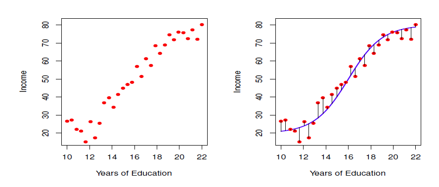
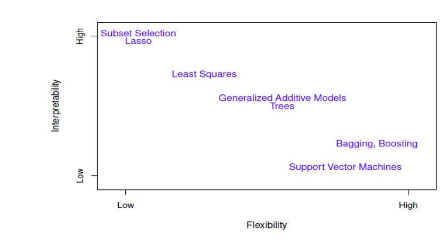
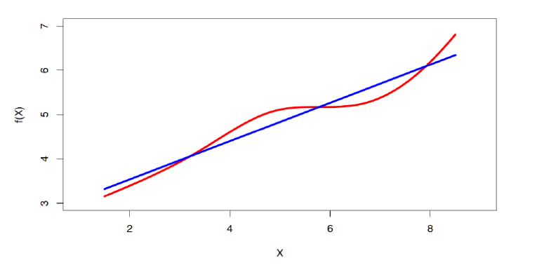
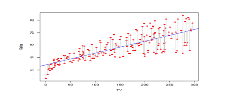
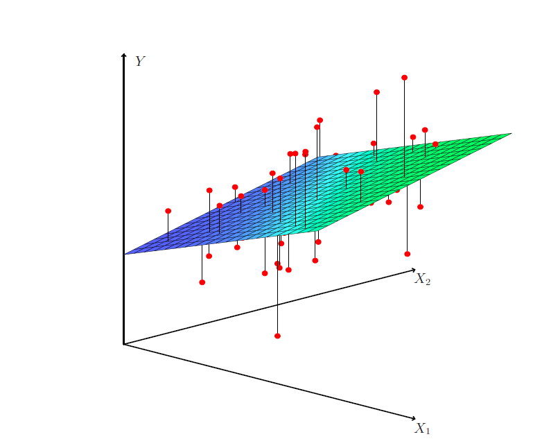

# Data Mining

Data Mining - many related fields ( Data science, ML, stats) can be viewed under the single umbrella term "data mining" = extracting useful knowledge / patterns from data 

Data mining is useful because it has the power to turn raw/ transactional data into actionable knowledge. It can be used in many types of ways for eg: recommendation systems. Like in ecommerce sites such as amazon, prime etc: Association rule example form (used in recommendation systems): If customer buys X and Y, then they are also likely to buy Z. 

# Why Data Mining is important - Scientific Viewpoint 

Modern science and tech generates massive amounts of data very quickly - this makes it difficult to analyse manually 

**Examples of large data sources:**
1. Genome data: DNA sequencing produces extremely large datasets 
2. Protein data: Used in bioinformatics to study protein structures and functions. 
3. Astronomical data: Telescopes generate huge image datasets of space. 
4. Digital data: Emails, youtube and other online content also produce large datasets. 

**Problem** - traditional methods like statistical or manual analysis techniques cannot handle raw, extremely large datasets. 

**Why cant they handle large datasets?**

1. Enormity of data - the sheer volume of the data is too much 
2. High dimensionality - Data can have many variables / features 
3. Heterogeneous and distributed data - data comes from many sources ( images, text, biological data etc)

The scientific motivation for data mining is the need to **automatically analyse large, complex, high dimensional datasets** generated by modern technologies and scientific research. 

Data mining is a field withing computer science focused on **discovering useful patterns and knowledge from large datasets**. It combines several techniques from areas such as *Machine learning *Statistics *Artificial Intelligence *Database systems 

The term data mining can be a bit misleading the goal is **not to extract the data itself** but to extract **meaningful patterns, relationship and knowledge from the data.**

**To summarise:** Data mining focuses on discovering patterns and useful knowledge **from large datasets using computational statistical techniques**

The term **Data mining** became popular because of marketing. Even though most of data mining techniques are already present in traditional Machine learning and statistical analysis. There was a well known book that was mainly about machine learning techniques that used the word **Data mining** in the title mainly to attract attention. 

Data mining mainly refers to **large scale data analysis** using techniques from **machine learning, Artificial intelligence and Statistics**

**Data Mining** = broader term used in industry for analystics + machine learning applied to large datasets

# Pattern Recognition 
It is the automatic recognition of patterns and regular structures in large amounts of data. Used in statistical analysis and ML specially in tasks where the systems should detect structure - such as classification, clustering and image recognition. 

It was originally developed from statistics and engineering but modern techniques heavily use machine learning. Pattern recognition can depend on whether: 
1. labels are available - supervised learning
2. labels are not available - unsupervised learning 
3. approach is statistical - probability based models
4. approach is non - statistical - rule based heiristic methods 

**Key takeaway** - pattern recognition is about automatically detecting patterns in data often using ML and statistical techniques and can involve supervised and unsupervised techniques. 

# Machine Learning 
Machine learning is a subfield of **Computer science and artificial intelligence** focused on developing algorithms that **learn patterns from data and improve performance automatically without explicit programming** 

ML was developed from **pattern recognition and computational learning theory** and is closely connected to **computational ststistics** since many ML algorithms rely on ststistical methods implemented on computers. 

ML and pattern recognition both focus on finding patterns and making predictions from data. 

# Main categories of ML 
1. Supervised learning: learning from labeled data. 
2. Unsupervised learning: discovering structure in unlabeled data. 
3. Reinforcement learning: learning through interaction and feedback from the environment

**Key Takeaway**: ML focuses on algorithms that learn patterns from data, combining ideas from AI, statistics, and pattern recognition and is commonly divifed into supervised, unsupervised and reinforcment learning. 

# Relationship between **Data Mining** and **Machine Learning**

Both are closely related and use the same algorithms hence can be confused between one anther - 
**ML mainly focuses on prediction** - learning from training data to predict future outcomes.
**Data Mining** - mainly focuses on **discovering previously unknown patterns or relationships in large datasets** 

**The overlap** - Data mining frequently uses ML algorithms to discover patterns in data. 

ML can also use data mining techniques - mostly 1. Unsupervised learning and 2. Data preprocessing (finding patterns or structure in data befor training the models)

**Key Takeaway** - ML is **prediction focused** and Data mining is **discovery focused** - both fields share many methods and strongly overlap. 

# Statistical Machine Learning

These notes are on **statistical ML** which lies between **data mining, machine learning and classical statistics** but is not the same as any of them. 

**Why not purely data mining or machine learning**
1. Data mining - is a very broad field covering many types of large scale data analysis. 
2. Machine learning - often focuses more on prediction accuracy and large scale applications. 
3. Classical multivariate statistics - includes traditional statictical techniques but does not cover modern computational methods

Statistical ML - combines ststictics with computational methods from Computer science, optimization and systems science. 

**Main focus of statistical ML** 
1. Building statistical models 
2. Understanding model interpretability
3. Measuring precision and uncertainty in predictions 

Statistical ML integrates statistical modeling with computational algorithms, focusing not only on prediction but also on understanding models, uncertainty and interpretability. 

# Data Science 

Data science is a broad interdisciplinary field focused on extracting useful knowledge and insights from data (structured and unstructured). 

**Goal of data science** 
The aim is to analyse real - world data to understand phenomena and support decision making using scientific methods and computational tools. 

Data science brings together several areas: 
1. Statistics and mathematics (for modeling and inference)
2. Computer science (for algorithms and computation)
3. Data analysis and machine learning
4. Domain knowledge or business expertise 

Data science integrates statistics, computing and domain knowledge to analyse large datasets and extract actionable insights from real-world data. 

The **Two cultures** concept in the use of statisical modeling to reach conclusions from data. 

As mentioned in **Leo Breiman Statistical Modeling : The two cultures** There are 2 cultures : Data modeling and ALgorithmic modeling 
1. Data modeling : assumes that the data is generated by  a given stochastic data model 
2. Algorithmic modeling : assumes the use of algorithmic modeling while treating the data as unknown. 

If the goal is to use data to solve problems we need to move away from exclusive dependence on data models and adopt a more diverse set of tools. 

# Supervised Machine Learning
In Supervised learning the dataset contains **input variables (X)** and **known output / response (Y)**. The goal is to **learn a relationship between X and Y** so that we can predict Y for new data. 

**Two main types of supervised learning problems:** 
1. Regression: The response variable Y is continuous (numerical). Examples: predicting house prices or blood pressure 

2. Classification: The response variable Y is categorical (labels or classes)
Examples: predicting survived /died or recognizing digitd 0 - 9 

**Common regression methods**
Linear regression, non linear regression, and model selection techniques

**Common classification methods** 
Logistic regression, discriminant analysis, and support vector machine

**Other important supervised methods**
Tree-based models and ensemble methods such as bagging, boosting and random forests. 

**Key takeaway** - Supervised learning learns a mapping from inputs (X) to known outputs (Y) and mainly involves regression (continuous Y) and classification (categorical Y) problems. 

# Unsupervised Learning 

In Unsupervised learning there is no response/output variable (Y). We **only observe input features (X)** and try to discover hidden structures or patterns in the data. 

**Goal of unsupervised learning** 
Since there are no labels the objective is less clearly defined. 
Typical goals include: 
1. Clustering - finding groups of similar observations 
2. Finding relationships between variables 
3. Finding **low dimensional respresentations** that capture most of the variables in the data. 

Evaluation difficulty - because there is no correct output it is often hard to measure how well models perform. 

**Unsupervised methods** often used as a preprocessing step before supervised learning, for example to reduce dimensionality or discover structure in data. 

**Common methods**
1. Clustering methods 
2. Principal Component Analysis (PCA)
3. Independent Component Analysis 
4. Factor Analysis 
5. Canonical Correlation Analysis 

**Key takeaway** - Unsupervised learning analyzes unlabeled data to discover structure, groups, or underlying patterns in the dataset. 

# Reinforcement Learning 
Reinforcement learning is a type of machine learning **where the agent learns to make decisions by interacting with the environment** 

**How the learning process works** 
The agent: 
1. Observes the current state of the environment
2. Takes an action 
3. Received a reward or penalty from the environment 
4. Uses this feedback to improve future actions 

**Goal of reinforment learning** 
The objective is to learn a strategy (policy) that maximizes the total long -term reward. 

**Connection to other fields** 
In operations research and control theory, reinforcement learning is related to **approximate dynamic programming**

**Mathemtical framework** 
Reinforcement learning problems are commonly modeled using a markov Decision Process (MDP), which describes states, actions, transitions and rewards. 

**Key takeaway** - Reinformcent learning learns optimal decision - making hrough interaction with an environment using rewards as feedback. 

# Modern Large Language Models (LLMS)

Modern LLMS are a result of the evolution of NLP (natural language processing), moving from traditional statistical methods to transformer based deep learning models. 

**How LLMs work** - They rely on **large neural network architectures (tranformers)** trained on massive datasets using specific training objectives and pipelines. 

**Why LLMS are powerful** 
Theire performance comes from 
1. Rich internal representation of language 
2. Scaling to very large datasets and models 
3. Emergent behaviours - where new capabilities appear as models become larger 

**How do people interact with LLMs** 
LLMs are used through techniques such as:
1. Prompting 
2. Instruction Tuning 
3. Reinforcement Learning from Human Feedbacl (RLHF)
4. Retrieval Augmented Generation (RAG) and external tools. 

Cuurent research direction - active areas include multimodal models (text + images etc), AI agents, safety and evaluation of model behaviour 

Key takeaway for exam: Modern LLms are **large tranformer based models trained on massive data**, and their capabilities come from **scaling, advanced training methods and new interactions like prompting and RLHF.**

# Historical Milestones in NLP and LLM development
**1950s - 1990s:** - Early NLP relied mainly on symbolic approaches, using handwritten grammar rules and some basic statictical techniques. 
**1990s - 2000s:** - The field shifted towards data driven methods, using probabilistic models such as n-grams, Hidden Markov Models (HMMs), and Conditional Random Fields (CRFs).
**2013 - 2017:** - Neural language models became important using deep learning methods such as word embeddings (word2vec) and sequence models like RNNs and LSTMs with attention mechanisms. 
**2017 - 2020:** - The introduction of trnsformer architectures revolutionized NLP, enabling large-scale pretraining models like BERT and GPT. 
**2020 - present:** - progress focuses on scaling models to huge sizes, improving alignment with human preferences, integrating external tools and developing multimodal and agent based systems. 

**Key takeaway** - NLP evolved from rule based systems --> statitical models --> neural networks --> transformers --> large-scale LLms with multimodal and agent capabilities. 

_______________________________________________________________

# LINEAR MODELS

Linear models is one of the most fundamental tools in statistical machine learning. They are used to **describe the relationship between input variables (features) and an output variable** using a **linear equation**.

This serves as a core foundation for many machine learning and statistical methods - especially in regression and classification problems. 

# Statistical Machine Learning

In statistical learning we model the relationship between predictors (covariates) X and a response variable Y. 

### General Model

The response is written as : 
Given response $$ Y and Covariates (X1i, X2i, X3i ....Xpi)^T $$

We model the relationship as: 

$$
Y_i = f(X_i) + \epsilon_i
$$

where:

- $f(X_i)$ represents the true underlying relationship between inputs and output.
- $\epsilon_i$ is random error (noise) with mean zero, capturing randomness or unexplained variation.

**Interpretation** - The goal of statistical learning is to estimate or approximae the unknown function $f$ using observed data. 

## Income vs Education

**Key Takeaway** - Statistical machine learning models data as : 
response = systematic relationship (function $f$) + random error, and the main goal is to **estimate $f$ from data**

# Learning the relationship between variables 

In statistical learning the goal is to estimate or learn the function $$f$$ that describes how the **response variable Y** depends on the **predictors X**.

**Two main objectives of learning $$f$$**
1. Prediction 
Use the estimated relationship to predict the response Y for new observations of X 
2. Inference 
Understand how the predictors influence the response, such as: 
- which variable affects Y 
- whether the effect is positive or negative 
- How strong the relationship is

**Example of prediction:** - Predicting how much money a person will donate using many observed characteristics of individuals. 

**Example of inference:** - Studying house prices to determine which factors (e.g. size, location, etc) have the strongest impact on price. 

**Key Takeaway** - Learning the function $$f$$ serves two purposes: predicting outcomes for new data and understanding the relationship between variables. 

# Methods for estimating the function of $$f$$$
To learn the relationship between inputs X and response Y we must estimate the unknown function $$f$$ using statistical models. 

2 main approaches 
1. **Parametric methods** - Assume a specific functional form for the relationship 
**Example** - Linear regression, where Y is modeled as a linear combination of predictors.
The parameters(coefficents $\beta$) are estimated using a loss function, commonly **Ordinary Least Squares (OLS)**

2. **Non parametric methods**  - Do not assume a fixed functional form for $$f$$. 
Instead, the data is allowed to determine the shape of the relationship. 
Examples include: **Spline method** & **Kernel Smoothing** 

**Trade off** 
- Parametric methods are simpler and require less data but may be less flexible. 
- Non Parametric methods are more flexible but usually require larger datasets for accurate estimation. 

**Key takeaway** - The relationship $$f$$ can be estimated using parametric methods(fixed structure) or nonparametric models (flexible structure) - with flexibility requiring more data.

# Tradeoff between accuracy and interpretability 
In statistical learning there is often a tradeoff between how accurate a model is and how easy it is to interpret. 

**Principle of Simpliciy**
According to Occam's razor (parsimony principle), simpler models are generally preferred because they are easier to understand and explain. 

Simple models like linear regression are highy interpretable because we can clearly see how each variable affects the response. 

**Accuracy and Overfitting**
More complex models may capture more patterns in data but can overfit, meaning they learn noise rather than true relationship. 
Sometimes simpler models actually give better predictions because they generalise better. 

## Accuracy Vs Interpretability

The above figure shows:
**Simple models** (eg: subset selection, lasso, least squares) --> high interpretability but lower flexibility. 
**Complex models** (e.g. SVM, boosting,bagging) -->higher flexibility and often better predictive power but harder to interpret. 

**Key Takeaway:** Machine Learning models must balance interpretability (simplicity) and predictive accuracy (flexibility), since increasing model complexity usually reduces interpretability. 

# Quality of Fit

Measuring the modelaccuracy or Quality of Fit - A common way to measure how well a model predicts the response variable is the **Mean Square Error (MSE)**

**What is the meaning of MSE** 
- MSE measures the avergae squared difference between the actual values Yi and the predicted values $\hat{Y}_i$.
- Smaller MSE means **better predictive accuracy** 

**Training Vs Test Data** 
- **Training data:** used to build the model and estimate predictions 
- **Test date:** new unseen data used to evaluate how well the model generalizes. 

Very flexible models can achieve **very low training MSE**, but may perform **worse on test data**, leading to higher test MSE. 

Model quality is often evaluated using **MSE** but the most important measure is **test MSE** since it reflects performance on new unseen data. 

# Levels of Flexibility 

Different models have different levels of flexibility - ie. how complex the relationship can learn between X and Y. 

In the above plot:
**Black line** - true underlying relationship
**Orange line** - simple linear model (low flexibilty)
**Blue Curve** - moderately flexible model 
**Green Curve** - highly flexible model that closely follows the data. 

**Effect of increasing flexibility** 
As the model flexibilty increases the model can fit the training data more closely - capturing more complex patterns. 

**Training vs test error** 
- **Training MSE(grey)** - decreases as flexibility increases because complex models fir the training data better. 
- **Test MSE (red)** - first decreases then increases when the model becomes too flexible 

The reason for increase in the test error is highly flexible models may overfit ie. they may capture noise in the training data instead of the true pattern. 

**Irreducible error** 
The dashed line represnts the minimum possible prediction error caused by randomness in the data that no model can eliminate.

**Key Takeaway** - Increasing model flexibility reduces training error but can increase test error due to overfitting - so the best model is usually somewhere in the middle level of flexibility 

# Bias and Variance Tradeoff 

When we choose any learning method we need to try to balance bias and variance  - two key sources of prediction error. 

- Bias : Bias measures the error caused by approximating a complex real-world relationship with a simpler model. 
High bias models are too simple and may miss important patterns in the data. 
- Variance: Variance measures how much the models predictions would change if we trained it on a different dataset. 

More flexible models usually have **higher variance** which means they are more sensitive to small changes in the training data. 

**Remember** 
Simple models --> high bias, low variance 
Complex models --> low bias, high variance

**Goal in ML**: Find the balance that will minimize overall prediction error. 

# Simple Linear Regression 

Linear regression is a basic supervised learning method used to model the relationship between a response variable Y and one or more predictor variables X. 

In real world problems the true relationship is usually more complex and not perfectly linear. 

**So why is linear regression still useful** 
It's simple yet widely used because: 
- easy to interpret 
- computationally efficient
- A foundation for many advanced statistical and machine learning methods. 

In the above graph the red curve represents the true nonlinear relationship and the blue line shows the linear approximation used by linear regression. 

Linear regression assumes a linear relationship between predictors and response and despite being simple it is a fundamental and powerful tool in statistical learning. 

## Simple Linear Regression (SLR)

### Model Idea
Simple Linear Regression models the relationship between a response variable $Y$ and a single predictor $X$ using a straight-line equation.

### Model Form

$$
Y = \beta_0 + \beta_1 X + \epsilon
$$

where:

- $\beta_0$ — intercept (value of $Y$ when $X = 0$)
- $\beta_1$ — slope (change in $Y$ for a one-unit increase in $X$)
- $\epsilon$ — random error capturing unexplained variation

### Estimated Regression Line

Since $\beta_0$ and $\beta_1$ are unknown, they are estimated from data:

$$
\hat{y} = \hat{\beta}_0 + \hat{\beta}_1 x
$$

### Prediction

For a new input $x$, the predicted response is:

$$
\hat{y}
$$

The hat symbol ($\hat{}$) indicates an **estimated or predicted value**.

### Key Takeaway

Simple Linear Regression estimates a **linear relationship between one predictor and a response variable**, using slope and intercept parameters learned from data.

## Estimating Parameters in Simple Linear Regression

### Residuals

For each observation $(y_i, x_i)$, the predicted value from the regression model is

$$
\hat{y}_i = \hat{\beta}_0 + \hat{\beta}_1 x_i
$$

The **residual** represents the difference between the observed value and the predicted value:

$$
e_i = y_i - \hat{y}_i
$$

Residuals measure the **prediction error** for each data point.

---

### Estimation Method (Ordinary Least Squares)

To estimate the parameters $\beta_0$ and $\beta_1$, we minimize the **Residual Sum of Squares (RSS)**:

$$
RSS = \sum_i e_i^2 = \sum_i (y_i - \hat{\beta}_0 - \hat{\beta}_1 x_i)^2
$$

This approach is known as **Ordinary Least Squares (OLS)**.

---

### Estimated Coefficients

Let

$$
\bar{x} = \frac{1}{n}\sum_i x_i, \qquad
\bar{y} = \frac{1}{n}\sum_i y_i
$$

The estimated parameters are

$$
\hat{\beta}_1 =
\frac{\sum_i (y_i - \bar{y})(x_i - \bar{x})}
{\sum_i (x_i - \bar{x})^2}
$$

$$
\hat{\beta}_0 = \bar{y} - \hat{\beta}_1 \bar{x}
$$

---

### Interpretation

- **Slope ($\hat{\beta}_1$)**: measures how the response variable $Y$ changes with a one-unit increase in $X$.
- **Intercept ($\hat{\beta}_0$)**: ensures the regression line passes through the point $(\bar{x}, \bar{y})$.

---

### Key Takeaway

In **Simple Linear Regression**, the parameters are estimated by minimizing the **sum of squared residuals (RSS)** using the **Ordinary Least Squares (OLS)** method.

### Example: Advertising Data

This example shows a simple linear regression model relating **TV advertising expenditure** to **sales**.

- The **blue line** is the least squares regression line.
- The **grey vertical lines** represent residuals (prediction errors).
- The regression line is chosen to **minimize the sum of squared residuals (RSS)**.

This approach captures the overall linear relationship between advertising spending and sales.

## Assessing the Coefficient Estimates

After fitting a simple linear regression model

$$
Y = \beta_0 + \beta_1 X + \epsilon
$$

we obtain estimates $\hat{\beta}_0$ and $\hat{\beta}_1$.  
However, these estimates are computed from a **sample of data**, so they are **not the true parameter values**.

If we collected a different sample, the estimated coefficients would be slightly different.  
Therefore, we need a way to **measure how reliable these estimates are**.

---

## 1. Standard Error (SE)

The **standard error** measures how much an estimated coefficient would vary if we repeatedly collected new datasets and refit the model.

- Small SE → estimate is **stable and reliable**
- Large SE → estimate is **noisy and uncertain**

Conceptually, imagine collecting many samples of data and estimating the regression line each time.  
The standard error measures the **variability of those estimates**.

---

## 2. Standard Error of the Slope

The standard error of the slope estimate is

$$
SE(\hat{\beta}_1) =
\sqrt{
\frac{\sigma^2}
{\sum_i (x_i - \bar{x})^2}
}
$$

where

- $\sigma^2 = Var(\epsilon)$ is the variance of the error term.

### Interpretation

The slope estimate becomes more precise when:

1. **Noise is small** (small $\sigma^2$)
2. **The predictor values vary a lot**

If all $X$ values are very similar, it becomes difficult to estimate a reliable slope.

---

## 3. Standard Error of the Intercept

The standard error of the intercept estimate is

$$
SE(\hat{\beta}_0) =
\sqrt{
\sigma^2
\left(
\frac{1}{n}
+
\frac{\bar{x}^2}{\sum_i (x_i - \bar{x})^2}
\right)
}
$$

This measures the **uncertainty in the intercept estimate**.

The intercept is usually harder to estimate precisely because it depends strongly on how the data are centered.

---

## 4. Confidence Intervals

A **confidence interval (CI)** provides a range of plausible values for the true parameter.

For a 95% confidence interval, the approximate form is

$$
\hat{\beta}_1 \pm 2 \cdot SE(\hat{\beta}_1)
$$

The constant "2" comes from the normal distribution and corresponds roughly to a **95% confidence level**.

---

## 5. What a 95% Confidence Interval Means

A common misunderstanding is:

> "There is a 95% probability that the true parameter lies in this interval."

This is **not correct**.

The correct interpretation is:

> If we repeated the sampling process many times and constructed a confidence interval each time, **about 95% of those intervals would contain the true parameter**.

---

## 6. Example: Advertising Dataset

For the advertising data, the 95% confidence interval for the slope coefficient is

$$
[0.042, 0.053]
$$

This means that for every additional unit of **TV advertising**, sales increase by approximately

- **at least 0.042**
- **at most 0.053**

This indicates that the relationship between TV advertising and sales is **clearly positive**.

---

## Key Takeaway

When fitting a regression model we:

1. Estimate regression coefficients
2. Measure the **uncertainty** of those estimates using **standard errors**
3. Express that uncertainty using **confidence intervals**

This allows us to assess **how trustworthy our regression results are**.

## Hypothesis Testing in Linear Regression

After fitting a regression model

$$
Y = \beta_0 + \beta_1 X + \epsilon
$$

we want to determine whether the relationship between **X and Y** is real or simply due to random variation in the data.

Hypothesis testing helps us answer this question.

---

## The Hypotheses

We test two competing statements about the slope coefficient.

### Null Hypothesis

$$
H_0: \beta_1 = 0
$$

This means there is **no relationship between X and Y**.

If this is true, the regression model reduces to

$$
Y = \beta_0 + \epsilon
$$

which implies that **X does not influence Y**.

---

### Alternative Hypothesis

$$
H_A: \beta_1 \neq 0
$$

This means there **is a relationship between X and Y**, and the predictor variable helps explain changes in the response variable.

---

## Role of the Standard Error

To test the hypotheses, we use the **standard error of the slope estimate**.

The idea is to check whether the estimated slope $\hat{\beta}_1$ is **large relative to its standard error**.

- If the slope is **much larger than its standard error**, it suggests the relationship between X and Y is real.
- If the slope is **similar in size to its standard error**, the relationship could simply be due to random noise.

---

## Intuition

- If $\beta_1 = 0$ → X and Y are unrelated.
- If $\beta_1 \neq 0$ → X helps explain variation in Y.

Hypothesis testing allows us to determine whether the predictor variable **has a statistically significant effect** on the response variable.

---

## Key Idea

In simple linear regression, we typically test

$$
H_0 : \beta_1 = 0
$$

to determine whether the predictor variable **X has a statistically significant relationship with Y**.

## Hypothesis Testing, t-Statistic, and Model Fit

After estimating a simple linear regression model

$$
Y = \beta_0 + \beta_1 X + \epsilon
$$

we want to determine whether the relationship between **X and Y** is statistically significant and how well the model explains the data.

---

## 1. The t-Statistic

To test the null hypothesis

$$
H_0 : \beta_1 = 0
$$

we compute the **t-statistic**

$$
t = \frac{\hat{\beta}_1 - 0}{SE(\hat{\beta}_1)}
$$

This measures **how many standard errors the estimated slope is away from zero**.

### Interpretation

- **Small |t|** → the slope could be due to random noise.
- **Large |t|** → the slope is far from zero, suggesting a real relationship between X and Y.

### Example intuition

If

$$
\hat{\beta}_1 = 0.05, \quad SE = 0.01
$$

then

$$
t = 5
$$

meaning the estimate is **5 standard errors away from zero**, which is strong evidence of a relationship.

---

## 2. Distribution of the t-Statistic

Under the null hypothesis

$$
H_0 : \beta_1 = 0
$$

the t-statistic follows a **t-distribution with \(n-2\) degrees of freedom**.

Why \(n-2\)?

Because we estimate two parameters:

- $\beta_0$ (intercept)
- $\beta_1$ (slope)

This reduces the degrees of freedom by two.

---

## 3. The p-Value

The **p-value** is the probability of observing a t-statistic as extreme as the one computed if the null hypothesis were true.

### Interpretation

- **Small p-value (< 0.05)** → reject \(H_0\)  
- **Large p-value** → insufficient evidence against \(H_0\)

If the p-value is small, it suggests that **X has a statistically significant effect on Y**.

---

## 4. R-Squared (Goodness of Fit)

The **R-squared statistic** measures how much of the variability in the response variable is explained by the model.

$$
R^2 = \frac{TSS - RSS}{TSS} = 1 - \frac{RSS}{TSS}
$$

---

## Components of R²

### Total Sum of Squares (TSS)

$$
TSS = \sum_i (y_i - \bar{y})^2
$$

Measures the **total variability in Y around its mean**.

---

### Residual Sum of Squares (RSS)

$$
RSS = \sum_i (y_i - \hat{y}_i)^2
$$

Measures the **unexplained error after fitting the regression model**.

---

## 5. Meaning of \(R^2\)

R-squared represents the **fraction of variance explained by the model**.

Examples:

| R² | Interpretation |
|----|---------------|
| 0.2 | Model explains 20% of variation |
| 0.6 | Model explains 60% of variation |
| 0.9 | Very strong fit |

Example:

If

$$
R^2 = 0.72
$$

then **72% of the variation in Y is explained by X**.

---

## Key Intuition

Regression analysis answers two main questions:

1️⃣ **Is there a relationship?**  
→ Use **hypothesis testing** (t-test, p-value)

2️⃣ **How strong is the model?**  
→ Use **R² (goodness of fit)**

Together, these measures help determine whether the regression results are **statistically meaningful and useful for prediction**.

# Linear Model 

## Multiple Linear Regression

In many real-world problems, a response variable depends on **multiple predictors**, not just one.

Instead of the simple linear regression model

Y = β₀ + β₁X + ε

we use **multiple linear regression**, where several predictors explain the response:

Y = β₀ + β₁X₁ + β₂X₂ + ... + βₚXₚ + ε

Where:

- **Y** = response variable  
- **X₁, X₂, ..., Xₚ** = predictor variables  
- **β₀** = intercept  
- **β₁, β₂, ..., βₚ** = coefficients measuring the effect of each predictor  
- **ε** = random error term  

### Example

Predicting **house price** using multiple predictors:

- Size of the house  
- Location  
- Number of bedrooms  
- Age of the house  

Each variable contributes to explaining the final price.

---

## Indicator Variables (Categorical Variables)

Regression models require **numerical inputs**, but many predictors are **categorical**.

Indicator variables (also called **dummy variables**) allow categorical information to be included in regression.

### Example: Gender

Male = 0  
Female = 1  

### Example: City

Edmonton = 1, otherwise 0  
Calgary = 1, otherwise 0  

These variables allow regression models to handle **non-numeric categories**.

---

## Model Selection

When many predictors are available, we must decide:

- Which variables should remain in the model
- Which variables should be removed

Including too many predictors can lead to **overfitting**, where the model fits the training data well but performs poorly on new data.

### Goal

Build a model that:

- Explains the data well  
- Uses only relevant predictors  
- Avoids unnecessary complexity  

In other words, we aim to find the **best predictive model without overfitting**.

## Multiple Linear Regression

In many real-world problems, the response variable depends on **multiple predictors**, not just one.  
Multiple Linear Regression extends simple linear regression to include several explanatory variables.

### Model

The multiple linear regression model is:

$$
Y = \beta_0 + \beta_1 X_1 + \beta_2 X_2 + ... + \beta_p X_p + \epsilon
$$

Where:

- **Y** = response variable (what we want to predict)
- **X₁, X₂, ..., Xₚ** = predictor variables
- **β₀** = intercept
- **β₁, β₂, ..., βₚ** = regression coefficients
- **ε** = random error term (often assumed to follow \(N(0, \sigma^2)\))

---

## Interpretation of the Coefficients

Each coefficient **βⱼ** represents the **average change in Y when Xⱼ increases by one unit**, while **all other predictors remain fixed**.

This is called the **partial effect** of a variable.

In other words, the coefficient measures the **separate contribution of each predictor** to the response.

---

## Example: Advertising Data

Suppose we model product sales using three advertising channels:

- TV advertising
- Radio advertising
- Newspaper advertising

The regression model becomes:

$$
Sales = \beta_0 + \beta_1 TV + \beta_2 Radio + \beta_3 Newspaper + \epsilon
$$

Interpretation:

- **β₁** → effect of TV advertising on sales  
- **β₂** → effect of Radio advertising on sales  
- **β₃** → effect of Newspaper advertising on sales  

Each effect is measured **while the other advertising channels are held constant**.

---

## Key Idea

Multiple regression allows us to measure the **individual impact of several predictors simultaneously**, helping us understand how each variable contributes to predicting the response.

## Multiple Linear Regression

Multiple Linear Regression extends simple linear regression by allowing **multiple predictor variables** to explain a response variable.

### Model

The multiple regression model is

Y = β₀ + β₁X₁ + β₂X₂ + ... + βₚXₚ + ε

where:

- **Y** = response variable (what we want to predict)
- **X₁, X₂, ..., Xₚ** = predictor variables
- **β₀** = intercept
- **β₁, β₂, ..., βₚ** = coefficients
- **ε** = random error term, usually assumed to follow  
  ε ~ N(0, σ²)

---

## Meaning of the Coefficients

Each coefficient **βⱼ** represents the **average change in Y when Xⱼ increases by one unit**, while **all other predictors are held fixed**.

This is called the **partial effect** of the predictor.

In other words, the coefficient measures how much a variable contributes to predicting **Y independently of the other variables**.

---

## Example: Advertising Data

Suppose we want to predict product **sales** using three advertising channels:

- TV advertising
- Radio advertising
- Newspaper advertising

The regression model becomes

Sales = β₀ + β₁(TV) + β₂(Radio) + β₃(Newspaper) + ε

### Interpretation

- **β₁** → effect of TV advertising on sales
- **β₂** → effect of radio advertising on sales
- **β₃** → effect of newspaper advertising on sales

Each effect is measured **while the other advertising channels are held constant**.

---

## Key Takeaway

Multiple linear regression allows us to measure the **separate contribution of multiple predictors** when explaining or predicting a response variable.

## Multiple Linear Regression

Multiple Linear Regression is used when the response variable depends on **more than one predictor variable**.

### Model

The multiple regression model is

Y = β₀ + β₁X₁ + β₂X₂ + ... + βₚXₚ + ε

where:

- **Y** = response variable (what we want to predict)
- **X₁, X₂, ..., Xₚ** = predictor variables
- **β₀** = intercept
- **β₁, β₂, ..., βₚ** = regression coefficients
- **ε** = random error term, typically assumed to follow  
  ε ~ N(0, σ²)

---

## Interpretation of the Coefficients

Each coefficient **βⱼ** represents the **average change in Y when Xⱼ increases by one unit**, while **all other predictors remain fixed**.

This is called the **partial effect** of the predictor.

In other words, the coefficient measures the **individual contribution of each variable** to predicting Y.

---

## Example: Advertising Data

Suppose we want to predict **sales** using three types of advertising:

- TV advertising
- Radio advertising
- Newspaper advertising

The regression model becomes

Sales = β₀ + β₁ × TV + β₂ × Radio + β₃ × Newspaper + ε

### Interpretation

- **β₁** → effect of TV advertising on sales  
- **β₂** → effect of radio advertising on sales  
- **β₃** → effect of newspaper advertising on sales  

Each effect is estimated **while keeping the other advertising channels constant**.

---

## Key Idea

Multiple linear regression allows us to measure the **separate impact of multiple predictors** on the response variable, helping us understand how different variables contribute to predicting Y.

## Coefficient Interpretation in Multiple Linear Regression

In multiple linear regression, each coefficient represents the effect of a predictor on the response variable **while holding all other predictors constant**.

### Ideal Case: Predictors are Uncorrelated

The easiest situation for interpretation occurs when the predictors are **uncorrelated** (sometimes called a *balanced design*).

In this case:

- Each coefficient can be estimated and tested **independently**
- The interpretation is straightforward

If \(X_j\) increases by **one unit**, then the response variable \(Y\) changes by **\(\beta_j\)**, **while all other variables remain fixed**.

This allows us to interpret the **separate contribution of each variable** to predicting \(Y\).

---

## When Predictors are Correlated

Problems arise when predictors are **correlated with each other**.

For example, in advertising data, spending on **TV and radio advertising** might increase together.

This creates several issues:

- Coefficient estimates become **unstable**
- The **variance of coefficient estimates increases**
- It becomes difficult to determine **which variable is actually responsible for the change in \(Y\)**

This phenomenon is known as **multicollinearity**.

Because predictors move together, when one variable changes, others tend to change as well, making interpretation harder.

---

## Causality Warning

Regression analysis on **observational data** identifies **associations**, not necessarily **causal relationships**.

Example:

- Ice cream sales increase
- Drowning incidents increase

Regression may detect a relationship, but the true cause is **temperature** (a hidden variable).

Therefore:

> Regression models show **relationships between variables**, but they do not automatically prove **cause and effect**.

---

## Key Takeaways

- If predictors are **independent**, coefficients are easy to interpret.
- If predictors are **correlated**, interpretation becomes difficult due to **multicollinearity**.
- Regression identifies **associations**, not necessarily **causal effects**.

## The Woes of Regression Coefficients

In multiple linear regression, a coefficient \( \beta_j \) represents the **expected change in the response variable \(Y\)** when the predictor \(X_j\) increases by one unit **while all other predictors are held fixed**.

This interpretation works well in theory, but it can become problematic in practice because predictors often **change together**.

---

## Why This Can Be Problematic

The regression interpretation assumes that we can change one variable while keeping the others constant.  
However, in real-world data, predictors are often **correlated**, meaning they tend to move together.

When this happens, the interpretation of regression coefficients becomes less intuitive.

---

## Example 1: Coins in Your Pocket

Suppose we want to model:

- \(Y\) = total amount of money in your pocket  
- \(X_1\) = number of coins  
- \(X_2\) = number of pennies, nickels, and dimes  

If the number of pennies increases, the **number of coins also increases**.

So it is unrealistic to interpret the coefficient of \(X_2\) as:

> increasing pennies while keeping the number of coins fixed.

Because these variables naturally change together, interpreting their coefficients separately can be misleading.

---

## Example 2: Football Player Tackles

Suppose we model:

- \(Y\) = number of tackles in a season  
- \(W\) = player weight  
- \(H\) = player height  

Regression model:

\[
Y = \beta_0 + 0.50W - 0.10H
\]

At first glance, the negative coefficient for height may seem strange.

However, the coefficient for height means:

> If height increases by one unit **while weight stays constant**, the number of tackles decreases.

But in reality, taller players are often heavier, so the model is considering an **unusual scenario**: a taller player with the same weight (a thinner player). This can lead to unexpected coefficient signs.

---

## Key Insight

Regression coefficients assume that other predictors remain fixed.  
But when predictors are correlated, this assumption may represent **unrealistic situations**, making coefficient interpretations harder.

This issue is closely related to **multicollinearity**.

---

## Main Takeaway

- Regression coefficients describe the effect of one variable **holding others fixed**
- In real data, predictors often **change together**
- This can make coefficient interpretations **counterintuitive**

# 2 Quotes by Famous Statisticians 

Essentially, all models are wrong but some are useful - George Box
The only way to find out what will happen when a complex system is disturbed is to disturb the system - not merely observe it passively. - Fred Mosteller and John Tukey, paraphrasing George Box

## Coefficient Estimation in Multiple Linear Regression

In multiple linear regression, the goal is to estimate the unknown coefficients of the model.

The regression model is

Y = β₀ + β₁X₁ + β₂X₂ + ... + βₚXₚ + ε

Since the true coefficients β₀, β₁, ..., βₚ are unknown, we estimate them from data.  
The estimated regression equation becomes

ŷ = β̂₀ + β̂₁X₁ + ... + β̂ₚXₚ

where:

- ŷ = predicted value of Y
- β̂₀, β̂₁, ..., β̂ₚ = estimated regression coefficients

---

## Residuals

For each observation we compare:

Actual value: yᵢ  
Predicted value: ŷᵢ  

The difference between them is called the **residual**:

eᵢ = yᵢ − ŷᵢ

Residuals represent the **prediction errors** of the model.

---

## Residual Sum of Squares (RSS)

To measure the overall prediction error, we compute the **Residual Sum of Squares**:

RSS = Σ (yᵢ − ŷᵢ)²

This quantity measures the total squared difference between the observed values and the predicted values.

---

## Least Squares Estimation

The regression coefficients are chosen to **minimize the Residual Sum of Squares (RSS)**.

The values

β̂₀, β̂₁, ..., β̂ₚ

that minimize RSS are called the **least squares estimates**.

This method is known as **Ordinary Least Squares (OLS)** and is used by statistical software to estimate regression models.

---

## Key Idea

Multiple linear regression estimates coefficients by choosing the values that **minimize the total squared prediction error**.

## Estimation Example (Geometric Interpretation)

This figure illustrates how **multiple linear regression fits a surface to data**.

### Axes in the Plot

The graph shows three variables:

- **X₁** – first predictor variable
- **X₂** – second predictor variable
- **Y** – response variable

Each red point represents an observed data point with coordinates:

(X₁, X₂, Y)

---

## The Regression Plane

In simple linear regression, we fit a **line** to the data.  
In multiple linear regression, we fit a **plane**.

The model is:

Y = β₀ + β₁X₁ + β₂X₂

The colored surface in the plot represents this **regression plane**.

For any combination of \(X₁\) and \(X₂\), the plane gives the predicted value:

ŷ = β̂₀ + β̂₁X₁ + β̂₂X₂

---

## Residuals (Prediction Errors)

The vertical lines between the red points and the plane represent **residuals**.

Residual for observation \(i\):

eᵢ = yᵢ − ŷᵢ

These measure the difference between the **actual value** and the **predicted value**.

---

## Least Squares Estimation

The regression coefficients are chosen to minimize the **Residual Sum of Squares (RSS)**:

RSS = Σ (yᵢ − ŷᵢ)²

This places the regression plane so that the **total squared vertical distance between the data points and the plane is minimized**.

---

## Key Insight

- Simple linear regression fits a **line**
- Multiple linear regression fits a **plane (or hyperplane)**

The goal is always to **minimize squared prediction errors**.

## Inference in Multiple Linear Regression

After fitting a regression model, we want to understand whether the predictors are useful and how reliable our predictions are. This is done through **statistical inference**.

---

## 1. Is the Model Useful? (F-Test)

First we test whether **at least one predictor affects the response variable**.

Null hypothesis:

H₀: β₁ = β₂ = ... = βₚ = 0

Alternative hypothesis:

Hₐ: At least one βⱼ ≠ 0

This is tested using the **F-statistic**:

F = ((TSS − RSS)/p) / (RSS/(n − p − 1))

Where:

- **TSS** = Total Sum of Squares
- **RSS** = Residual Sum of Squares
- **p** = number of predictors
- **n** = sample size

A large F-value suggests that the predictors explain a significant portion of the variation in Y.

---

## 2. Is an Individual Predictor Useful? (t-Test)

To test whether a specific predictor \(X_i\) is useful, we test:

H₀: βᵢ = 0

The test statistic is

t = β̂ᵢ / SE(β̂ᵢ)

If the t-statistic is large (or the p-value is small), we conclude that the predictor has a significant effect on Y.

---

## 3. Prediction Interval (PI)

A **prediction interval** estimates the range where a **future individual observation** is likely to fall.

This interval accounts for:

- uncertainty in the regression estimate
- natural variation in individual observations

---

## 4. Confidence Interval (CI)

A **confidence interval** estimates the range of the **average response value** for given predictor values.

---

## Key Difference

Prediction Interval (PI) → predicts **individual observation**

Confidence Interval (CI) → estimates **average response**

Prediction intervals are **wider than confidence intervals** because they include more sources of uncertainty.

## Advertising Example: Interpreting Regression Output

This example shows the results of fitting a multiple linear regression model to predict **sales** using three advertising channels:

Sales = β₀ + β₁(TV) + β₂(Radio) + β₃(Newspaper) + ε

---

## Estimated Coefficients

| Predictor | Estimate | Interpretation |
|-----------|----------|---------------|
| Intercept | 2.94 | Baseline sales when advertising spending is zero |
| TV | 0.0458 | Increasing TV advertising by 1 unit increases sales by about **0.0458 units**, holding other variables fixed |
| Radio | 0.1885 | Increasing radio advertising by 1 unit increases sales by about **0.1885 units**, holding other variables fixed |
| Newspaper | -0.0010 | Very close to zero → newspaper advertising has little effect on sales |

---

## Statistical Significance (p-values)

| Predictor | p-value | Conclusion |
|-----------|--------|------------|
| TV | < 2e-16 | Highly significant |
| Radio | < 2e-16 | Highly significant |
| Newspaper | 0.86 | Not significant |

Rule of thumb:

p-value < 0.05 → predictor is statistically significant.

**Conclusion:** TV and Radio advertising significantly affect sales, but Newspaper advertising does not add meaningful predictive power.

---

## Model Quality

Multiple R-squared = **0.897**

This means the model explains about **89.7% of the variation in sales**, indicating a very strong fit.

---

## Overall Model Significance

F-statistic = **570.3**

p-value < **2.2e-16**

This test checks whether **at least one predictor is useful**.

Since the p-value is extremely small, we conclude that **the regression model is statistically significant overall**.

---

## Confidence Interval (CI)

Average predicted sales:

Fit = **20.52**

95% Confidence Interval:

[19.99, 21.05]

Interpretation:

The **average expected sales** for these predictor values likely fall between **19.99 and 21.05**.

---

## Prediction Interval (PI)

Predicted value for a **new observation**:

Fit = **20.52**

95% Prediction Interval:

[17.15, 23.88]

Prediction intervals are **wider** because they account for variability in individual observations.

---

## Key Takeaways

- **TV and Radio advertising significantly increase sales.**
- **Newspaper advertising does not significantly contribute to predicting sales.**
- The model explains **about 90% of the variability in sales**, indicating a strong fit.
- Prediction intervals are **wider than confidence intervals** because they include additional uncertainty from individual observations.

## Indicator Variables (Categorical Predictors)

Sometimes predictors in regression are **not numerical**.  
Instead, they represent **categories** such as gender, city, or product type.

These are called:

- **Categorical variables**
- **Factor variables**
- **Indicator variables (dummy variables)**

---

## Example: Gender

Suppose we want to study whether **credit card balance differs between males and females**.

Since gender is categorical, we convert it into a **numeric indicator variable**.

Define:

xᵢ =  
- 1 → if person *i* is **female**  
- 0 → if person *i* is **male**

---

## Regression Model

We fit the regression:

Yᵢ = β₀ + β₁xᵢ + εᵢ

where:

- **Yᵢ** = credit card balance
- **xᵢ** = indicator variable (gender)

---

## Interpretation

### If the person is male

xᵢ = 0

The model becomes:

Yᵢ = β₀ + εᵢ

So **β₀ represents the average balance for males**.

---

### If the person is female

xᵢ = 1

The model becomes:

Yᵢ = β₀ + β₁ + εᵢ

So **β₀ + β₁ represents the average balance for females**.

---

## Meaning of β₁

β₁ measures the **difference between the two groups**.

β₁ = Average balance (female) − Average balance (male)

So:

- **β₁ > 0 → females have higher balances**
- **β₁ < 0 → males have higher balances**

---

## Key Idea

Indicator variables allow regression to **include categorical data** by converting categories into **0/1 numeric variables**.

This lets regression models analyze **group differences**.

---

## What if there are more than two categories?

If a variable has **k categories**, we use **k − 1 indicator variables**.

Example: City

- Edmonton → (1,0)
- Calgary → (0,1)
- Vancouver → (0,0) (reference category)

This avoids **perfect multicollinearity**.

---

## Key Takeaway

Indicator variables allow regression models to include **qualitative variables** and measure **differences between groups** in the response variable.

## Indicator Variables with Multiple Categories

When a categorical variable has **k categories (levels)**, we cannot include all k indicators in a regression model.

Instead, we use **k − 1 indicator variables**.

This avoids a problem called **perfect multicollinearity**.

---

## Example: 3 Categories

Suppose a categorical variable **x** has three levels:

- A
- B
- C

We create **two indicator variables**:

x_A =  
- 1 if x = A  
- 0 otherwise  

x_B =  
- 1 if x = B  
- 0 otherwise  

---

## Baseline Category

If the observation belongs to **C**, then:

x_A = 0  
x_B = 0  

So **C becomes the baseline (reference category)**.

The regression model compares other categories **relative to this baseline**.

---

## Regression Model

The model becomes:

Y = β₀ + β_A x_A + β_B x_B + ε

---

## Interpretation of Coefficients

| Case | Model Value | Meaning |
|-----|-----|-----|
| x = C | Y = β₀ + ε | Baseline category |
| x = A | Y = β₀ + β_A + ε | Difference between A and C |
| x = B | Y = β₀ + β_B + ε | Difference between B and C |

---

## Meaning of the Coefficients

- **β_A** = difference between category **A and baseline C**
- **β_B** = difference between category **B and baseline C**

These are called **contrasts**.

---

## Key Takeaway

For a categorical variable with **k levels**, we use **k − 1 indicator variables**, and the remaining category becomes the **baseline** that all other categories are compared against.

## Why Model Selection

In many real-world problems, we may have **many predictors (features)** available.

Sometimes the number of predictors **p** can even be larger than the number of observations **n**.

Because of this, we usually do **model selection** — choosing only the **important predictors** to include in the model.

This follows **Occam's Razor**, which states that **simpler models are preferred when they explain the data well**.

---

## Why Remove Unimportant Predictors?

### 1. Simpler Models

Removing unnecessary variables makes the model:

- easier to understand
- easier to interpret
- less complex

---

### 2. Lower Cost of Prediction

If a model requires fewer variables:

- fewer measurements need to be collected
- prediction becomes cheaper and faster

Example:
If predicting house prices requires only **size and location**, we don't need to measure **20 other variables**.

---

### 3. Better Prediction Performance

Including too many predictors can cause **overfitting**.

Overfitting means the model learns noise from the training data and performs poorly on new data.

Removing irrelevant predictors can **improve prediction accuracy** on new observations.

---

## Prediction Error Decomposition

Prediction error is often written as:

\[
MSE = Bias^2 + Variance
\]

Where:

- **Bias** = error due to overly simple models
- **Variance** = error due to overly complex models

---

## The Bias–Variance Tradeoff

Model selection is a **balance between bias and variance**.

- **Too many variables → high variance → overfitting**
- **Too few variables → high bias → underfitting**

The goal is to choose a model with the **right level of complexity**.

---

## Key Takeaway

Model selection helps us:

- keep only **important predictors**
- build **simpler models**
- reduce **cost and complexity**
- improve **prediction performance**
- manage the **bias–variance tradeoff**

## How to Select a Model in Linear Regression

When we have many predictors, we need methods to decide **which variables to include in the model**.  
There are three common approaches used in linear regression.

---

## 1. Subset Selection

Subset selection chooses **a subset of the available predictors** that are most related to the response variable.

Instead of using all predictors, we fit the regression model using only the selected variables.

Two common methods are:

### Best Subset Selection
- Fits models using **all possible combinations of predictors**.
- Then selects the best model based on a performance metric (like AIC, BIC, or adjusted \(R^2\)).

### Stepwise Selection
Adds or removes predictors step-by-step.

Common variants:
- **Forward Selection** → start with no predictors, add variables one at a time.
- **Backward Selection** → start with all predictors, remove the least useful variables.
- **Stepwise Selection** → combination of forward and backward methods.

Goal: find a **good subset of predictors without testing every possible model**.

---

## 2. Shrinkage (Regularization)

Shrinkage methods keep **all predictors in the model**, but they **shrink the estimated coefficients toward zero**.

This reduces model complexity and helps prevent overfitting.

Mathematically, the coefficients become **smaller than the ordinary least squares estimates**.

Benefits:
- Reduces **variance of the model**
- Improves **prediction performance**
- Can sometimes **automatically remove unimportant variables**

Common shrinkage methods in machine learning:

- **Ridge Regression**
- **Lasso Regression**
- **Elastic Net**

These methods are also called **regularization techniques**.

---

## 3. Dimension Reduction

Instead of selecting predictors, we **transform the original predictors into a smaller set of new variables**.

If we start with **p predictors**, we create **M new variables**, where:

\[
M < p
\]

These new variables are **linear combinations of the original predictors**.

We then fit a regression model using these new variables instead.

Example techniques:

- **Principal Component Regression (PCR)**
- **Partial Least Squares (PLS)**

Benefits:
- Reduces complexity
- Handles highly correlated predictors
- Improves stability of the model

---

## Key Idea

All three approaches aim to **handle situations with many predictors** and improve model performance.

| Method | Main Idea |
|------|------|
| Subset Selection | Choose a subset of predictors |
| Shrinkage | Keep all predictors but shrink coefficients |
| Dimension Reduction | Create new predictors from combinations of the original ones |

Each method helps **reduce overfitting and improve prediction accuracy**.

